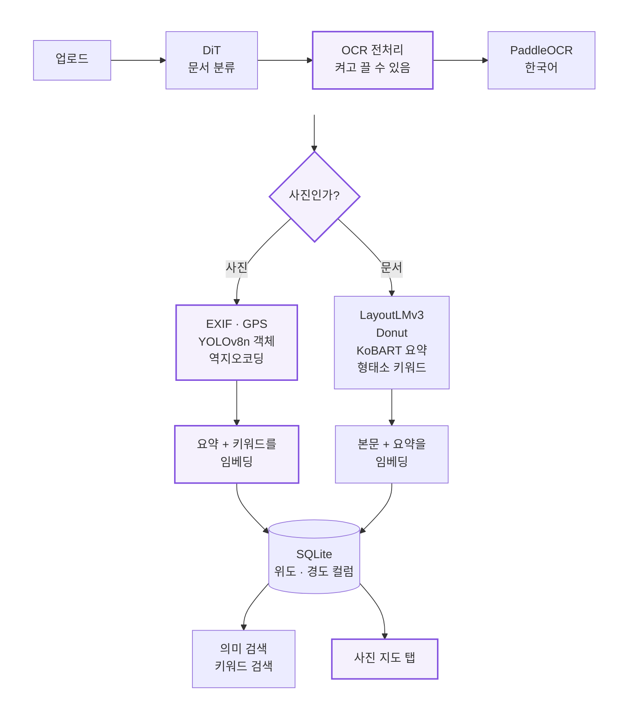
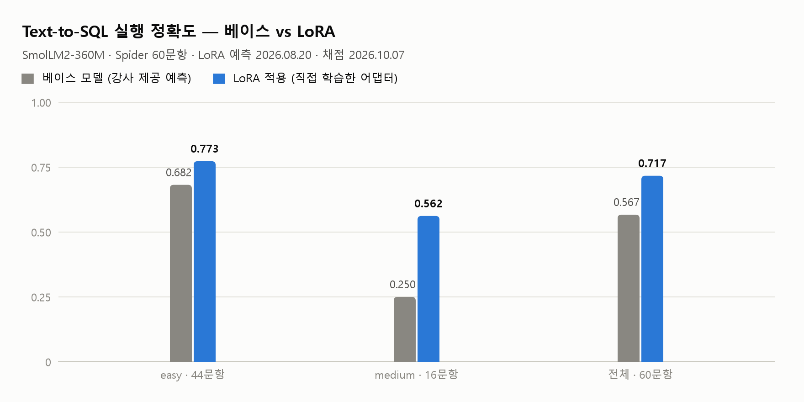
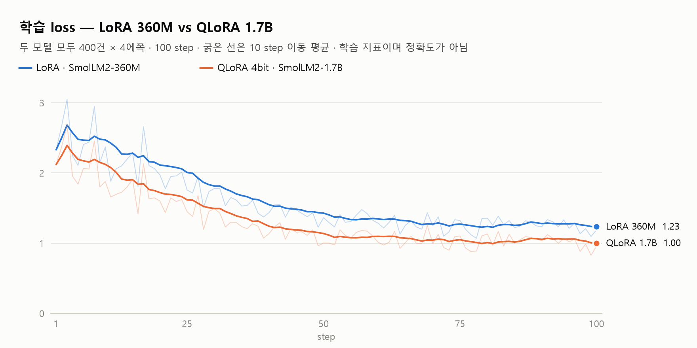
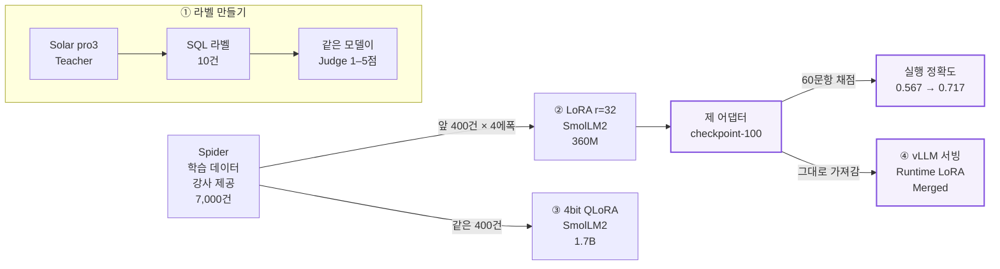
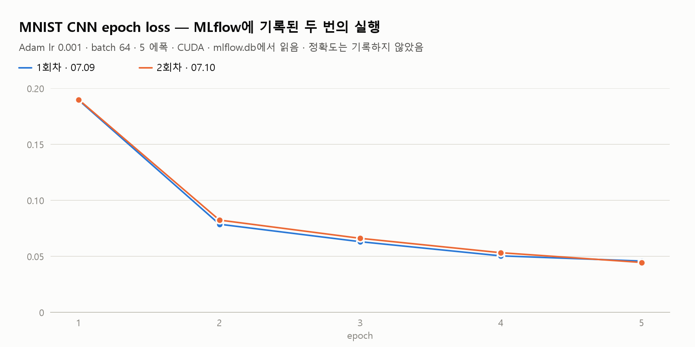

<div align="center">

# 🧪 한동인 · AI 포트폴리오

**AI 모델을 화면 기능으로 엮고, 그 결과를 다시 재 보는 프론트엔드 개발자**<br/>
<sub>삼성청년SW·AI아카데미(SSAFY) 15기 · 2026.07 – 08 · 개인 실습</sub>

<a href="./README.md">← 메인 포트폴리오</a> · <a href="#user-content-glance">역량 한눈에</a> · <a href="#user-content-integrate">🧩 통합</a> · <a href="#user-content-verify">🔬 검증</a> · <a href="#user-content-constraint">🔋 제약</a> · <a href="#user-content-frontend">프론트엔드로</a> · <a href="#user-content-retro">돌아보며</a> · <a href="#user-content-records">실습별 기록</a>

</div>

<br/>

프로젝트에서 AI 기능을 화면에 연결해 온 프론트엔드 개발자가, 7 · 8월 AI 실습에서 **모델을 직접 붙이고, 학습하고, vLLM으로 돌려 보고, 채점해 본** 기록입니다. 실습 순서가 아니라 **이 기록이 보여 주는 역량 세 가지**로 묶었습니다.

<a id="glance"></a>

## 🗂 역량 한눈에

| 역량 | 대표 근거 | 사례 |
|---|---|---|
| 🧩 **통합**<br/>모델을 화면 기능으로 엮습니다 | 쓰이지 않던 **CLIP을 검색에 연결** · OCR 글자 없는 **사진도 검색되게** 경로 분기 · **고친 문단만 다시 그리기** | 🛍 · 📄 · 📚 |
| 🔬 **검증**<br/>점수 대신 실물로 확인합니다 | LLM 채점 평균 4.6점인 라벨 중 스키마에 있는 이름만 쓴 것은 **4 / 10** · 강사 값 0.567을 먼저 재현한 뒤 제 어댑터를 **0.717**로 채점 · 벤치마크 배수를 조건별로 분해 <sub>(모두 2026.10.07, 실습 기록을 Claude Code와 함께 다시 열어서)</sub> | 🏷 ① · 🎯 ② · 🚀 ④ · ⚙️ |
| 🔋 **제약**<br/>작은 GPU에 맞춰 돌려 냅니다 | 6 GB 노트북 GPU에서 **1.7B QLoRA** 학습(5,915 / 6,141 MiB) · vLLM 시작 검사 실패를 **별도 프로세스 스크립트**로 넘겨 제 어댑터 실행 | 🚀 ④ · 🧊 ③ |

<sub>📄 📚 🛍는 7월 앱 3종, ⚙️는 7월 MLOps, 🏷 ① · 🎯 ② · 🧊 ③ · 🚀 ④는 8월 LLM 실습 네 개입니다. 실습별 기간 · 받은 것 · 제 몫은 맨 아래 <a href="#user-content-records">실습별 기록</a>에 있습니다.</sub>

<details>
<summary>📖 <b>읽는 법</b> — 제 몫 구분 · 숫자 출처 · 제출본과 작업 사본</summary>
<br/>

- **7월 앱 3종**은 기준 앱 위에 기능을 직접 더했고, **8월 노트북**은 제 GPU(RTX 4050 Laptop 6 GB)에서 돌려 실습끼리 이어 붙였습니다.
- 기능마다 **제 몫과 제공받은 몫을 나눠** 적었고, 숫자는 **제 실행 기록**(노트북 출력 · 체크포인트 · 로그 · MLflow DB · git 이력)에서만 가져왔습니다. 끝난 뒤 다시 잰 값에는 날짜를 붙였습니다.
- **제출본**은 SSAFY GitLab에 낸 저장소(비공개 · 요청 시 공개)이고, **작업 사본**은 제 PC에서 실제로 돌린 폴더입니다. 8월 숫자 중 LoRA 예측 · QLoRA 실행 출력 · `run_lora.log`는 작업 사본에 남아 있습니다.

</details>

> **용어** — **LoRA**는 원래 모델(**베이스 모델**)의 가중치는 그대로 두고, 덧붙인 작은 행렬(**어댑터**)만 학습하는 방법입니다. **QLoRA**는 베이스 모델을 4bit로 줄여 GPU에 올린 채 LoRA로 학습하는 방법입니다. **Text-to-SQL**은 자연어 질문을 SQL로 바꾸는 과제이고 **Spider**는 그 벤치마크이며, **실행 정확도**는 예측 SQL과 정답 SQL을 DB에서 실제로 돌려 결과가 같은 비율입니다. 학습 표의 **토큰 정확도**는 학습 중 정답 토큰을 그대로 예측한 비율이라 실행 정확도와 다릅니다. **vLLM**은 LLM을 빠르게 돌리는 추론 엔진입니다.

<br/>

---

<a id="integrate"></a>

## 🧩 통합 — 모델을 화면 기능으로 엮습니다

7월 실습은 문서 · 이미지 · 텍스트 모델을 붙여 둔 **완성형 기준 앱** 위에 기능을 더하는 과제였습니다. 앱마다 커밋을 거의 한 번에 몰아 해 중간 과정은 이력에 남지 않았고, **실행 화면 · DB · 결과물도 남기지 않았습니다**(→ [돌아보며](#user-content-retro)). 그래서 앱 3종은 실행 결과 대신 **무엇을 왜 그렇게 만들었는지**를 코드로 보여 드립니다.

<sub>코드는 저장소에서 발췌해 간추렸고, 주석 일부는 설명을 위해 붙였습니다.</sub>

<a id="shopping"></a>

### 🛍 쓰이지 않던 CLIP을 검색에 연결하기 — AI 쇼핑 어시스턴트

> **불러오기만 하고 쓰지 않던 CLIP을 검색에 연결하고, "5만원 이하"를 알아듣게 했습니다.**

패션 사진에서 옷을 탐지(DeepFashion2 YOLO)해 네이버 쇼핑에서 검색하고, 벡터 DB(ChromaDB)에서 꺼낸 상품 정보를 한국어 LLM 답변에 넣어(RAG) 추천하는 Gradio 앱입니다.

**제가 만든 것**
- **CLIP 이미지 유사 검색** — 기준 앱은 CLIP 모델을 불러오고 특징 추출 함수를 정의만 했을 뿐 **한 번도 호출하지 않았습니다.** 텍스트 검색으로 받은 상품의 이미지를 CLIP 벡터로 저장해 두고, 올린 사진과 비슷한 상품을 그중에서 찾아 텍스트 검색 결과와 합칩니다. 텍스트 임베딩(768차원)과 CLIP(512차원)은 차원이 달라 **컬렉션을 따로 두고 코사인 거리**를 썼습니다.
- **옷 색상 → 검색어** — 탐지한 옷 영역을 50×50으로 줄여 k-means(k=3)로 가장 큰 색 덩어리를 고르고, HSV로 바꿔 **무채색(검정 · 흰색 · 회색)을 먼저 판정**한 뒤 색조 구간으로 이름을 붙입니다. 검색어 앞에 색 이름이 붙어 '빨간 short_sleeved_shirt'처럼 됩니다(옷 종류는 모델의 영어 클래스명 그대로).
- **자연어 예산 필터** — "5만원 이하", "3~5만원", "10만원 이상", "더 저렴한 거"를 정규식으로 읽고 가격순으로 거릅니다. "더 저렴한 거"는 **직전 검색 결과의 평균가**를 기준으로 삼아, 대화의 앞뒤가 이어지게 했습니다.
- **의도 나누기와 기준 앱 버그** — "비슷한 거"류 요청은 LLM을 부르지 않고 이미지 검색으로 안내하고, 빈 메시지에서 출력 두 개 중 하나만 돌려주던 버그를 고쳤습니다.

<details>
<summary><b>코드 · 차원이 다른 이미지 벡터는 컬렉션을 나눠서</b></summary>

```python
# 쇼핑 어시스턴트 app.py (발췌)
# 텍스트(768차원)와 이미지(512차원) 차원이 다르므로 별도 컬렉션 사용
image_client = chromadb.PersistentClient(path="./chroma_db_images")
image_vectorstore = image_client.get_or_create_collection(
    name="product_images", metadata={"hnsw:space": "cosine"}
)

def save_products_with_clip_vectors(products):
    for product in products:
        if not has_valid_image_url(product):   # 더미 상품의 placeholder 이미지는 건너뜀
            continue
        image = download_and_preprocess_image(product['image'])   # timeout 5초 · 224px
        embeddings.append(extract_clip_features(image).flatten().tolist())
        ...
    image_vectorstore.upsert(embeddings=embeddings, metadatas=metadatas, ids=ids)
```

</details>

**아쉬운 점**
- **거르지 못했는데 걸렀다고 안내했습니다.** 조건에 맞는 상품이 하나도 없으면 거르기 전 목록을 그대로 돌려주면서, 안내문은 "50,000원 이하의 상품을 저렴한 순으로 정리했습니다"라고 말했습니다. 사용자는 예산을 넘는 상품을 예산 안의 상품으로 믿게 됩니다.
- **예산 파서가 읽게 하려던 말을 못 읽었습니다.** 함수를 떼어 실행해 보니(2026.10.07) "3만원에서 5만원" · "3만원부터 5만원까지"가 범위가 아니라 **"3만원 이하"**로 읽혔습니다. 범위 정규식 `[~부터에서\-]`에 '에서' · '부터'를 넣었지만, 한 글자씩만 맞추는 문자 집합이라 두 글자 단어를 잡지 못했습니다. 읽게 하려던 문장을 테스트로 남겼다면 바로 잡혔을 일입니다.

`Gradio` `YOLOv8 (DeepFashion2)` `CLIP ViT-B/32` `ChromaDB` `LangChain` `Bllossom 3B` `ko-sroberta` `OpenCV` `네이버 쇼핑 API`

<br/>

<a id="archive"></a>

### 📄 글자 없는 사진도 찾게 경로 나누기 — AI 문서 아카이브

> **문서만 받던 보관함에 사진 길을 따로 내, OCR 글자가 없어도 검색되게 했습니다.**

문서 이미지를 올리면 **분류 → OCR → 구조화 → 요약 → 키워드 → 임베딩**을 거쳐 SQLite에 보관하고, 의미 검색과 키워드 검색으로 다시 찾는 Streamlit 앱입니다.



<sub>보라 테두리가 제가 더한 부분입니다. 위도 · 경도 컬럼과 형태소 키워드도 제가 더했고, 분류 · OCR · LayoutLMv3 · Donut · 요약 · 임베딩 · 검색의 뼈대는 기준 앱에 있었습니다.</sub>

**제가 만든 것**
- **사진 분기** — EXIF에 카메라 · 촬영일 · GPS가 있거나 OCR 글자가 10자 미만이면 사진으로 보고, 문서용 모델(LayoutLMv3 · Donut · KoBART)을 건너뜁니다. 대신 EXIF · YOLOv8n 객체 · GPS 역지오코딩 주소로 **요약과 키워드를 만들어 그것을 임베딩**합니다. 사진에는 OCR 본문이 없으니, 이렇게 해야 사진도 의미 검색에 걸립니다.
- **위치를 데이터로** — GPS를 도분초에서 십진수로 바꿔 DB의 위도 · 경도 컬럼에 저장하고, 저장된 사진을 지도 한 장에 모아 보는 **'사진 지도' 탭**을 더했습니다.
- **OCR 전처리** — 그레이스케일 → 노이즈 제거 → 대비 개선(CLAHE) → 기울기 보정 → 적응형 이진화. 기울기는 **0.5–15°일 때만** 돌려 과보정을 막았고, 전처리는 **체크박스로 켜고 끄며 원본과 나란히 비교**할 수 있게 했습니다.
- **키워드 추출** — 공백으로 자르고 불용어를 빼던 방식을 **형태소 분석(Okt) 명사 + 이어진 명사로 만든 복합명사 + 빈도 순위**(TfidfVectorizer를 썼지만 문서 한 장으로 계산해 사실상 단어 빈도)로 바꾸고, 구조화 결과에서 키워드로 넣는 항목을 기준 앱의 store · date에서 LayoutLMv3 결과의 상호명 · 날짜 · 제목까지 넓혔습니다.
- **없는 라이브러리는 기능만 끄기** — konlpy · ultralytics · folium 등을 불러오지 못해도 앱은 뜨고, 그 기능만 꺼지게 플래그를 뒀습니다.

<details>
<summary><b>코드 · 사진은 만든 요약과 키워드로 임베딩</b></summary>

```python
# 문서 아카이브 app.py (발췌)
def is_photo(image, doc_type, content):
    exif = read_exif_data(image)
    if exif.get('camera_info') or exif.get('taken_date') or exif.get('gps_info'):
        return True
    return len(content.strip() if content else "") < 10   # OCR 글자가 거의 없으면 사진

# process_document() 안
if is_photo(image, doc_type, content):
    metadata = extract_photo_metadata(image)           # EXIF · GPS → 위도 · 경도
    objects = detect_photo_objects(image, yolo_model)  # YOLOv8n 객체 이름
    keywords = ", ".join(generate_photo_keywords(metadata, objects))  # 역지오코딩 주소 포함
    summary = create_photo_summary(objects, metadata)
    # 사진에는 OCR 본문이 없으므로, 만든 요약 + 키워드를 임베딩해 의미 검색에 걸리게 한다
    embedding = create_embedding(summary + " " + keywords, embedding_model)
```

</details>

**아쉬운 점**
- **새 의존성을 requirements.txt에 적지 않았습니다.** 다른 PC에서는 EXIF · GPS · 객체 정보가 **경고 없이 빠져** 사진이 '일반 사진'으로만 저장되고, 키워드도 공백 분리로 조용히 돌아갑니다(지도 탭만 설치 안내를 띄움). 실패를 막으려고 둔 장치가 실패를 가린 셈입니다.

`Streamlit` `PaddleOCR` `DiT` `LayoutLMv3` `Donut` `KoBART` `ko-sroberta` `YOLOv8n` `OpenCV` `konlpy` `folium` `SQLModel`

<br/>

<a id="storybook"></a>

### 📚 고친 문단만 다시 그리기 — AI 스토리북

> **이야기를 문단 단위로 나눠, 글을 고친 문단의 그림만 다시 그리게 했습니다.**

한국어 LLM이 다섯 문단짜리 이야기를 쓰고, 문단마다 Stable Diffusion으로 삽화를 그려 PDF로 묶는 Gradio 앱입니다. 저는 테마를 **우주 SF**로 바꾸고, **문단(챕터) 단위 편집**을 만들었습니다.

**제가 만든 것**
- **문단 단위 저장과 편집** — 이야기를 통째로만 저장하던 구조에 `StoryChapter` 테이블을 더해 문단마다 본문 · 그림 경로 · **'다시 그려야 함' 플래그**를 두었습니다. 문단마다 편집 칸과 '수정 & 이미지 재생성' 버튼을 붙여 **고친 문단의 그림만** 그 자리에서 다시 그립니다. 스토리북을 만들 때는 플래그가 켜졌거나 그림 파일이 없는 문단만 그리고, 나머지는 저장된 그림을 씁니다.
- **우주 SF로 테마 전환** — 기준 앱에 있던 주인공 고정 장치(LLM 지칭 규칙 · 고정 캐릭터 문구 · 문단별 고정 seed)를 우주 탐험가(`young astronaut explorer wearing white space suit…`)로 바꾸고, 그림 프롬프트에 **화풍 접미사**(`sci-fi concept art, …`)를 더하고, 기준 앱의 네거티브 프롬프트에 화질 · 변형 관련 항목을 늘렸습니다.
- **기준 앱 버그 세 개** — ① 장면 분석에 문단 번호를 넘기지 않아 기본 장면이 늘 1문단용이던 것, ② 캐시 키가 글만 봐서 문단이 달라도 같은 그림이 나올 수 있던 것, ③ 캐시 기록은 있는데 파일이 지워졌을 때를 확인하지 않던 것을 고쳤습니다.

<details>
<summary><b>코드 · 플래그가 켜진 문단만 다시 그리기</b></summary>

```python
# 스토리북 app.py (발췌)
class StoryChapter(SQLModel, table=True):
    story_id: int = Field(index=True, foreign_key="story.id")
    chapter_num: int
    content: str
    image_path: Optional[str] = None
    needs_regeneration: bool = True     # 문단을 고치면 True로

def create_storybook(story_id):
    for ch in get_chapters(story_id):
        if ch.needs_regeneration or not ch.image_path or not os.path.exists(ch.image_path):
            img_path = generate_image(ch.content, ch.chapter_num, force=ch.needs_regeneration)
            ...  # 그린 뒤 플래그를 끄고 경로를 저장
        else:
            img_path = ch.image_path    # 고치지 않은 문단은 그대로 쓴다
```

</details>

**아쉬운 점**
- **한글 폰트가 없으면 Helvetica로 넘어가 PDF의 한글이 깨집니다.** 폴백이 오류를 막는 대신 깨진 결과를 내는 구조였습니다.

`Gradio` `Bllossom 5B` `diffusers` `DreamShaper 8` `ReportLab` `SQLModel`

<br/>

---

<a id="verify"></a>

## 🔬 검증 — 점수 대신 실물로 확인합니다

7 · 8월 실습 기록을 포트폴리오로 정리하며(2026.10.07) Claude Code와 함께 다시 열어, 점수와 수치를 실물과 대조했습니다. 실습 당시가 아니라 정리하면서 한 일이라 날짜를 붙였고, 실습 중에 놓친 것은 놓쳤다고 적었습니다.

<a id="label"></a>

### 🏷 ① LLM 채점 4.6점을 스키마와 대조하기

> **Judge 평균은 4.6점이었지만, 스키마에 있는 이름만 쓴 쿼리는 10건 중 4건이었습니다.**

큰 모델(Upstage `solar-pro3`)을 **Teacher**로 써서 Spider 질문 10건에 SQL 라벨과 풀이를 만들고, 같은 모델을 **Judge**로 써서 1–5점과 비평을 매겼습니다. 생성과 채점은 기준 코드로 돌렸고, Judge 출력은 기준 코드에서 strict JSON schema · temperature 0 · seed 42로 고정돼 있었습니다.

**스키마와 대조해 보니** <sub>2026.10.07 · 저장된 라벨 10건을 Spider `tables.json`의 실제 스키마와 하나씩 대조</sub>

| 라벨 SQL | 건수 | Judge 점수 |
|---|---|---|
| 실제 테이블 · 컬럼만 씀 | 4 | 5 · 5 · 5 · 5 |
| 없는 컬럼 · 테이블을 씀 | 6 | **5 · 5** · 4 · 4 · 4 · 4 |

- 없는 것을 쓴 예: `budget`(실제는 `Budget_in_Billions`), `Rank`(실제는 `Ranking`), `head.Acting`, 존재하지 않는 `acting` · `employee` 테이블.
- Judge는 4점을 준 쿼리에서 "스키마를 확인하지 않고 컬럼명을 가정했다"고 일부 짚었지만, **두 건은 5점으로 통과시켰습니다.**
- 원인은 생성 프롬프트와 채점 프롬프트 **둘 다 스키마를 받지 못했고**, 실제로 실행해 보는 단계가 없었다는 데 있습니다. 같은 모델이 쓰고 같은 모델이 채점한 것도 한계입니다.
- **다음엔** 스키마를 프롬프트에 넣고, 점수를 매기기 전에 **SQLite에서 먼저 실행해 보는 검증**을 Judge 앞에 두겠습니다. 점수는 실행을 통과한 것끼리 비교할 때 의미가 있습니다.

<details>
<summary><b>같은 실습에서 고친 것 · 흔들리는 LLM 출력을 받아 내는 JSON 파서</b></summary>
<br/>

- **JSON 파서** — 실습 앞부분의 JSON 응답 예제에서, 기준 코드는 ```` ```json ```` 표시를 찾는 방식이라 코드 블록 없이 JSON만 오면 예외가 나는 구조였습니다. 코드 블록(언어 표시 유무 무관)을 정규식으로 먼저 찾고, 없으면 첫 `{`부터 마지막 `}`까지 잘라 읽고, 그래도 없으면 원문을 담아 실패하게 바꿨습니다. 라벨 생성은 SQL 문자열을 그대로 받고 Judge는 `response_format`(JSON schema)으로 받아, 두 단계 모두 이 파서를 거치지 않습니다.
- **출력 언어 고정** — 제출본의 한 셀에는 추론형(reasoning) 모델이 영어 독백만 남기고 답을 맺지 못한 출력이 남아 있습니다. 작업 사본에서는 프롬프트 앞에 "한국어로"를 붙여 출력 언어를 고정했고, 한국어 답을 받았습니다.

파서와 JSON schema가 잡아 주는 것은 **형식**까지입니다. 위 대조처럼 형식이 맞아도 내용은 틀릴 수 있어, 내용은 따로 검증해야 합니다.

```python
def json_parsing(output_text: str) -> dict:
    # 1) ```json ... ``` 또는 ``` ... ``` 코드 블록 우선 추출
    match = re.search(r"```(?:json)?\s*(.*?)\s*```", output_text, re.DOTALL)
    if match:
        output_text = match.group(1)
    else:
        # 2) 코드 블록이 없으면 첫 '{' ~ 마지막 '}' 구간 추출
        start, end = output_text.find("{"), output_text.rfind("}")
        if start == -1 or end == -1:
            raise ValueError(f"JSON을 찾을 수 없습니다:\n{output_text}")
        output_text = output_text[start:end + 1]
    return json.loads(output_text)
```

</details>

`Upstage Solar` `OpenAI SDK` `JSON Schema` `LLM-as-a-Judge`

<br/>

<a id="lora"></a>

### 🎯 ② 평가 환경부터 맞추고, 제 어댑터를 다시 채점하기

> **강사 값 0.567을 먼저 재현해 평가 환경을 확인한 뒤, 제 어댑터를 같은 조건으로 채점했습니다. 60문항 중 맞힌 쿼리가 34개에서 43개로 늘었습니다.**

`HuggingFaceTB/SmolLM2-360M-Instruct`에 LoRA를 붙여 자연어 질문을 SQL로 바꾸도록 학습하고, Spider test-suite로 **실행 정확도**를 쟀습니다.

**제가 한 것** — 안내대로 평가용 **test-suite DB 28개(Spider 20 · 다른 벤치마크 8)를 받아 평가 경로에 배치하고**, LoRA를 학습하고, `inference.py`로 60문항을 추론했습니다. 이 어댑터를 ④ vLLM 실습에 그대로 가져갔습니다. 코드와 하이퍼파라미터는 노트북 그대로 썼습니다.

<picture>
  <source media="(prefers-color-scheme: dark)" srcset="./assets/ai-text2sql-accuracy-dark.png"/>
  
</picture>

| 실행 정확도 (60문항) | easy (44) | medium (16) | 전체 |
|---|---|---|---|
| 베이스 SmolLM2-360M <sub>(강사 제공 예측)</sub> | 0.682 | 0.250 | **0.567** (34문항) |
| **LoRA 적용(제 어댑터)** | **0.773** | **0.562** | **0.717** (43문항) |

<sub>LoRA 예측은 08.20에 만들었고, 채점은 포트폴리오를 정리하며(2026.10.07) 강사 노트북과 같은 조건(Spider test-suite 실행 정확도, SQL 속 값은 정답에서 끼워 넣는 `--plug_value`)으로 돌렸습니다. 8월 당시의 채점 기록은 남아 있지 않습니다. 베이스 쪽 예측은 강사가 준 `base_model_predict.txt`를 그대로 썼고, 제가 배치한 DB로 다시 채점한 값이 강사 노트북의 0.567과 같아 평가 환경이 맞음을 확인했습니다. LoRA 학습 파라미터 17,367,040개는 베이스 361,821,120개의 4.8%입니다.</sub>

<details>
<summary><b>학습 설정과 loss</b></summary>

| 항목 | 값 |
|---|---|
| LoRA | r=32 · alpha=64 · dropout 0 · q/k/v/o/gate/up/down_proj 7곳 |
| 학습 | 100 step · batch 4 × 누적 4(유효 16) · lr 2e-5 linear · bf16 · seed 42 |
| 데이터 | 7,000건 중 앞 400건을 4에폭 · 프롬프트 부분은 라벨 −100으로 가려 답(SQL)만 학습 |

| step | 1 | 25 | 50 | 75 | 100 |
|---|---|---|---|---|---|
| loss | 2.33 | 1.75 | 1.36 | 1.32 | 1.19 |
| 토큰 정확도 | 0.627 | 0.634 | 0.683 | 0.686 | 0.711 |

<sub>출처: `outputs/checkpoint-100/trainer_state.json`</sub>

</details>

**무엇이 달라졌나** <sub>(정답 · 베이스 · LoRA 순)</sub>

```sql
-- 문항 #44 · 템플릿별 문서 수
정답  : SELECT template_id, count(*) FROM Documents GROUP BY template_id
베이스: CREATE TABLE template_ids ( template_id INT PRIMARY KEY, ... INSERT INTO documents ...  -- 질의 대신 테이블을 만듦
LoRA  : SELECT template_id, COUNT(*) FROM documents GROUP BY template_id

-- 문항 #0 · 20살 넘는 가수의 국가
정답  : SELECT DISTINCT country FROM singer WHERE age > 20
베이스: SELECT COUNT(*) FROM singers WHERE age > 20 AND country = 'Country Name'
LoRA  : SELECT country FROM singer WHERE age > 20
```

**아쉬운 점**
- **표본이 작고, 프롬프트에 스키마가 없습니다.** 7,000건 중 400건을 보수적인 학습률(2e-5)로 100 step만 학습했고, 평가셋도 60문항이라 0.15 차이를 일반화하기엔 작습니다. 스키마 없이 테이블 이름을 추측해, 베이스가 맞힌 문항을 LoRA가 틀리기도 했습니다(맞던 `airports`를 없는 `airport`로 바꾼 #10 등).

`Transformers` `PEFT (LoRA)` `TRL SFTTrainer` `Spider test-suite`

<br/>

<a id="bench"></a>

### 🚀 ④ 벤치마크 배수를 조건별로 뜯어보기

> **노트북이 낸 '10.7배'를 그대로 쓰지 않고, 두 쪽이 무엇을 같게 쟀고 무엇을 다르게 쟀는지부터 확인했습니다.**

노트북의 측정 코드로 HF Transformers와 vLLM의 생성 속도를 비교했습니다. 포트폴리오를 정리하며(2026.10.07) 측정 코드를 다시 읽어 보니, 두 쪽은 같은 조건이 아니었습니다. ④ 실습에서 무엇을 돌렸는지는 아래 <a href="#user-content-vllm">🔋 제약 ④</a>에 있습니다.

| HF Transformers ↔ vLLM (프롬프트 5개 · 64토큰 · greedy) | HF | vLLM |
|---|---|---|
| 생성 처리량 | 25.56 토큰/s | 272.50 토큰/s |
| 전체 시간 | 4.58초 | 0.51초 |
| 첫 토큰까지 | 109.9 ms | 156.5 ms |

- **배치** — HF는 프롬프트를 하나씩 처리하고 vLLM은 다섯 개를 한 번에 처리해, 배치 효과가 섞여 있습니다.
- **모델** — HF는 어댑터 없는 베이스(fp16), vLLM은 제 어댑터를 합친 모델(bf16)이라 다릅니다.
- **토큰 수** — 생성한 토큰 수도 HF 약 117개, vLLM 약 139개로 달랐고(상한 5 × 64 = 320), HF 시간에는 첫 토큰을 재려고 따로 돌린 forward 5번이 들어 있습니다.
- **첫 토큰** — HF는 forward 한 번, vLLM은 프롬프트 하나를 끝까지 생성한 시간이라 같은 것을 재지 않았습니다.
- **편차** — 같은 날(16:21) 다시 돌린 실행에서는 12.5배가 나와, 두 번 사이 편차도 컸습니다.

그래서 처리량 10.7배 · 시간 9.0배는 참고로만 씁니다. <sub>메모리는 vLLM 엔진이 떠 있는 채로 장치 전체를 재서 비교에서 뺐습니다. vLLM의 KV 캐시는 3.33 GiB(87,168토큰)였습니다.</sub>

**아쉬운 점**
- 실습 당시에는 벤치마크 수치를 받아 들고 **측정 조건이 같은지 확인하지 않았습니다.** 같은 배치 크기 · 같은 정밀도 · 워밍업 후 반복 측정으로 다시 재야 "몇 배"라고 말할 수 있습니다.

<br/>

<a id="mlops"></a>

### ⚙️ 학습 기록과 서빙이 서로 다른 모델을 가리키고 있었다 — MLOps

> **MLflow로 학습 · 등록한 모델과 BentoML이 올린 모델이 달랐는데, 실습 당시에는 알아차리지 못했습니다.**

강사가 준 MLOps 스켈레톤(MLflow · BentoML · DVC · Prometheus · Grafana · docker-compose · EC2 배포 스크립트)에서 **코드는 바꾸지 않았고**, 로컬 MLflow 추적 서버(SQLite 백엔드)를 띄워 MNIST CNN을 GPU로 두 번 학습하고 모델 레지스트리에 등록했습니다. BentoML 서버도 띄워 봤습니다. 실행 기록은 맨 아래 <a href="#user-content-records">실습별 기록</a>에 있습니다. 기록을 다시 열어 보니 이랬습니다.

- **레지스트리와 서빙이 이어져 있지 않았습니다.** 07.09에 띄운 BentoML 서버가 올린 `model.pt`는 레지스트리의 ConvNet이 아니라 **학습되지 않은 다른 모델**(SimpleNet)이었습니다. 마지막 실행의 요청 집계에 예측 호출은 0건이고, 당시에는 알아차리지 못했습니다. 버전을 붙이는 것과 그 버전을 실제로 서빙하는 것은 별개의 연결이라는 걸 돌아보며 알았습니다.
- **loss만 남고 정확도는 없습니다.** 스켈레톤이 정확도를 기록하지 않았고, 저도 테스트셋 평가를 더하지 않았습니다. `train_metrics.json`의 정확도 0.92는 코드에 박힌 상수라 쓰지 않았습니다.

`MLflow` `PyTorch` `BentoML` <sub>· 스켈레톤의 DVC · Prometheus · Grafana · Docker Compose · EC2 배포는 실행 기록 없음</sub>

<br/>

---

<a id="constraint"></a>

## 🔋 제약 — 작은 GPU에 맞춰 돌려 냅니다

8월 노트북은 빈칸 없는 **참고 코드**였고, 강사가 2026.02에 돌린 출력이 들어 있었습니다. 저는 그것을 노트북 GPU(RTX 4050 Laptop 6 GB)에서 직접 돌렸습니다. 막혀서 제가 손댄 곳은 vLLM 실행(④) 하나이고, QLoRA(③)는 노트북 설정 그대로 6 GB 안에서 돌았습니다(학습 직후 5,915 / 6,141 MiB).

<a id="vllm"></a>

### 🚀 ④ 제 어댑터를 vLLM에 올리고, 막힌 셀은 스크립트로

> **②에서 직접 학습한 어댑터를 vLLM에 올리고, 노트북 셀이 시작 검사에서 막히자 실행 스크립트로 따로 띄웠습니다.**

WSL에서 vLLM 0.13.0(LLM 추론 서버 엔진)으로 PagedAttention · KV 캐시를 실습하고, LoRA를 **Runtime LoRA**(요청마다 어댑터를 얹음)와 **Merged**(어댑터를 합친 새 모델) 두 방식으로 띄웠습니다. API 서버는 띄우지 않았고, 노트북과 스크립트에서 vLLM의 오프라인 엔진(`LLM` 클래스)으로 추론했습니다. HF와의 속도 비교는 <a href="#user-content-bench">🔬 검증 ④</a>에서 조건부터 따져 봤습니다.

**제가 한 것**
- **강사 어댑터 대신 제 어댑터** — 실습 폴더의 어댑터를 ②에서 학습한 `checkpoint-100`으로 바꿔 넣었습니다(파일 해시로 확인). 그래서 Runtime LoRA와 Merged 모두 제 어댑터로 돌렸습니다.
- **어댑터에 맞춰 베이스 모델을 고르는 스크립트** — 노트북에서 어댑터 자동 로드 셀이 **시작할 때 GPU 여유 메모리 검사**(여유 4.35 GiB < 설정 0.75 × 6 GiB = 4.5 GiB)에서 실패했습니다. 노트북 밖의 별도 프로세스(`run_lora.py`)로 같은 설정을 띄우니 통과했습니다(`max_model_len`은 2048로 지정). 어댑터 가중치 헤더에서 **LoRA rank와 hidden size를 읽어** 베이스 모델(135M · 360M · 1.7B)을 고르고, `max_lora_rank`도 어댑터에 맞춥니다. 실행 확인은 360M 어댑터로 했습니다.

<details>
<summary><b>코드 · 어댑터 헤더에서 rank와 베이스 모델 판별</b></summary>

```python
# 4. skeleton04/run_lora.py (발췌)
with safe_open(weight_file, framework="pt") as f:
    key = next(k for k in f.keys() if "q_proj.lora_A" in k)
    rank, hidden = f.get_slice(key).get_shape()   # lora_A: (rank, hidden)

base_model_name = {
    576:  "HuggingFaceTB/SmolLM2-135M-Instruct",
    960:  "HuggingFaceTB/SmolLM2-360M-Instruct",
    2048: "HuggingFaceTB/SmolLM2-1.7B-Instruct",
}[hidden]

llm = LLM(model=base_model_name, enable_lora=True,
          max_lora_rank=max(int(rank), 16),
          gpu_memory_utilization=0.75, max_model_len=2048, enforce_eager=True)
outputs = llm.chat(messages, SamplingParams(max_tokens=256, temperature=0.0),
                   lora_request=LoRARequest("skeleton02", 1, lora_adapter_dir))
```

```text
# run_lora.log (08.19 16:17)
adapter rank=32, base=HuggingFaceTB/SmolLM2-360M-Instruct
SELECT name FROM employees WHERE age > 30
```

</details>

`vLLM 0.13` `PagedAttention` `LoRARequest` `PEFT merge_and_unload` `WSL`

<br/>

<a id="qlora"></a>

### 🧊 ③ 1.7B 모델을 6 GB 노트북 GPU에서 QLoRA로 학습하기

> **4.7배 큰 모델을 4bit로 줄여, 같은 6 GB GPU에서 같은 데이터로 학습을 끝냈습니다.**

`HuggingFaceTB/SmolLM2-1.7B-Instruct`를 bitsandbytes로 **4bit(NF4 + 이중 양자화, 계산은 bf16)** 불러와 LoRA(r=16 · alpha=32, 학습 파라미터 18,087,936개)를 붙였습니다. 데이터와 step 수는 ②와 같습니다(400건 × 4에폭, 100 step).

**제가 한 것** — 제 GPU에서 학습을 돌려 메모리 · 시간 · loss를 기록했습니다. 노트북 코드와 설정은 그대로 썼습니다.

| 항목 | 값 |
|---|---|
| 4bit 로드 직후 GPU 메모리 | **1,755 MiB** / 6,141 MiB |
| 학습 직후 GPU 메모리 | **5,915 MiB** / 6,141 MiB |
| 학습 시간 | **372.6초** (0.268 step/s · 4.29 샘플/s) |
| loss (구간 평균) | 2.121 (step 1–10) → 0.997 (step 91–100) |
| 토큰 정확도 (구간 평균) | 0.638 → 0.747 |
| 단건 추론 | 3.17초 · 8.84 토큰/s |

<sub>출처: 작업 사본 `QLoRA.ipynb`의 08.19 실행 출력과 `trainer_state.json`. 메모리는 nvidia-smi 장치 전체 사용량입니다.</sub>

<picture>
  <source media="(prefers-color-scheme: dark)" srcset="./assets/ai-training-loss-dark.png"/>
  
</picture>

<sub>두 어댑터의 `trainer_state.json`(step마다 기록된 loss 100개)에서 그렸습니다.</sub>

**아쉬운 점**
- **학습은 끝냈는데 채점을 못 했습니다.** ②에서 배치했던 평가 DB를 ③에서는 빠뜨려 베이스 모델 평가가 `unable to open database file`로 실패했고, 바로잡지 않은 채 학습으로 넘어가 학습 후 60문항 추론과 채점도 하지 않았습니다. 그래서 loss가 ②보다 낮게 끝났어도(마지막 10 step 평균 0.997 대 1.231) **SQL을 더 잘 맞히는지는 모릅니다.** 모델 크기와 rank(16 대 32)도 달라, loss끼리도 같은 조건의 비교는 아닙니다.

`bitsandbytes (NF4)` `PEFT (QLoRA)` `TRL` `Windows · CUDA`

<br/>

---

<a id="frontend"></a>

## 🖥 프론트엔드로 가져가는 것

- **바뀐 것만 다시 만듭니다.** 📚에서 문단마다 '다시 그려야 함' 플래그를 둬, 고친 문단의 그림만 다시 그렸습니다. 화면에서도 모델 호출 · 이미지 생성처럼 비싼 작업은 무엇이 바뀌면 다시 할지를 상태로 들고 있어야 합니다.
- **AI 결과는 화면에 올리기 전에 실물과 대조합니다.** 🏷 ①에서 형식을 JSON schema로 고정한 채점도 내용은 틀릴 수 있었습니다(4.6점 대 4 / 10). 화면에서도 응답 형식 검증과 내용 검증을 따로 둬야 합니다.
- **폴백했으면 폴백했다고 알립니다.** 🛍 예산 필터는 거르지 못한 목록을 걸렀다고 안내했습니다. 빈 결과는 빈 결과라고 말하는 화면이 맞습니다.
- **속도는 사용자가 체감하는 지표로 봅니다.** 🚀 ④에서 처리량과 첫 토큰 시간은 서로 다른 것을 쟀고, 배수는 조건에 따라 크게 흔들렸습니다. 채팅 화면이라면 처리량보다 첫 토큰이 뜨는 시간을 먼저 재겠습니다.

<br/>

---

<a id="retro"></a>

## 📈 돌아보며

✅ **잘한 점** — 받은 코드를 끝까지 이어 붙였습니다. 사례는 위 🧩 통합과 🔋 제약에 있습니다.

<sub>아래 셋은 메인 포트폴리오의 <a href="./README.md#user-content-principles">일하는 원칙</a>에 비춘 아쉬운 점입니다.</sub>

<details>
<summary>🔎 <b>사실만 말하기</b> — 폴백과 점수가 실패를 가렸다</summary>
<br/>

🛍 예산 폴백 · 📚 폰트 폴백 · 📄 기능 끄기 · 🏷 Judge 4.6점은 모두 **실패나 오류를 성공처럼 보이게** 했습니다. 잡싸피에서 음성 분석 실패를 예시 피드백으로 가린 것과 같은 모양이고, 쮸토피아에서 도구 결과와 맞지 않는 AI 숫자를 화면에 올리지 않은 것(목에서 검증)도 같은 원칙입니다.

</details>

<details>
<summary>🧯 <b>안 됐을 때를 먼저</b> — 학습은 끝까지, 채점은 못 한 채로</summary>
<br/>

🧊 평가 경로가 깨진 채 학습으로 넘어가 가장 큰 모델(1.7B)의 결과를 채점하지 못했고, 🚀 우회에 성공한 실행 로그(`run_lora.log`)는 `.gitignore`(`*.log`)에 걸리고 ② LoRA 예측은 작업 사본에만 남아, 둘 다 제출본에 들어가지 않았습니다. 평가 경로는 학습 전에 베이스 모델로 먼저 통과시키고, 실패와 우회는 함께 남겼어야 했습니다.

</details>

<details>
<summary>📏 <b>재서 판단하기</b> — 남긴 것만 다시 잴 수 있었다</summary>
<br/>

7월 앱 3종은 실행 결과를 남기지 않아 지금은 코드로만 설명할 수 있고, 8월은 예측 파일이 작업 사본에 남아 한 달 반 뒤에도 **0.567 → 0.717을 채점**할 수 있었습니다. ⚙️ MLOps는 loss만 남겨 정확도를 말할 수 없고, 🚀 vLLM은 조건이 다른 두 쪽을 비교한 배수라, 같은 날 두 번 잰 값끼리도 10.7배와 12.5배로 달랐습니다. 숫자만큼 **무엇을 어떤 조건으로 잰 숫자인지**를 함께 남겨야 했습니다.

</details>

**다음엔**
- LLM이 만든 결과는 **실행해 보는 검증을 먼저** 두고, 점수는 그다음에 매기겠습니다(라벨 · SQL 모두).
- 실험마다 **평가 지표를 학습 기록과 같은 자리에**(MLflow run 등) 남기고, 비교는 **같은 조건 · 반복 측정**으로 하겠습니다.
- 폴백은 사용자에게 **폴백했다고 알리고**, 파서가 읽어야 할 문장은 **테스트로 고정**하겠습니다.
- 결과물(예측 · 로그 · 채점 결과)은 제출본에서 빠지지 않게 **산출물 경로를 따로 정해 두겠습니다.**

<br/>

---

<a id="records"></a>

## 🗓 실습별 기록

<sub>실습 순서로 본 기간 · 제 몫 · 근거입니다. 7월 AI 서비스 실습은 2026.07.06 – 07.10, 8월 AI 특화 LLM 실습은 2026.08.18 – 08.21이었습니다.</sub>

| 실습 | 기간 | 제 몫 | 근거 |
|---|---|---|---|
| 📄 **AI 문서 아카이브** | 2026.07.06 – 07.09 | OCR 전처리 · 형태소 키워드 · **사진 분기**(EXIF · GPS · YOLO · 지도) 구현 | 기준 앱 대비 +611 / −318줄 |
| 📚 **AI 스토리북** | 2026.07.06 – 07.08 | **문단 단위 편집**과 고친 문단만 다시 그리기, 우주 SF 테마 전환 | 기준 앱 대비 +383 / −221줄 |
| 🛍 **AI 쇼핑 어시스턴트** | 2026.07.06 – 07.08 | 옷 **색상 인식** · 자연어 **예산 필터** · **CLIP 이미지 유사 검색** | 기준 앱 대비 +635 / −276줄 |
| ⚙️ **MLOps** | 2026.07.09 – 07.10 | MLflow로 학습 → 추적 → 레지스트리 등록, BentoML 서버 기동(코드 변경 없음) | epoch loss **0.19 → 0.045** · 2회 실행 |
| 🏷 **LLM 라벨 생성 · Judge** | 2026.08.19 | Teacher LLM으로 SQL 라벨 생성, LLM-as-a-Judge 채점, JSON 파서 보강 <sub>(생성 · 채점은 기준 코드)</sub> | Judge 평균 **4.6점** · 스키마에 있는 이름만 쓴 쿼리 **4 / 10** <sub>(10.07 대조)</sub> |
| 🎯 **LoRA Text-to-SQL** | 2026.08.19 – 08.20 | 360M 모델 LoRA 학습, 평가 DB 배치, 추론 <sub>(노트북 설정 그대로)</sub> | 실행 정확도 **0.567 → 0.717** <sub>(베이스 → 제 어댑터 · 10.07 채점)</sub> |
| 🧊 **QLoRA** | 2026.08.19 | 1.7B 모델을 4bit로 6 GB GPU에서 학습 <sub>(노트북 설정 그대로)</sub> | 학습 **373초** · GPU 메모리 **5,915 / 6,141 MiB** <sub>(장치 전체)</sub> |
| 🚀 **vLLM 서빙** | 2026.08.19 | **직접 학습한 어댑터**를 vLLM에 올리고, 어댑터에서 베이스 모델을 고르는 실행 스크립트 작성 | Runtime LoRA · Merged **두 방식**으로 추론 |

<sub>줄 수는 각 앱 메인 파일의 git diff 기준이며, 더한 줄과 지운 줄 모두 빈 줄 · 주석이 섞여 있습니다(빈 줄 · 공백 변경을 빼면 더한 줄은 위에서부터 553 · 340 · 528줄). 같은 주에 받은 MCP 서버 스켈레톤(FastMCP · 메모 · 할 일 · 통계 도구 11개)은 코드를 바꾸지도, 실행하지도 않아 본문에서 뺐습니다.</sub>

<details>
<summary>🗺 <b>8월 실습 흐름</b> — ① 라벨 · ② LoRA · ③ QLoRA · ④ vLLM이 어떻게 이어졌나</summary>
<br/>

제 몫은 참고 노트북을 **제 GPU에서 직접 돌리고**, 평가 DB를 받아 배치하고, **직접 학습한 ② 어댑터를 ④ vLLM 실습으로 가져가 추론까지** 이은 것입니다.



<sub>①의 라벨은 ②의 학습 데이터로 이어지지 않았습니다(학습에는 강사가 준 7,000건을 씀). 보라 테두리는 제가 이어 붙이거나 다시 잰 부분입니다. 제출본 노트북 일부에는 강사 출력이 그대로 남아 있어, 숫자는 작업 사본의 제 실행 출력 · 체크포인트 · 로그에서 가져왔습니다.</sub>

</details>

<details>
<summary>⚙️ <b>MLOps 실행 기록</b> — MLflow에 남은 두 번의 학습</summary>
<br/>

<picture>
  <source media="(prefers-color-scheme: dark)" srcset="./assets/ai-mlflow-loss-dark.png"/>
  
</picture>

| 실행 | 시각 | 소요 | epoch loss (1 → 5에폭) | 등록 버전 |
|---|---|---|---|---|
| 1회차 | 07.09 16:41 | 98초 | 0.189 → 0.079 → 0.063 → 0.050 → **0.046** | v1 · v2 |
| 2회차 | 07.10 14:08 | 88초 | 0.190 → 0.082 → 0.066 → 0.053 → **0.045** | v3 · v4 · `production` |

<sub>위 표와 그래프는 MLflow 기록(`mlflow.db`)을 읽은 값입니다. ConvNet(Conv 32 → Conv 64 → FC 128 → FC 10) · Adam lr 0.001 · batch 64 · 5에폭 · CUDA. 학습 한 번에 버전이 두 개씩 생기는 건 스켈레톤 설계(`log_model`의 자동 등록 + `register_model`)입니다. 실행 태그에 그 시점의 git 커밋(6e856b8 · f97d054)이 남아, 어떤 코드로 학습했는지 거슬러 갈 수 있습니다(두 커밋 사이에 MLOps 코드 변경은 없고, 학습 결과물만 더해졌습니다).</sub>

</details>

<br/>

## 🛠 사용 기술

| 분야 | 기술 | 쓴 곳 |
|---|---|---|
| LLM 학습 | Transformers · PEFT(LoRA · QLoRA) · TRL SFTTrainer · bitsandbytes | ② ③ |
| LLM 서빙 | vLLM(Runtime LoRA · Merged · PagedAttention) | ④ |
| LLM 활용 | Upstage Solar(OpenAI SDK 호환) · JSON Schema 출력 · LLM-as-a-Judge · LangChain · Bllossom | ① 🛍 📚 |
| 평가 | Spider test-suite(실행 정확도) | ② |
| 비전 · 문서 | PaddleOCR · DiT · LayoutLMv3 · Donut · YOLOv8 · CLIP · Stable Diffusion(DreamShaper) · OpenCV | 📄 🛍 📚 |
| 검색 | ko-sroberta 임베딩 · ChromaDB · konlpy | 📄 🛍 |
| MLOps | MLflow(추적 · 레지스트리) · BentoML(서버 기동까지) <sub>· DVC · Prometheus · Grafana는 스켈레톤에 있었지만 실행 기록 없음</sub> | ⚙️ |
| 앱 · 데이터 | Streamlit · Gradio · SQLModel · SQLite · ReportLab · folium | 📄 📚 🛍 |

<sub>2026.10.07 기준 · 저장소는 SSAFY GitLab 비공개(요청 시 공개)</sub>
