<div align="center">

<picture>
  <source media="(prefers-color-scheme: dark)" srcset="./assets/header-dark.svg"/>
  
</picture>

<br/>

<!-- ▼ 헤더 카드: 여기부터 -->
<table>
<tr>
<td align="center" width="50%">🎓 <b>수학 전공</b><br/><sub>삼성청년SW·AI아카데미(SSAFY) 15기 재학 중 · 2026.01 ~</sub></td>
<td align="center" width="50%">💻 <b>Frontend Developer</b><br/><sub>React · TypeScript · Vue.js</sub></td>
</tr>
<tr>
<td align="center">🏦 <b>핀테크 · 🤖 로봇 관제 · 💼 AI 취업 준비</b><br/><sub>SSAFY 프로젝트 3개</sub></td>
<td align="center">🔍 <b>프론트엔드 포지션을 찾고 있어요</b><br/><sub>편하게 연락 주세요</sub></td>
</tr>
</table>

<a href="mailto:d5353973@gmail.com"></a>
<a href="https://app.notion.com/p/3e91b429679f8183ae77c26eb318da9e"></a>

<sub>📂 프로젝트별 포트폴리오</sub><br/>
<a href="https://app.notion.com/p/3e91b429679f81728bb5ed4cedc72a62?source=copy_link"></a>
<a href="https://app.notion.com/p/SSACURITY-3e91b429679f814da3e4d88472095981?source=copy_link"></a>
<a href="https://app.notion.com/p/3e91b429679f81a8b22cf2e8cb2e0702?source=copy_link"></a>
<!-- ▲ 헤더 카드: 여기까지 -->

<br/>

<a href="#about"></a>
<a href="#stack"></a>
<a href="#zzutopia"></a>
<a href="#ssacurity"></a>
<a href="#jobssafy"></a>
<a href="#principles"></a>
<a href="#retro"></a>

</div>

<br/>

<a id="about"></a>

## 🙋 About Me

**화면이 사실만 말하게 만드는 프론트엔드 개발자**입니다. 받지 못한 데이터는 '기록 없음'으로, 실패는 실패로 보여 주고, 기준값은 근거를 남겨 정합니다.<br/>
가까이는 React · TypeScript 실무에서 로딩 · 실패 · 빈 데이터까지 책임지는 화면을 만들고, 길게는 서버 · AI 파트와 API 계약을 먼저 세워 팀 전체의 품질 기준을 만드는 개발자가 되려 합니다.

수학을 전공했고, **삼성청년SW·AI아카데미(SSAFY) 15기**(2026.01부터 12개월 · 총 1,725시간) 수료를 앞두고 있습니다.

ChatGPT가 등장해 사람들이 일하고 배우는 방식이 바뀌는 흐름을 보며, **바라보는 쪽이 아니라 그 흐름을 만드는 쪽에 서고 싶어** 개발을 시작했습니다.<br/>
그래서 첫 프로젝트부터 AI 파트를 맡았고, 이후에는 **AI가 실제 데이터와 일치하도록** 만드는 데 집중했습니다.

<br/>

### 💪 이런 방식으로 일합니다

| 강점 | 근거가 된 경험 |
|---|---|
| **🤝 협력** | 다른 파트에 보낼 요청은 번호 붙은 문안으로 관리하고, **보내기 전에 코드와 수치를 다시 재서** 이미 해결된 일을 요청하지 않았습니다. 팀원이 먼저 만든 해결책은 복사하지 않고 공용 함수로 빼서 함께 쓰게 했습니다. |
| **🧱 논리** | "FE는 도메인 수치를 계산하지 않는다" 같은 **불변 규칙 12개**를 세우고 eslint · 테스트로 강제했습니다. 라이브 시연 실패는 정상 주행 로그와 **대조 분석**해, 하드웨어가 아니라 끊긴 중립 명령이 로봇을 세웠다는 조건까지 좁혔습니다. |
| **🌱 학습** | 수학 전공에서 개발로 넘어와 Vue.js에 브라우저 음성 인식(Whisper)을 붙이는 것으로 시작했고, 로봇 관제 프로젝트의 검수 · 발표를 거쳐 React · TypeScript 핀테크 서비스의 프론트엔드를 혼자 맡기까지 **프로젝트마다 새 역할과 스택으로 결과를 냈습니다.** |
| **🙇 검증** | 테스트가 통과해도 믿지 않고 **가드를 일부러 되돌려 실패하는지 확인**합니다. 회고에서는 잘한 점만큼 아쉬운 점과 다음에 바꿀 점을 구체적으로 남깁니다. |

<br/>

## 🗂 한눈에 보기

<table>
<tr>
<td width="33%" valign="top">
<a href="#zzutopia"></a>
<p><b>🏦 쮸토피아</b><br/><sub>주주 우대 제도를 설계 · 운영하는 B2B SaaS</sub></p>
<p><sub>2026.08 – 09 · 프론트엔드 담당 · 7명 팀</sub></p>
<p>“실패는 실패라고, 모르는 숫자는 모른다고 말하는 화면”</p>
<p><sub>✅ 테스트 1,212개 통과<br/>✅ 프론트엔드 코드 88% 작성</sub></p>
</td>
<td width="33%" valign="top">
<a href="#ssacurity"></a>
<p><b>🤖 SSACURITY</b><br/><sub>셔틀 승강장 출입을 관제하는 무인 태깅 로봇</sub></p>
<p><sub>2026.07 – 08 · 프론트엔드 · 발표 · 6명 팀</sub></p>
<p>“보안 요원의 동선대로 써 보며 짚은 문제, 로그로 좁혀 간 시연 실패의 원인”</p>
<p><sub>✅ 거짓 경보 · 로그인 루프 짚어 전달<br/>✅ 시연 미출발 조건을 로그로 특정</sub></p>
</td>
<td width="33%" valign="top">
<a href="#jobssafy"></a>
<p><b>💼 잡싸피</b><br/><sub>SSAFY 교육생 AI 취업 준비 플랫폼</sub></p>
<p><sub>2026.05 – 06 · 팀장 · 프론트엔드 · 2명 팀</sub></p>
<p>“목소리가 브라우저 밖으로 나가지 않는 AI 면접 연습”</p>
<p><sub>✅ 음성 데이터 서버 전송 0건<br/>✅ 첫 화면 JS −73%</sub></p>
</td>
</tr>
</table>

<sub>그림을 누르면 아래 프로젝트 설명으로 갑니다 · 쮸토피아 화면의 회사와 수치는 목 데이터, SSACURITY 관제 화면은 팀 결과물(목 모드)입니다.</sub>

<br/>

<a id="stack"></a>

## 🛠 Tech Stack

<div align="center">

**Frontend**<br/><br/>
<picture>
  <source media="(prefers-color-scheme: dark)" srcset="https://skillicons.dev/icons?i=react,ts,vue,js,html,css,vite,tailwind&theme=dark"/>
  
</picture>

<br/>

**Backend · Tools**<br/><br/>
<picture>
  <source media="(prefers-color-scheme: dark)" srcset="https://skillicons.dev/icons?i=python,django,fastapi,git,gitlab,docker&theme=dark"/>
  
</picture>

<br/>

**Library · Test**<br/><br/>


</div>

<br/>

**숙련도와 쓴 곳** <sub>프로젝트에서 쓴 것만 · 숙련도는 5단계 자기 평가입니다.</sub>

| 분야 · 기술 | 숙련도 | 그걸로 한 일 |
|---|:---:|---|
| **프론트엔드**<br/>React 19 · TypeScript | ■■■■□ | 주주 웹과 IR 콘솔을 한 SPA로 만들고 프론트엔드 코드의 88%를 썼습니다. IR 콘솔은 지연 로딩으로 나눠 주주가 받지 않게 했습니다. <sub>쮸토피아</sub> |
| **프론트엔드**<br/>Vue 3 · Vue Router · Pinia | ■■■■□ | 로그인 여부를 전역 가드 한곳에서 판단하고, 화면 14개 중 12개를 지연 로딩해 첫 화면 JS를 73% 줄였습니다. <sub>잡싸피</sub> |
| **상태 · 데이터**<br/>TanStack Query · Zustand · Zod | ■■■□□ | 서버 값은 쿼리 캐시에, 화면에서만 생기는 값은 스토어 두 개에 나눠 담았습니다. 요청마다 기본 12초 상한과 재시도 규칙을 걸어 멈추는 대신 실패를 알리고, 제도 설계 입력은 Zod로 칸마다 검사합니다. <sub>쮸토피아</sub> |
| **목 · 테스트**<br/>MSW · Vitest · Testing Library · Playwright · axe-core | ■■■□□ | 백엔드보다 먼저 목 서버로 화면을 완성하고 경로 단위로 실서버에 옮겼습니다. 테스트 1,212개를 모두 통과시켰고, 손으로 쓴 타입 34쌍은 CI에서 서버 OpenAPI와 대조했습니다. <sub>쮸토피아</sub> |
| **온디바이스 AI**<br/>Transformers.js · Whisper | ■■■□□ | 음성 인식 모델을 브라우저 안에서 돌려, 음성을 서버로 보내지 않는 면접 연습을 만들었습니다(23.5초 답변 인식 3.2초). <sub>잡싸피</sub> |
| **백엔드(공동)**<br/>Python · Django REST Framework · django-filter | ■■■■□ | 커뮤니티 검색을 필드 성격에 맞춰 완전 일치 · 부분 일치 · 제목 + 본문 통합 검색으로 나눴습니다. <sub>잡싸피</sub> |

**🤖 AI 코딩 도구** — Claude Code와 함께 구현하되, 수정을 되돌려 테스트가 정말 깨지는지 보고 프리뷰 배포본과 실제 AI 서버에서 다시 확인했습니다. <sub>쮸토피아</sub>

<br/>

---

## 🚀 Projects

<a id="zzutopia"></a>

### 🏦 쮸토피아 — 주주 우대 제도를 설계 · 운영하는 B2B SaaS

   <a href="https://jjutopia.site"></a>

> **실패는 실패라고, 모르는 숫자는 모른다고 말하는 화면을 만들었습니다.**

발행사 IR 담당자가 법적 위험 없이 주주 우대 제도를 설계 · 검증 · 운영하고, 주주는 '보유 주식 수 × 보유 일수'로 쌓인 혜택을 확인하는 서비스입니다.<br/>
7명 팀에서 프론트엔드를 혼자 맡아 **주주 웹과 IR 콘솔을 한 SPA로** 만들었습니다. 백엔드보다 먼저 MSW 목 서버로 화면을 완성하고, 준비된 API부터 경로 단위로 실서버에 옮겼습니다.

<div align="center">


<sub>테스트: Vitest 898 + Playwright 314 · 주주가 받지 않는 콘솔 코드 38.4 KB(gzip) · axe serious·critical, E2E 24곳 검사 · 2026-09-28 기준</sub>

</div>

**핵심 성과**
- **멈추지 않고 실패를 말하는 화면** — 모든 요청에 기본 12초 상한을 걸어, API가 죽거나 답하지 않아도 카드마다 무엇을 못 불러왔는지 표시
- **백엔드를 기다리지 않는 개발** — 목에서 뺄 경로만 적는 `VITE_LIVE_API` 스위치를 만들어, 종료 시점까지 팀이 함께 핸들러 33개를 실서버로 이전
- **숫자를 지어낸 AI 답변 차단** — 본문 숫자를 서버 도구 결과와 대조해, 없는 숫자가 있으면 본문을 표시하지 않음(개인 수치 대조는 목에서만 검증)
- **모르는 날을 "0"이라 말하지 않기** — '적립' · '적립 없음'에 '기록 없음'을 세 번째 상태로 더하고, 회색 명도 대신 빗금으로 구분
- **타입 불일치를 CI가 잡게** — 서버 OpenAPI와 손으로 쓴 타입 34쌍을 `npm test`로 자동 대조

**화면**

<table>
<tr>
<td width="50%"><p align="center"><sub><b>주주 홈</b> · 승급 조건 두 가지(SP · 보유일수)를 따로 표시</sub></p></td>
<td width="50%">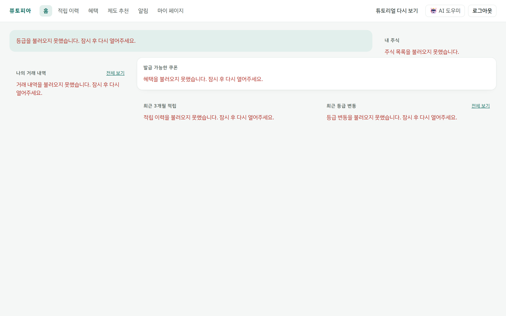<p align="center"><sub><b>API 장애 시 홈</b> · 멈추지 않고 카드마다 실패를 말함</sub></p></td>
</tr>
<tr>
<td width="50%">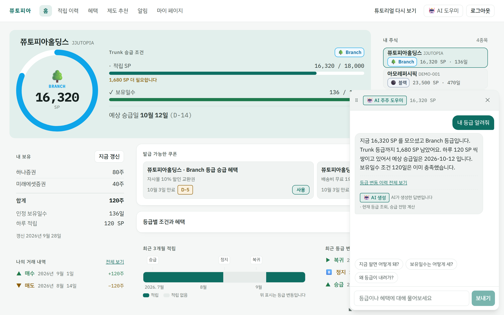<p align="center"><sub><b>AI 개인 수치 답변</b> · 도구 결과와 숫자가 같을 때만 표시</sub></p></td>
<td width="50%">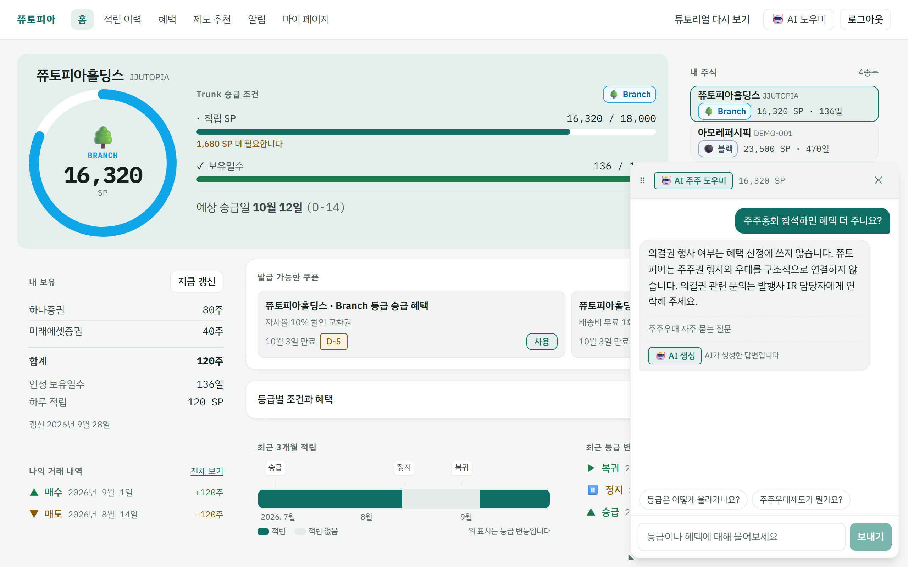<p align="center"><sub><b>AI 제도 지식 답변</b> · 근거 문서가 있을 때만 표시</sub></p></td>
</tr>
<tr>
<td width="50%"><p align="center"><sub><b>적립 이력 12개월</b> · 적립 없음(회색)과 기록 없음(빗금) 구분</sub></p></td>
<td width="50%">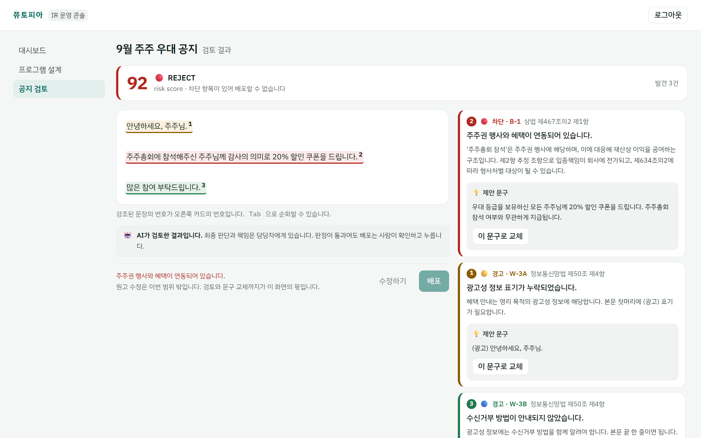<p align="center"><sub><b>공지 검토</b> · 차단 항목이 있으면 배포 잠금</sub></p></td>
</tr>
<tr>
<td width="50%">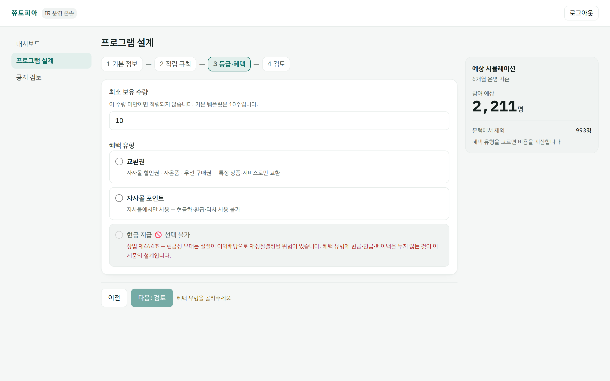<p align="center"><sub><b>제도 설계</b> · 현금 지급은 고를 수 없고 이유를 그 자리에서 표시</sub></p></td>
<td width="50%"></td>
</tr>
</table>

<sub>화면 속 회사와 수치는 모두 목 데이터입니다.</sub>

**기술 선택 이유**

| 기술 | 왜 이걸 골랐나 |
|---|---|
| TanStack Query | 화면의 도메인 수치를 전부 서버 값으로 쓰기로 했기 때문에, 서버 상태의 캐싱 · 재조회를 전담시킴 |
| Zustand | 서버 상태와 섞이지 않는 순수 클라이언트 상태만 가볍게 관리 |
| MSW | 백엔드보다 먼저 화면을 완성하고, 화면 코드를 바꾸지 않고 경로 단위로 실서버에 붙이기 위해 |
| Zod | 입력 형식 검증에만 사용. 법적 판단은 서버 컴플라이언스 API에만 맡기도록 역할을 분리 |
| Next.js 미사용 | 모든 화면이 세션 쿠키 뒤라 SSR로 얻을 검색 노출이 없고, 정적 배포 전제 · 서비스워커 기반 MSW와 맞지 않음 (ADR 기록) |

<details>
<summary><b>🏗 요청이 가는 길 (아키텍처)</b></summary>
<br/>

목 서버는 서비스워커라 앱 코드는 어느 경로가 목인지 모르고, `VITE_LIVE_API`에 적은 경로만 실서버로 나갑니다. 운영 빌드에는 목이 아예 없습니다.

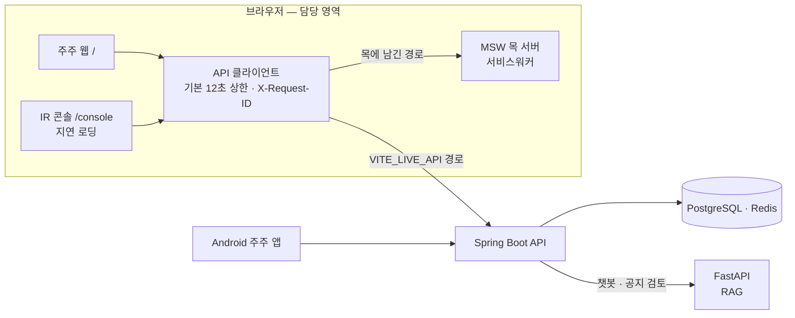

</details>

<details>
<summary><b>🔧 트러블슈팅 — 에러 화면을 다 만들고도 "불러오는 중…"에 멈춘 화면</b></summary>
<br/>

- **문제** 서버가 연결만 받고 답하지 않으면 홈 카드 6개가 30초 뒤에도 로딩. 에러 화면은 다 만들어 두었는데 한 번도 뜨지 않음
- **원인** `fetch`는 스스로 포기하지 않는데 요청에 시간 상한이 없었음. 같은 상태로 가는 다른 길인 TanStack Query 기본값 `networkMode: 'online'`(오프라인이면 쿼리를 `paused`로 묶음)은 목이 서비스워커라 첫 초안부터 `'always'`로 막아 둠
- **판단** 모든 요청에 기본 **12초 상한**(느린 네트워크 기준 3초의 4배 · E2E 대기 15초보다 짧게, LLM을 거치는 챗봇 경로만 30초). 끊긴 요청은 취소가 아니라 **실패**(`TimeoutError`)로 구분
- **결과** API가 죽거나 답하지 않아도 카드마다 실패를 말함. E2E가 앱보다 먼저 `fetch`를 바꿔 끼워 로딩 문구가 남지 않는지, 응답이 아예 없는 경우는 단위 테스트가 `TIMEOUT`으로 끊기는지 확인

```typescript
queries: { networkMode: 'always' },

export const REQUEST_TIMEOUT_MS = 12_000
const timeout = AbortSignal.timeout(options.timeoutMs ?? REQUEST_TIMEOUT_MS)
const signal = options.signal ? AbortSignal.any([options.signal, timeout]) : timeout
```

</details>

<details>
<summary><b>🔧 트러블슈팅 — 백엔드를 기다리지 않고, 경로 단위로 옮기기</b></summary>
<br/>

- **문제** 프론트가 부르는 31개 경로 중 백엔드에 있는 건 12개, 응답 모양까지 맞는 건 핸들러 7개뿐. 목 전체 on/off로는 실연동을 확인할 수 없음
- **판단** **목에서 뺄 경로만 적는 스위치**(`VITE_LIVE_API`). 비우면 전부 목이라 기본값이 안전하고, 아무 핸들러에도 안 맞는 항목은 오타로 알림
- **되돌림** 증권사 목록(`GET`)만 실서버로 켜는 변경을, 연결 직후 `linked: false`가 오는 모순을 병합 전 검토에서 찾아 13분 만에 되돌림 → **부분 연동의 단위는 경로가 아니라 한 상태를 읽고 쓰는 흐름**
- **결과** 이 스위치 위에서 백엔드 · 인프라 담당 팀원과 함께 옮겨, 종료 시점 데모 빌드에서 핸들러 33개가 실서버로 이전. 테스트가 CI 설정 파일을 직접 읽어 이 목록을 잠금

</details>

<details>
<summary><b>🔧 트러블슈팅 — 숫자를 지어낸 AI 답변은 화면에 올리지 않는다</b></summary>
<br/>

- **문제** 챗봇이 홈과 나란히 떠서, AI가 숫자를 지어내면 사용자는 어느 쪽을 믿어야 할지 모름. 서버 쪽 숫자 검증은 없었음
- **판단** 개인 수치 답변은 본문 숫자를 도구 결과(`figures`)와 대조해 없는 숫자가 있으면 본문 비표시. 조문 번호(상법 제467조의2) 때문에 제도 설명이 통째로 숨는 걸 실측하고, 답변 범위를 나눠 달라고 요청 → AI 파트가 `answerScope` 추가
- **링크 안전** AI가 준 주소는 허용 목록으로만 링크화. 'AI 생성' 표시는 서버가 생성 답변이라고 알려 오면 다른 조건 없이 부착(AI 기본법 제31조)
- **한계** 실서버가 항상 제도 지식으로 답해, 개인 수치 대조는 목에서만 증명됨

```typescript
if (input.answerScope === 'KNOWLEDGE') {
  return renderableCitations(input.citations) > 0 ? PASS : { blocked: true, reason: 'NO_CITATIONS' }
}
const numbers = unverifiedNumbers(input.reply, input.figures) // 모르는 범위도 엄격한 쪽으로
return numbers.length > 0 ? { blocked: true, reason: 'UNVERIFIED_NUMBERS', numbers } : PASS
```

</details>

<details>
<summary><b>🔧 트러블슈팅 — 받지 못한 것을 "0"이라고 말하지 않기</b></summary>
<br/>

- **문제** 프리뷰 배포본(dev)에서 적립 원장이 빈 배열로 오자 "적립된 날 0일" 표시(같은 화면 등급 카드는 보유 198일). 빈 배열 가드 후에도 "91일 중 적립된 날 1일"로 다시 틀림
- **원인** 비어 있는 날을 `?? 0`으로 채움. 진짜 조건은 '배열이 비었나'가 아니라 **'원장이 이 기간을 덮는가'**
- **판단** 기록 구간 안의 빈칸은 진짜 0, 구간 밖은 **모름**. '기록 없음'이라는 세 번째 상태를 더하고, 회색 명도 대신 **빗금**으로 구분. 범례 · 툴팁 · 스크린리더 라벨도 같은 말
- **결과** 12개월(목 데이터)에서 "최근 364일 중 적립된 날 136일. 기록이 없는 날 198일." 두 번째 수정(09.15)을 되돌리면 테스트 5건이 실패하는 것까지 확인

```typescript
// 전
return { date, sp: bySp.get(date) ?? 0 }
// 후
const known = recorded && date >= recorded.from && date <= recorded.to
if (!known) return { date, sp: 0, unknown: true }
```

</details>

<details>
<summary><b>🔧 트러블슈팅 — 손으로 쓴 타입이 서버와 어긋나는 걸 CI가 잡게</b></summary>
<br/>

- **문제** 손으로 쓴 약 740줄 API 타입은 서버가 바뀌어도 컴파일이 통과하고 화면은 `undefined`를 그림. 한 주에 손으로 대조한 것만 네 번
- **판단** 서버 OpenAPI 스냅샷을 커밋하고, TypeScript 컴파일러 API로 타입 파일을 파싱해 비교. FE에만 있는 필드(`+`) · 서버에만 있는 필드(`-`) · 타입 불일치(`≠`) · **해소됐는데 남은 예외(`!`)** 네 가지 검사
- **결과** 첫 실행에서 이미 요청해 둔 불일치 두 가지(쿠폰 번호 · 등급 사다리)를 독립적으로 재발견. 종료 시점 34쌍을 CI에서 대조. 필수 여부 · enum은 대조하지 않는다는 한계도 기록

</details>

<details>
<summary><b>📜 그 밖에 만든 것</b></summary>
<br/>

- **법을 화면 구조로** — 현금성 혜택은 선택 불가 + 이유(상법 제464조) 표시, 공지 검토 차단 시 배포 잠금, 화면 · 목 문안의 투자 권유 어휘는 테스트로 차단(자본시장법 제178조, 실서버 답변은 대상 밖)
- **콘솔은 주주에게 보내지 않기** — IR 콘솔 지연 로딩, 데모 도구(`/ops`)는 `lazy()`를 빌드 상수 삼항 안에 둬 운영 빌드에 청크 자체가 없음
- **추적 번호** — 요청마다 `X-Request-ID`를 만들어 실패 안내에 남김. 빈 문자열이 번호를 지우던 회귀를 18분 만에 수정하고 가드 테스트 추가
- **인증 경계** — 401은 보던 자리를 `next`에 남기고(열린 리다이렉트 차단), 403은 장애가 아닌 역할로 안내. 쿠키 없는 첫 주주 로그인만 막히던 CSRF 버그 수정
- **목 부팅 시한** — `worker.start()`가 끝나지 않아 빈 화면이 되던 간헐적 실패를 5초 시한으로 차단
- **접근성** — 등급을 색만으로 구분하지 않음. `aria-hidden` 라벨 대비를 실제 CSS 변수로 읽어 4.5:1 이상인지 테스트로 잠금
- **계약 먼저 협업** — 처음 보낸 백엔드 스키마 요청 8건 모두 반영(7건은 09.03 재작성, 1건은 09.18 · 뒤에 보낸 등급 사다리 요청은 끝까지 예외), "E2E가 CI에 없다"는 요청 다음 날 CI에 E2E 잡 생성

</details>

`React 19` `TypeScript` `Vite 8` `TanStack Query` `Zustand` `Zod` `Tailwind CSS 4` `MSW 2` `Vitest` `Playwright` `axe-core`


<br/>

---

<a id="ssacurity"></a>

### 🤖 SSACURITY — 셔틀 승강장 출입 태깅을 로봇이 대신하는 관제 시스템

  

> **화면은 요원의 동선대로 써 보며 문제를 짚고, 실패한 시연은 로그로 따라가 멈춘 조건을 좁혔습니다.**

보안 요원이 셔틀 시간마다 태깅 기기를 들고 나가 설치·회수하던 승강장에, 셔틀이 도착하면 로봇이 AprilTag를 따라 태깅 지점에 서고 미태깅 통과를 바로 경보하는 시스템입니다. 기능은 건물 보안 요원 인터뷰에서 정했습니다.<br/>
저는 **첫 관제 화면 목업, 요원 동선 기준의 실사용 검수, 로봇 동작 검증, 최종 발표**를 맡았습니다. 관제 화면은 백엔드 담당 팀원이, 펌웨어는 STM32 주행 제어 담당 팀원과 모터 제어 담당 팀원이 구현했고, 제가 짚은 문제를 담당 팀원이 코드에 반영했습니다.

<div align="center">


<sub>코드 반영은 담당 팀원 · 속도 수치는 동일 조건 3회 반복 주행 기준(흔들림은 이동창을 거친 측정값) · 시연 미출발은 로그 대조로 멈춘 조건 특정</sub>

</div>

**핵심 성과**
- **감지 → 확인 → 기록이 한 화면에서 끝나게** — 요원 동선대로 써 보며 흐름이 끊기는 두 자리를 짚어 전달
- **거짓 경보와 로그인 루프 제거** — 정상 신호에도 뜨던 "재연결 중"과, 로그인한 교육생 계정에 "로그인이 필요합니다"라던 안내를 짚어 전달(원인 수정은 담당 팀원)
- **"속도가 이상해요"가 아니라 "저속 구간에서만"** — 조건을 특정해 넘겼고, 팀원이 속도를 이동창으로 재도록 바꿔 측정 흔들림 약 70% 감소
- **안 됐을 때를 먼저 쓴 발표** — 대본 14분 27초 · Q&A 44문항 · 8장면 시연 시나리오 · 실패 상황별 대응 문장 8개
- **시연 실패를 로그로 좁히기** — 39분 뒤 정상 주행 로그와 대조해, 하드웨어가 아니라 끊긴 중립 명령이 로봇을 세웠다는 조건까지 특정

**화면** <sub>(관제 화면은 팀 결과물 · 목 모드 캡처)</sub>

<table>
<tr>
<td width="50%"><p align="center"><sub><b>관제 개요</b> · 로봇 위치 · 게이트 판정 · 경고를 한 화면에</sub></p></td>
<td width="50%">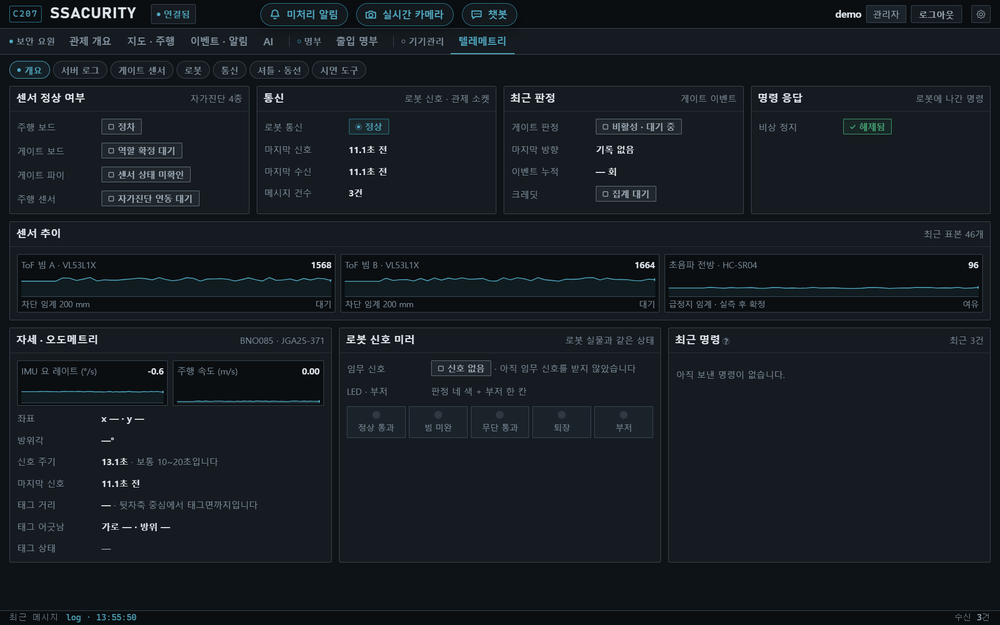<p align="center"><sub><b>텔레메트리</b> · 마지막 신호 11초 전이어도 정상</sub></p></td>
</tr>
<tr>
<td width="50%">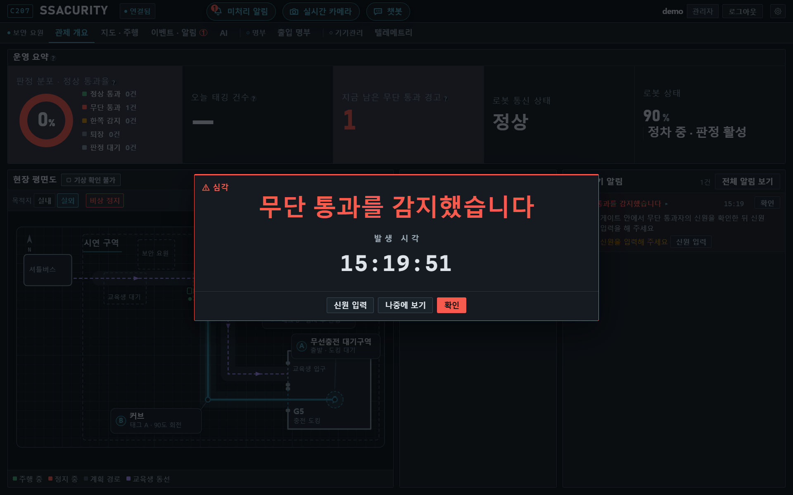<p align="center"><sub><b>무단 통과 경보</b> · 경보 창에서 바로 신원 입력으로</sub></p></td>
<td width="50%">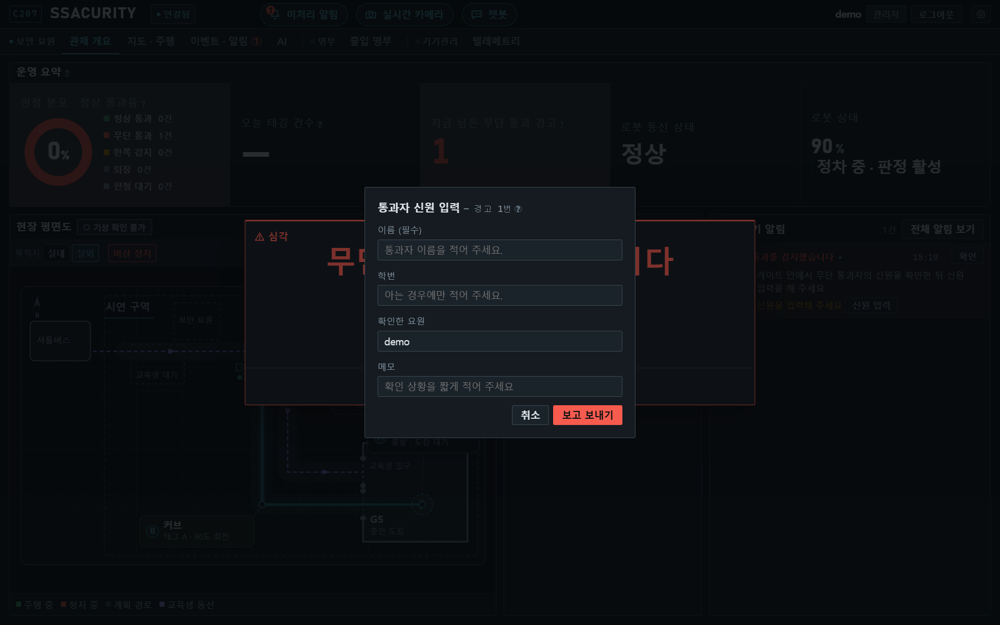<p align="center"><sub><b>신원 입력</b> · 확인 요원은 로그인한 이름으로 채움</sub></p></td>
</tr>
</table>

**발표 장표** <sub>(발표 담당)</sub>

<table>
<tr>
<td width="33%"><p align="center"><sub><b>ToF 판정</b> · 통과 · 방향을 잡고 태깅 기록과 대조</sub></p></td>
<td width="33%"><p align="center"><sub><b>시연 구성</b> · 시연자 셋 · 촬영 둘</sub></p></td>
<td width="33%"><p align="center"><sub><b>AprilTag 보정</b> · 태그 지점에서 쌓인 오차를 끊고 다시 맞춤</sub></p></td>
</tr>
</table>

<details>
<summary><b>🏗 요청이 가는 길 (아키텍처)</b></summary>
<br/>

역할은 **실패했을 때 무엇이 위험한가**로 나눴습니다. 모터 제어와 안전 정지는 STM32가 혼자 판단하고, 무거운 인식은 젯슨이 맡습니다.

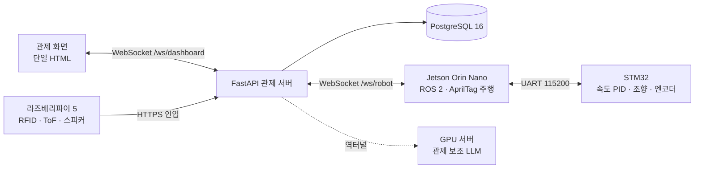

</details>

<details>
<summary><b>🔍 화면 검수 — 감지에서 끝나면 안 되는 화면</b></summary>
<br/>

- **문제** 무단 통과 경보 → 현장 확인 → 신원 기록 → 사건 종료 순서대로 써 보니 흐름이 끊기는 자리가 둘
- **신원 입력이 먼저** 상세 창에서 처리 완료를 눌러도 신원이 비어 반쪽 → 상세에는 신원 입력만, 경고 닫기는 알림 카드 한 자리로. 버튼 이름도 "수정 보내기"로 바꿔 버튼이 무엇을 하는지 말하게
- **선택지는 없애도 알림은 남긴다** 로봇이 이미 나가 있을 때 셔틀이 또 오면 선택 창 대신 버튼 없는 알림을 5초 띄우고, 이력에 "셔틀이 도착했지만 로봇을 보내지 않았습니다"를 남기자고 제안
- **결과** 관제 화면 담당 팀원이 반영했고, 뒤이어 신원 입력도 알림 카드 · 경보 창으로 모임. 다만 버튼 없는 알림 창은 시연 각본 갈래에만 들어감

</details>

<details>
<summary><b>🔍 화면 검수 — 통신은 정상인데 뜨는 "재연결 중" · 로그인 루프</b></summary>
<br/>

**거짓 경보**
- **문제** 신호가 정상 주기로 오는데 시연 각본마다 상단바에 "재연결 중". 거짓 경보는 운영자가 진짜 경보까지 무시하게 만듦
- **원인** 계약상 신호 주기 상한은 20초인데 상단바만 임계 6초. 요약 타일은 연결 상태만 봐서 한 화면이 "재연결 중"과 "정상"을 동시에 말함(이 갈림은 08.02 검토에서 따로 잡혀, 두 곳이 한 판정을 읽게 고쳐짐)
- **결과** 담당 팀원이 임계를 **단일 상수 25초**(20초 + 여유 5초)로 모아 상단바 · 로봇 카드 · 텔레메트리가 함께 사용

**로그인 루프**
- **문제** 교육생 계정은 관제 소켓이 1008로 닫히면 "로그인이 필요합니다" → 로그아웃 → 다시 로그인해도 같은 거절
- **원인** 서버는 세션 없음과 권한 부족을 같은 1008로 닫는데, 화면은 전부 세션 만료로 읽음
- **결과** 담당 팀원이 1008을 화면이 아는 역할로 분기. 로그인했는데 권한이 없으면 이유만 안내

```javascript
var HEARTBEAT_MAX_S = 20;
var STALE_S = HEARTBEAT_MAX_S + 5;   // 신선도 임계는 한 곳에서만

if (e && e.code === 1008) {
  if (authUser && !can("agent")) {
    toast("이 계정은 관제 화면 권한이 없습니다. 관리자에게 문의해 주세요.");
    return;
  }
}
```

</details>

<details>
<summary><b>🔍 화면 검수 — 쓰다 보면 걸리는 자잘한 어긋남</b></summary>
<br/>

| 짚은 문제 | 원인 · 잰 값 | 반영 |
|---|---|---|
| 재연결 중일 때 떠 있는 버튼(미처리 알림)이 연결 상태 칩에 겹침 | 가장 긴 문구의 칩 끝 x = 439 | 여유 약 60을 두어 버튼 줄을 `left: 500px`부터 |
| 표 머리와 첫 행이 한 덩어리로 보임 | 머리 글자와 칸 내용 시작점이 같은 선 | `th` 왼쪽 여백 10 → 18px |
| 명부 행 높이가 들쭉날쭉 | 버튼 있는 행만 키가 큼 | 행 46px · 버튼 28px 고정 |
| 입력 전후로 조회칸이 움직임 | 지우기 버튼 등장 · 건수 글자 길이 변화 | 자리를 차지한 채 숨김 → 항상 x=680px |

</details>

<details>
<summary><b>🔧 로봇 동작 검증 — 저속 구간에서만 튀는 속도 값</b></summary>
<br/>

- **문제** 눈으로는 정상 주행인데 로그에선 저속 구간에서만 속도가 크게 튐
- **원인** 제어 주기 10ms에서 1 count ≈ 24.4 mm/s. 100 mm/s 주행 시 한 주기 펄스가 4개 남짓이라 ±1 오차가 속도를 ±24% 흔듦. **속도가 아니라 측정이 흔들렸고**, 그 값이 PID 입력으로 들어가 제어까지 흔듦
- **전달** 양자화 자체는 STM32 주행 제어 담당 팀원 문서(07.30)에 먼저 적혀 있었고, 이 값이 제어까지 흔든다는 점을 "저속 구간에서만"이라는 조건으로 특정해 모터 제어 담당 팀원에게 넘김
- **결과** 모터 제어 담당 팀원이 5샘플(50ms) 이동창으로 바꿔 1 count ≈ 4.9 mm/s, 측정 흔들림 **약 70% 감소**(텔레메트리도 창을 거친 값이라 상당 부분은 측정이 매끄러워진 효과). 같은 날 팀원이 고정 22%였던 피드포워드를 속도 비례로 바꿔 추종률 **88% → 98%**. 반응 속도와 맞바꾼 결정
- **남은 한계** ToF 두 개로는 바짝 붙어 지나가는 두 사람을 가르지 못함

</details>

<details>
<summary><b>🎤 발표 — 안 됐을 때를 먼저 쓴 발표</b></summary>
<br/>

- **문제** 라이브 시연 필수. 로봇이 이동하는 동안 할 말이 없고, 자체 GPU 서버의 챗봇은 답이 보통 4–5초, 길면 10초 가까이 걸림
- **판단** 기능 나열 대신 **보안 요원의 하루**로 흐름을 짬. 발표 대본 14분 27초, Q&A 44문항(담당자 배정), 6명 · 8장면 · 3분 42초 시연 시나리오
- **실패 대응** 여덟 가지 실패 상황마다 발표자가 말할 한 문장을 미리 작성. 느린 챗봇은 "관제 기록이 한 글자도 밖으로 나가지 않는다"는 설계 근거로 말하게 함
- **돌아보면** 여덟 문장이 전부 "한 번 더 하면 될 수도 있다"를 전제했고, 당일의 멈춤은 재시도로 풀리지 않는 실패였음

</details>

<details>
<summary><b>🔧 로그 분석 — 라이브 시연 3회 연속 미출발</b></summary>
<br/>

| 항목 | 시연 (09:55 – 10:20) | 주행 시험 (10:59) |
|---|---|---|
| 명령 송신 | **없음** | **202회** |
| fault 비트 | `COMM_TIMEOUT` | **0** |
| `drive_state` | `SAFE_STOP` 고정 · READY 0회 | READY 73 · DRIVING 135 |

- **원인** 대기 중 중립 명령이 끊겨 300ms 뒤 `COMM_TIMEOUT` → `SAFE_STOP`. 이 상태는 **중립 명령을 다시 받아야만** 풀리는데 그 흐름이 끊겨 있었음. 출동 명령은 출발 전 점검이 "READY 아님"으로 거절했고, 거절하지 않았더라도 STM32는 `SAFE_STOP`에서 주행 명령을 받지 않음 → 재시도로 풀리지 않음
- **리허설에서 안 걸린 이유** 대기 후 출동하는 순서는 시연 시나리오에만 있었음. 버그는 기능이 아니라 **순서**에
- **판단** 준비 판정도 재무장 판정과 같은 기준("중립 명령 재송신으로 풀리지 않는 fault만 막는다")을 따르는 수정안 제안. 다만 판정만 풀어서는 출발하지 못해, 중립 명령으로 먼저 재무장하고 READY를 확인한 뒤 출발하는 순서가 함께 필요. 중립 명령이 끊긴 이유는 남은 질문이고, 프로젝트 종료 전 코드 반영은 못 함
- **재발 방지** 출발 직전 READY 확인, 재시도 판단 담당 분리, 시나리오 그대로의 리허설

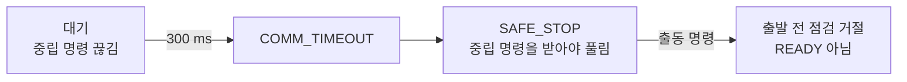

</details>

`관제 화면 검수` `Vanilla JS` `WebSocket` `FastAPI` `ROS 2` `UART` `초기 목업: React · TypeScript`

<br/>

---

<a id="jobssafy"></a>

### 💼 잡싸피 — SSAFY 교육생을 위한 AI 취업 준비 플랫폼

  

> **목소리가 브라우저 밖으로 나가지 않는 AI 면접 연습을 만들었습니다.**

합격 자소서 추천, AI 자소서 평가, 면접 연습, 취업 커뮤니티를 한곳에 모은 서비스입니다.<br/>
팀장이자 프론트엔드 담당으로 라우팅 · 인증 같은 공통 구조와 주요 화면을 만들었고, 면접 연습에는 **Whisper 음성 인식 모델을 브라우저 안에서 돌리는 온디바이스 AI**를 붙였습니다.

<div align="center">


<sub>WASM · 측정 PC 기준 · gzip · 화면 14개 중 12개 지연 로딩</sub>

</div>

**핵심 성과**
- **서버 없는 음성 인식** — Transformers.js로 Whisper(tiny)를 브라우저에서 실행, 말하기 속도와 습관어 5종을 피드백
- **첫 화면에서 AI 라이브러리 빼기** — 모든 화면 정적 import → 12개 지연 로딩으로 첫 화면 JS −73%
- **어느 경로로 와도 같은 본인 판단** — 내 프로필에 '팔로우'가 뜨던 버그를 서버가 준 프로필 주인 기준으로 수정
- **필드 성격에 맞춘 검색** — 글 유형은 exact, 직무는 icontains, 검색어는 제목 + 본문 OR 검색

**화면**

<table>
<tr>
<td colspan="2"><p align="center"><sub><b>면접 연습 결과</b>(예시 답변) · 브라우저 안에서 텍스트로 바꾸고 말하기 속도와 습관어를 짚음 · tiny 모델이라 '면접 → 면적'처럼 발음이 비슷한 단어는 틀리기도 함 · 화면의 답변 시간 25초는 녹음 버튼 기준(음성은 23.5초)</sub></p></td>
</tr>
<tr>
<td width="50%"><p align="center"><sub><b>홈</b> · 글래스모피즘 카드와 떠다니는 배경</sub></p></td>
<td width="50%">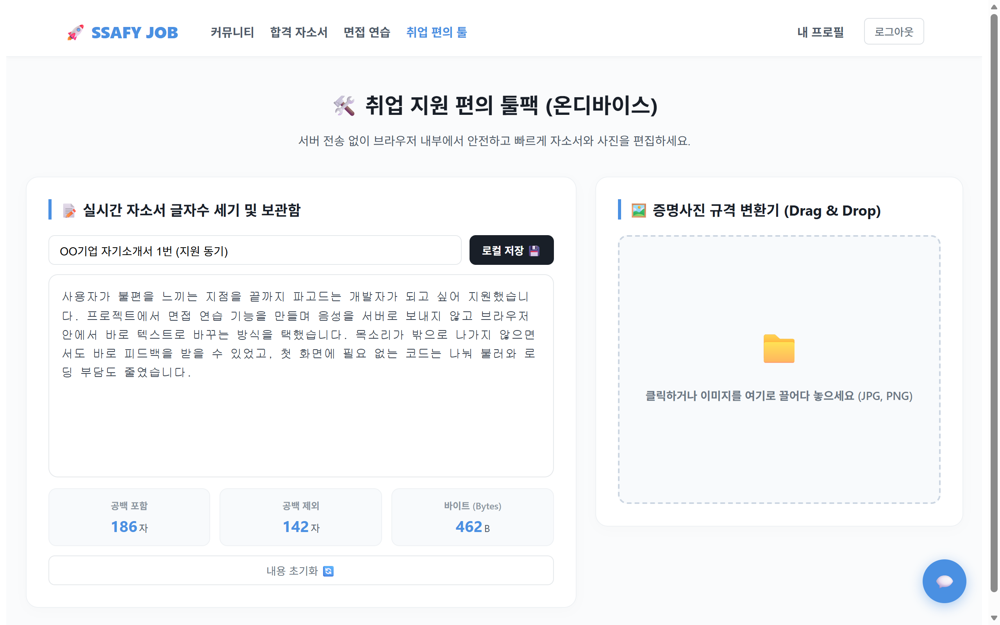<p align="center"><sub><b>취업 편의 툴</b> · 글자 수 계산 · 임시 저장 · 증명사진 변환</sub></p></td>
</tr>
</table>

**기술 선택 이유** — Transformers.js는 Hugging Face의 음성 인식 모델을 브라우저에서 그대로 불러와, 2명 · 최종 구현 5일 조건에서 서버를 늘리지 않고 붙일 수 있었습니다.

<details>
<summary><b>🏗 요청이 가는 길 (아키텍처)</b></summary>
<br/>

음성은 브라우저 밖으로 나가지 않고, 네트워크를 타는 건 처음 한 번 받는 모델 파일(Hugging Face)과 WASM 런타임(jsDelivr CDN)뿐입니다. 서버 쪽 AI는 팀원이 맡았습니다.

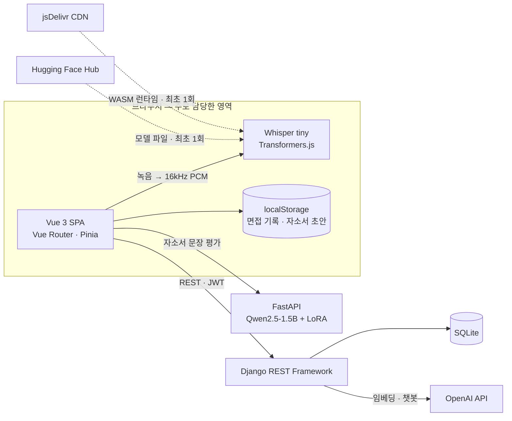

</details>

<details>
<summary><b>🔧 트러블슈팅 — 목소리를 서버로 보내지 않는 음성 인식</b></summary>
<br/>

- **문제** 녹음 파일을 서버로 보내면 사용자의 목소리가 밖으로 나가고, 음성 인식 서버나 유료 API를 새로 붙여야 하며, 답변마다 네트워크 왕복이 생김
- **판단** Whisper(tiny)를 브라우저에서 직접 실행. MediaRecorder로 녹음해 **16kHz로 디코딩**한 뒤 모델에 넘기고, 모델은 화면 진입 시 불러와 답변마다 재사용
- **결과** 음성 데이터 서버 전송 0건. 공백을 뺀 분당 글자 수와 습관어 5종을 피드백하고 기록은 localStorage에 저장

```javascript
transcriber = await pipeline('automatic-speech-recognition', 'Xenova/whisper-tiny', { dtype: 'fp32' });

const audioContext = new AudioContext({ sampleRate: 16000 });
const audioBuffer = await audioContext.decodeAudioData(await audioBlob.arrayBuffer());
const output = await transcriber(audioBuffer.getChannelData(0), {
  chunk_length_s: 30, stride_length_s: 5, language: 'korean',
});
```

</details>

<details>
<summary><b>🔧 트러블슈팅 — 첫 화면에 실려 가던 AI 라이브러리</b></summary>
<br/>

- **문제** 라우터가 모든 화면을 정적 import해, 면접 화면에서만 쓰는 Transformers.js까지 첫 화면 번들에 포함
- **판단** 첫 화면인 홈은 바로 불러오고 나머지는 `() => import()`로 바꿔, 최종 코드 기준 화면 14개 중 12개 지연 로딩(뒤에 붙은 합격 자소서 상세는 정적 import)
- **결과** 첫 화면 JS **216.2 KB → 59.2 KB(gzip, −73%)**. 면접 화면 코드 147.0 KB는 그 화면에 들어갈 때만 받음

```javascript
import HomeView from "@/views/HomeView.vue";   // 첫 화면은 바로
const InterviewSimulationView = () => import("@/views/InterviewSimulationView.vue");
const CareerToolsView = () => import("@/views/CareerToolsView.vue");
```

</details>

<details>
<summary><b>🔧 트러블슈팅 — 내 프로필에 뜨는 '팔로우' 버튼</b></summary>
<br/>

- **문제** 게시글에서 내 이름을 눌러 들어간 `/profile/내아이디`에 '팔로우' 버튼이 뜨고 관리 버튼이 사라짐
- **원인** 주소창 아이디와 스토어의 로그인 사용자를 비교했는데, 스토어는 `/profile`을 한 번 거쳐야 채워짐. 새로고침하면 비어 있어 늘 '남의 프로필'로 판단
- **판단** 비교 기준을 **서버가 돌려준 프로필 주인**으로 바꾸고, 스토어가 비면 내 정보를 한 번 더 조회. `/profile/내아이디`는 `/profile`로 replace
- **결과** 헤더 · 게시글 · 새로고침 어느 경로로 와도 결국 같은 판단. 다만 프로필은 받았는데 내 정보가 아직 오지 않은 짧은 사이엔 '팔로우'가 잠깐 보임

```javascript
const isMyProfile = computed(() => {
  if (!route.params.username) return true;
  if (!person.value) return true;   // 프로필을 받기 전에는 비교하지 않는다
  return person.value.username === authStore.user?.username;
});
```

</details>

<details>
<summary><b>🔧 트러블슈팅 — 조금만 달라도 결과가 비는 검색</b></summary>
<br/>

- **문제** django-filter는 필드만 나열하면 완전 일치(exact). '프론트'로 찾으면 '프론트엔드' 글이 안 나오고, 제목과 본문을 함께 찾을 수도 없음
- **판단** 필드 성격에 맞춰 lookup 분리 — 정해진 값인 글 유형은 exact, 직무는 icontains, 검색어는 `Q` 객체로 제목 OR 본문
- **결과** 부분 일치 · 대소문자 무시 · 다중 조건(유형 + 직무 + 검색어) 검색. 커뮤니티 백엔드는 팀원과 분담

```python
search = django_filters.CharFilter(method="filter_by_search_keyword")
post_type = django_filters.ChoiceFilter(choices=POST_TYPE_CHOICES, lookup_expr="exact")
job_role = django_filters.CharFilter(field_name="job_role", lookup_expr="icontains")

def filter_by_search_keyword(self, queryset, name, value):
    return queryset.filter(Q(title__icontains=value) | Q(content__icontains=value))
```

</details>

<details>
<summary><b>📜 그 밖에 만든 것</b></summary>
<br/>

- **인증 가드** — `requiresAuth` · `guestOnly`를 전역 `beforeEach`에서 한 번에 검사, 로그인이 필요한 라우트 13개(화면 11개)를 로그인 사용자만 열게 함
- **홈 배경 애니메이션** — `transform`만 움직여 레이아웃 · 페인트 재계산 없이 합성 단계에서 처리
- **취업 편의 툴** — 자소서 글자 수(공백 포함 · 제외 · 바이트) 즉시 계산, 자동 임시 저장, 캔버스로 증명사진 규격 자르기
- **면접장 분위기** — 실제 면접장 같은 영상을 질문 카드 위에 소리 없이 반복 재생

</details>

`Vue 3` `Vite` `Vue Router` `Pinia` `Transformers.js` `Whisper` `Web Audio API` `Django REST Framework` `django-filter`

<br/>

---

<a id="principles"></a>

## 🧭 일하는 원칙 — 세 프로젝트를 잇는 것

<sub>시간순 · 잡싸피 → SSACURITY → 쮸토피아 · 펼치면 프로젝트마다 한 줄씩</sub>

잡싸피에서 사용자에게 숨긴 실패는 쮸토피아의 "실패는 실패라고"가 됐고, SSACURITY에서 다시 만들어야 했던 화면은 쮸토피아의 "계약 먼저"가 됐습니다.

<details>
<summary>🔎 <b>사실만 말하는 화면</b> — 받지 못한 것, 모르는 것, 틀린 것을 미리 채우지 않습니다.</summary>
<br/>

- **💼 잡싸피** — 마이크 권한이 없거나 음성 분석에 실패해도 예시 문장으로 피드백을 만들어 기록에 남겨, 사용자가 진짜 결과로 오해할 수 있었습니다.
- **🤖 SSACURITY** — 로그인에 성공한 교육생 계정에 "로그인이 필요합니다"라고 말하던 안내를 짚었습니다. 틀린 안내를 믿고 따르면 같은 고리를 계속 돌게 됩니다.
- **🏦 쮸토피아** — 서버가 죽거나 답하지 않아도 카드마다 무엇을 못 불러왔는지 말하고, 받지 못한 날은 '기록 없음'으로 따로 세고, 도구 결과와 맞지 않는 AI 숫자는 화면에 올리지 않습니다(실서버는 개인 수치 답변을 내지 않아 이 대조는 목에서만 검증).

</details>

<details>
<summary>🧯 <b>안 됐을 때를 먼저</b> — 잘됐을 때보다 안 됐을 때 어떻게 물러설지를 먼저 정합니다.</summary>
<br/>

- **💼 잡싸피** — 음성 인식 모델을 불러오는 동안에는 녹음 버튼을 막았지만, 불러오지 못했을 때의 길은 정하지 않았습니다. 실패는 콘솔에만 남고 버튼이 다시 열려, 답변을 마친 뒤에야 예시 문장 피드백으로 넘어갔습니다.
- **🤖 SSACURITY** — 시연 실패에 대비한 문장 여덟 개가 모두 재시도를 전제로 쓰여, 재시도로 풀리지 않는 멈춤 앞에서는 소용이 없었습니다. 필요했던 건 출발 직전 로봇 상태를 확인하는 점검표 한 줄이었습니다.
- **🏦 쮸토피아** — 요청마다 기본 12초 상한을 걸어 멈추는 대신 실패하게 했고, 목 서버가 뜨지 않아 빈 화면으로 남던 실패는 5초 시한으로 막았습니다. 증권사 목록만 실서버로 켜는 부분 연동이 전부 목일 때보다 나빠진다는 걸 병합 전에 찾아, 13분 만에 되돌렸습니다.

</details>

<details>
<summary>🤝 <b>계약을 먼저</b> — 화면보다 서버와 주고받을 약속을 먼저 세웁니다.</summary>
<br/>

- **💼 잡싸피** — '내 프로필인가'를 프론트가 추측하다가 "팔로우" 버튼 버그를 냈습니다. 서버가 아는 사실은 응답에 넣자고 먼저 맞췄어야 했습니다.
- **🤖 SSACURITY** — 서버와 메시지 형식을 맞추기 전에 먼저 만든 React 관제 화면 목업은 손대지 않고 살릴 코드가 약 18%뿐이라(팀 전수 측정), 팀이 화면을 새로 만들었습니다.
- **🏦 쮸토피아** — 목 서버로 계약을 먼저 세우고 경로 단위로 목을 끄는 스위치를 만들어, 응답 모양까지 맞는 경로부터 팀이 함께 실서버로 옮겼습니다(마칠 때 핸들러 33개). 손으로 쓴 타입 34쌍은 CI에서 서버 OpenAPI와 대조했습니다.

</details>

<details>
<summary>📍 <b>기준은 한곳에</b> — 하나의 판단을 여러 곳에서 하지 않습니다.</summary>
<br/>

- **💼 잡싸피** — 로그인이 필요한 화면인지는 라우트마다 따로 막지 않고 전역 가드 한곳에서 판단했습니다.
- **🤖 SSACURITY** — 상단바만 다른 신선도 임계(6초)를 들고 있어, 시연 각본에서 신호가 정상 주기로 와도 "재연결 중"이 떴습니다. 이 거짓 경보를 짚었고, 팀원이 임계를 단일 상수로 모았습니다.
- **🏦 쮸토피아** — 모든 요청이 API 클라이언트 한곳을 지나며 시간 상한 · 추적 번호 · 오류 해석을 한꺼번에 받고, 실서버로 보낼 경로 목록은 테스트가 CI 설정을 직접 읽어 잠급니다.

</details>

<details>
<summary>📦 <b>필요한 사람에게 필요한 코드만</b> — 자리에 맞춰 나누되, 나눌 이유가 없으면 나누지 않습니다.</summary>
<br/>

- **💼 잡싸피** — 면접 화면에서만 쓰는 AI 라이브러리를 지연 로딩으로 빼 첫 화면 JS를 216.2 KB에서 59.2 KB로 줄였습니다(−73%).
- **🤖 SSACURITY** — 나누지 않는 쪽이 맞았던 사례입니다. 팀이 다시 만든 관제 화면은 빌드 없는 파일 한 장이었고, 1920×1200 화면 하나에서 탭 여섯을 오가는 구조라 라우팅 · 코드 분할 없이도 충분했습니다.
- **🏦 쮸토피아** — IR 콘솔 38.4 KB를 주주가 받지 않게 나누고, 운영 빌드에는 목 · 데모 도구 코드를 싣지 않았습니다(0 KB).

</details>

<details>
<summary>📏 <b>재서 판단하기</b> — 체감 대신 측정값으로 정합니다.</summary>
<br/>

- **💼 잡싸피** — 음성 인식 모델을 양자화 버전과 비교해 보지 않고 fp32(약 145 MB)로 정했습니다. 끝난 뒤 다시 측정해 보니 면접 화면 첫 로딩이 약 34초였습니다. 같은 모델의 q8 버전은 fp32의 4분의 1쯤인 약 39 MB입니다.
- **🤖 SSACURITY** — 저속 구간에서만 튀는 속도 값을 로그에서 찾아 조건을 특정했고, 실패한 시연 로그를 39분 뒤 성공한 주행 로그와 나란히 놓고 명령 송신 횟수(0회 ↔ 202회)로 원인을 좁혔습니다.
- **🏦 쮸토피아** — 5초 목 부팅 시한은 정상 부팅 실측(0.6–1.0초)에서 정했고, 숫자 대조가 조문 번호 · 연도 · 단계 수까지 막아 제도 설명 예문 3개가 모두 숨는 것을 확인한 뒤, AI 답변 범위를 나누자고 요청했습니다.

</details>

<br/>

---

<a id="retro"></a>

## 📈 돌아보며

<details open>
<summary><b>🏦 쮸토피아</b> — 증상이 아니라 길을 고쳤다 · 목에서만 참인 것들</summary>
<br/>

**잘한 점 · 증상이 아니라 길을 고쳤다**
- 에러 화면이 안 뜰 때 화면을 고치지 않고, **그 화면에 도달하지 못하는 길**(없던 시간 상한)을 찾아 막았습니다.
- 기준값은 근거를 남겨 정했습니다. 5초 목 부팅 시한은 정상 부팅 실측(0.6–1.0초)에서, 12초 요청 상한은 느린 네트워크 기준(3초)의 4배로 정했습니다.
- 제 변경도 틀리면 바로 되돌리거나 고쳤습니다. 증권사 부분 연동은 병합 전 검토에서 13분 만에 되돌렸고, 추적 번호 회귀는 18분 만에 고쳤습니다.

**아쉬운 점 · 목에서만 참인 것들**
- 개인 수치 대조는 끝내 실서버에서 돌지 못하고 목에서만 증명됐습니다.
- 목에 권한 검사가 없어, 역할 버그를 E2E가 잡지 못하고 잘못된 이유로 통과한 적이 있습니다.
- 계약 대조는 스냅샷 갱신이 CI 밖이라, 스냅샷이 낡으면 조용합니다.

**다음엔 · 목도 서버만큼 엄격하게**
- 목에도 **권한 경계**를 넣어 E2E가 역할 문제를 잡게 하겠습니다.
- OpenAPI 스냅샷 갱신을 CI에 넣고, 수기 타입 대신 **생성 타입**을 검토하겠습니다.
- 서버가 개인 수치를 `figures`와 함께 내려주는 계약을 **처음부터** AI · BE와 맞추겠습니다.

> 잡싸피에서 숨긴 실패는 실패를 실패라고 말하는 화면으로, 무거운 AI 라이브러리를 첫 화면에서 뺐던 일은 IR 콘솔 · 데모 도구 분리로 이어졌습니다. SSACURITY에서 먼저 만든 목업을 다시 만들어야 했던 일은 목 서버로 계약을 먼저 세우는 방식으로 이어졌습니다.

</details>

<details>
<summary><b>🤖 SSACURITY</b> — 사람이 움직이는 순서로, 좁혀서, 로그로 · 재시도를 전제한 대본, 기능 단위 리허설</summary>
<br/>

**잘한 점 · 사람이 움직이는 순서로, 좁혀서, 로그로**
- **화면을 기능이 아니라 동선으로 봤습니다.** "이걸 누가, 어떤 상황에서 보는가"라는 질문 하나로 화면 검수도, 시연 시나리오도, 대본도 정리됐습니다.
- **문제를 좁혀서 넘겼습니다.** "안 돼요" 대신 어디까지 왔고 어디서 끊겼는지, "속도가 이상해요" 대신 어느 구간에서만 튀는지를 말하니 고칠 사람이 같은 것을 보고 움직일 수 있었습니다.
- **눈으로는 정상 주행이어도 로그를 의심**해 저속 구간의 측정 불안정을 찾았고, **실패한 시연을 성공한 주행과 대조**해 "하드웨어 탓"으로 끝날 뻔한 일을 구조적 원인으로 좁혔습니다.

**아쉬운 점 · 재시도를 전제한 대본, 기능 단위 리허설**
- **실패 대응 문장 여덟 개가 전부 재시도를 전제**했습니다. 문장은 만들었지만, 그 문장을 언제 써야 하는지 판별할 눈은 만들지 않았습니다.
- **기능 단위 확인을 리허설이라고 불렀습니다.** 시나리오를 만들었으면 그 시나리오 그대로 리허설했어야 했습니다.
- **수정안은 끝내 코드에 들어가지 못했습니다.** 멈춘 조건을 찾은 시점이 발표 뒤였습니다.
- **같은 판단 기준이 여러 곳에 흩어져** 있는 것을 거짓 경보가 난 뒤에야 알았습니다.
- **붙어 지나가는 두 사람은 끝내 가르지 못했습니다.** 바짝 붙어 지나가면 통과가 한 번으로 집계됩니다. ToF 두 개로는 통과와 방향까지는 알아도 사람 수는 셀 수 없는 구조였습니다.

**다음엔 · 물러설 길부터, 나오는 길까지**
- 무언가를 보여 줄 자리에서는 **어떻게 보여 줄지보다 어떻게 물러설지**를 먼저 정하겠습니다. 출발 전 상태 점검표를 두고, 재시도 여부는 발표자가 아닌 사람이 판단하게 하겠습니다.
- 상태 기계는 **들어가는 조건과 나오는 길을** 같은 무게로 확인하겠습니다. 모든 상태에 탈출 경로가 하나 이상 있는지 표로 그려 보는 것부터입니다.
- **'살아 있음' 신호가 끊기면 보내는 쪽이 먼저 알게 하겠습니다.** 로봇은 위험해서가 아니라 조용해서 멈췄습니다. 대기 중 중립 명령이 '살아 있지만 시킬 일은 없다'는 신호였는데, 그 신호가 끊긴 것을 받는 쪽(STM32)만 알았습니다.
- 통합 직전에는 **안전 관련 정의만이라도 문서와 코드를 대조**하고, 상태 판단에 쓰는 임계는 처음부터 **단일 상수**로 두겠습니다.
- 화면은 **서버 창구와 메시지 형식을 먼저 정하고** 목 데이터로 시작하겠습니다.

> 이 경험은 쮸토피아에서 목 서버로 API 계약을 먼저 세우고, 준비된 경로부터 실서버로 옮기는 방식으로 이어졌습니다.

</details>

<details>
<summary><b>💼 잡싸피</b> — 서버보다 브라우저에서 풀 수 있는지 따져 봤다 · 첫 로딩, 메인 스레드, 숨긴 실패</summary>
<br/>

**잘한 점 · 서버보다 브라우저에서 풀 수 있는지 따져 봤다**
- 음성 인식을 서버 일로만 보지 않고 **브라우저에서 풀 수 있는지** 따져, 2명 · 최종 구현 5일 조건에서 백엔드 부담 없이 기능을 완성했습니다.
- 무거운 라이브러리를 붙인 뒤 **라우트를 지연 로딩으로 바꿔**, 면접 연습을 하지 않는 사용자가 그 비용을 치르지 않게 했습니다.

**아쉬운 점 · 첫 로딩, 메인 스레드, 숨긴 실패**
- **면접 화면의 첫 로딩이 무겁습니다.** fp32 모델(약 145 MB)과 WASM 런타임(약 22 MB)을 받아야 해서, 다시 재 보니 첫 로딩에 약 34초가 걸렸습니다. 같은 모델의 q8 양자화 버전은 약 39 MB인데, 두 버전을 비교해 보지 않고 fp32로 정했습니다.
- **추론이 메인 스레드에서 돕니다.** 분석하는 동안에는 화면이 멈추거나 느려질 수 있습니다.
- **실패를 숨겼습니다.** 마이크 권한이 없거나 음성 분석에 실패하면 예시 문장으로 피드백을 만들어 기록에 저장했습니다. 모델을 불러오지 못했을 때도 콘솔에만 남기고, 불러오는 동안 막아 둔 녹음 버튼을 다시 열어, 답변을 마치면 역시 예시 문장 피드백이 나왔습니다.
- **본인 여부를 프론트에서 추측했습니다.** 요청을 한 번 더 보내 확인했지만, 서버가 `is_me` 같은 값을 내려 줬다면 요청 한 번으로 끝났을 일입니다.
- **API 주소와 인증 헤더를 호출마다 적었습니다.** 로그인 여부는 전역 가드 한곳에서 판단했지만, 요청은 한곳을 지나지 않았습니다. 제가 쓴 코드에만 `http://localhost:8000`이 20곳, 인증 헤더를 직접 만드는 곳이 16곳이라, 주소를 바꾸거나 배포 환경으로 옮기려면 호출을 하나하나 고쳐야 하는 구조였습니다.

**다음엔 · 무거운 일은 워커로, 판단은 서버로**
- 모델은 **fp32와 양자화 버전의 정확도를 비교해** 고르고, 추론은 **Web Worker**로 옮겨 화면이 멈추지 않게 하겠습니다.
- 실패는 **실패라고 알리고** 기록에서 빼겠습니다.
- 본인 여부 · 권한처럼 **서버가 아는 사실은 응답에 넣자고** API 설계 단계에서 먼저 맞추겠습니다.
- 요청은 **API 클라이언트 한곳**을 지나게 해, 주소와 인증 헤더를 한 번만 적겠습니다.

> 숨긴 실패는 쮸토피아에서 실패를 실패라고 말하는 화면으로, 무거운 라이브러리를 첫 화면에서 뺀 일은 IR 콘솔 · 데모 도구를 떼어 내는 번들 분리로 이어졌습니다.

</details>

<br/>

---

## 📊 Activity

<div align="center">

프로젝트는 SSAFY 사내 **GitLab**에서 진행했습니다. 아래는 JJUTOPIA 저장소 기록 기준입니다.

<br/>


<br/>

<sub>GitHub에는 앞으로의 개인 작업과 학습 기록을 쌓아 갈 예정입니다.</sub>

</div>


