

<picture>
  <source media="(max-width: 1011px) and (prefers-color-scheme: dark)" srcset="./assets/header-mobile-dark.svg"/>
  <source media="(max-width: 1011px)" srcset="./assets/header-mobile.svg"/>
  <source media="(prefers-color-scheme: dark)" srcset="./assets/header-dark.svg"/>
  
</picture>

 

 

<!-- ▼ 헤더 카드: 여기부터 -->
<table>
<tr>
<td align="center" width="50%">🎓 <b>수⁠학 전⁠공</b> 삼⁠성⁠청⁠년SW·AI아⁠카⁠데⁠미(SSAFY) 15기 재⁠학 중 · 2026.12 수⁠료 예⁠정</td>
<td align="center" width="50%">💻 <b>Frontend Developer</b> React · TypeScript · Vue.js</td>
</tr>
<tr>
<td align="center">🏦&nbsp;<b>핀⁠테⁠크</b>&nbsp;· 🤖&nbsp;<b>로⁠봇&nbsp;관⁠제</b>&nbsp;· 💼&nbsp;<b>AI&nbsp;취⁠업&nbsp;준⁠비</b> SSAFY 프⁠로⁠젝⁠트 3개</td>
<td align="center">🔍 <b>프⁠론⁠트⁠엔⁠드 포⁠지⁠션⁠을 찾⁠고 있⁠어⁠요</b> 편⁠하⁠게 연⁠락 주⁠세⁠요 · d5353973@gmail.com</td>
</tr>
</table>

📂 프로젝트별 포트폴리오(Notion) — <a href="https://app.notion.com/p/3e91b429679f81728bb5ed4cedc72a62?source=copy_link">🌳&nbsp;쮸⁠토⁠피⁠아</a>&nbsp;· <a href="https://app.notion.com/p/SSACURITY-3e91b429679f814da3e4d88472095981?source=copy_link">🤖&nbsp;SSACURITY</a>&nbsp;· <a href="https://app.notion.com/p/3e91b429679f81a8b22cf2e8cb2e0702?source=copy_link">💼&nbsp;잡⁠싸⁠피</a> 저장소는 SSAFY GitLab 비공개 · 요청 시 공개
<!-- ▲ 헤더 카드: 여기까지 -->

 

<a href="#user-content-about">About Me</a> · <a href="#user-content-stack">Tech Stack</a> · <a href="#user-content-projects">Projects</a> · <a href="#user-content-principles">일⁠하⁠는&nbsp;원⁠칙</a>&nbsp;·&nbsp;<a href="#user-content-retro">돌⁠아⁠보⁠며</a>

 

## 🙋 About Me

**화면이 사실만 말하게 만드는 프론트엔드 개발자, 한동인**입니다. 받지 못한 데이터는 '기록 없음'으로, 실패는 실패로 보여 주고, 기준값은 근거를 남겨 정합니다. 
가까이는 React · TypeScript 실무에서 로딩 · 실패 · 빈 데이터까지 책임지는 화면을 만들고, 길게는 서버 · AI 파트와 API 계약을 먼저 세워 팀 전체의 품질 기준을 만드는 개발자가 되려 합니다.

수학을 전공했고, **삼성청년SW·AI아카데미(SSAFY) 15기**(2026.01부터 12개월 · 총 1,725시간)를 **2026.12에 수료할 예정**입니다.

ChatGPT가 등장해 사람들이 일하고 배우는 방식이 바뀌는 흐름을 보며, **바라보는 쪽이 아니라 그 흐름을 만드는 쪽에 서고 싶어** 개발을 시작했습니다. 
그래서 첫 프로젝트부터 브라우저에서 도는 음성 인식(온디바이스 AI)을 맡았고, 이후에는 **AI가 실제 데이터와 일치하도록** 만드는 데 집중했습니다.

 

### 💪 이⁠런 방⁠식⁠으⁠로 일⁠합⁠니⁠다

| 강⁠점 | 근거가 된 경험 |
|---|---|
| **🤝 협⁠력** | 다른 파트에 보낼 요청은 번호 붙은 문안으로 관리하고, **보내기 전에 코드와 수치를 다시 재서** 이미 해결된 일을 요청하지 않았습니다. |
| **🧱 논⁠리** | "FE는 도메인 수치를 계산하지 않는다" 같은 **불변 규칙 12개**를 세우고 eslint · 테스트로 강제했습니다. 라이브 시연 실패는 정상 주행 로그와 **대조 분석**해, 하드웨어가 아니라 끊긴 중립 명령이 로봇을 세웠다는 조건까지 좁혔습니다(끊긴 이유는 남은 질문). |
| **🌱 학⁠습** | 수학 전공에서 개발로 넘어와 Vue.js에 브라우저 음성 인식(Whisper)을 붙이는 것으로 시작했고, 로봇 관제 프로젝트의 검수 · 발표를 거쳐 React · TypeScript 핀테크 서비스의 프론트엔드를 유일한 담당으로 맡기까지 **프로젝트마다 새 역할과 스택으로 결과를 냈습니다.** |
| **🙇 검⁠증** | 테스트가 통과해도 믿지 않고 **가드를 일부러 되돌려 실패하는지 확인**합니다. 회고에서는 잘한 점만큼 아쉬운 점과 다음에 바꿀 점을 구체적으로 남깁니다. |

 

## 🗂 한⁠눈⁠에 보⁠기

<table>
<tr>
<td width="33%" valign="top">
<a href="#user-content-zzutopia">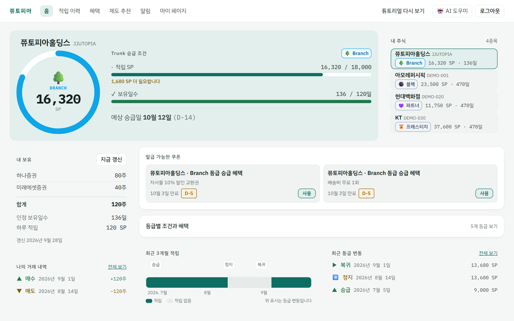</a>

<b>🌳 쮸⁠토⁠피⁠아</b> 주⁠주 우⁠대 제⁠도⁠를 설⁠계 · 운⁠영⁠하⁠는 B2B SaaS

2026.08 – 09 · 프⁠론⁠트⁠엔⁠드 담⁠당 · 7⁠명&nbsp;팀

“실⁠패⁠는 실⁠패⁠라⁠고, 모⁠르⁠는 숫⁠자⁠는 모⁠른⁠다⁠고 말⁠하⁠는 화⁠면”

✅ 테⁠스⁠트 1,212개 통⁠과 ✅ 프⁠론⁠트⁠엔⁠드 코⁠드 88% 작⁠성

</td>
<td width="33%" valign="top">
<a href="#user-content-ssacurity">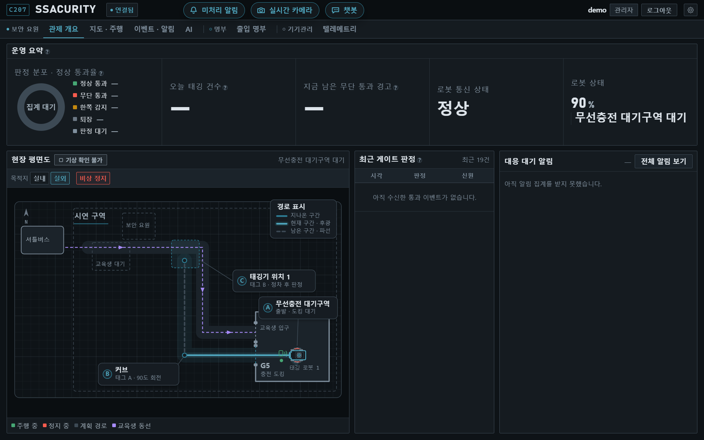</a>

<b>🤖 SSACURITY</b> 셔⁠틀 승⁠강⁠장 출⁠입⁠을 관⁠제⁠하⁠는 무⁠인 태⁠깅 로⁠봇

2026.07 – 08 · 프⁠론⁠트⁠엔⁠드 · 발⁠표 · 6⁠명&nbsp;팀

“보⁠안 요⁠원⁠의 동⁠선⁠대⁠로 써 보⁠며 짚⁠은 문⁠제, 로⁠그⁠로 좁⁠혀 간 시⁠연 실⁠패⁠의 원⁠인”

✅ 거⁠짓 경⁠보 · 로⁠그⁠인 루⁠프 짚⁠어 전⁠달 ✅ 시⁠연 미⁠출⁠발 조⁠건⁠을 로⁠그⁠로 특⁠정

</td>
<td width="33%" valign="top">
<a href="#user-content-jobssafy">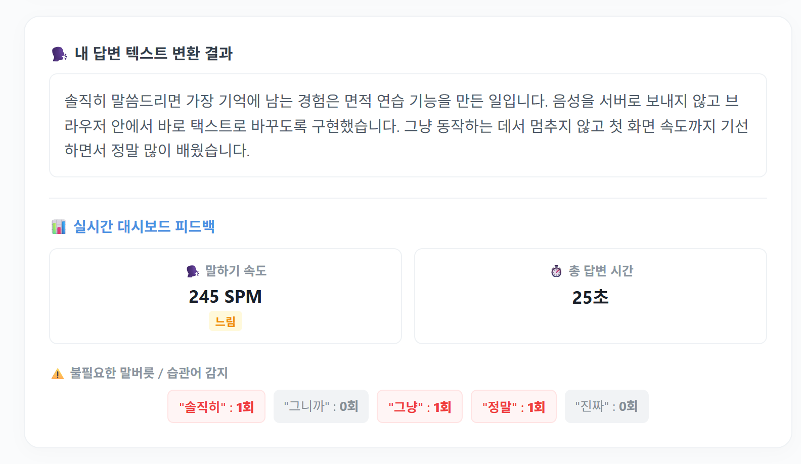</a>

<b>💼 잡⁠싸⁠피</b> SSAFY 교⁠육⁠생 AI 취⁠업 준⁠비 플⁠랫⁠폼

2026.05 – 06 · 팀⁠장 · 프⁠론⁠트⁠엔⁠드 · 2⁠명&nbsp;팀

“목⁠소⁠리⁠가 브⁠라⁠우⁠저 밖⁠으⁠로 나⁠가⁠지 않⁠는 AI 면⁠접 연⁠습”

✅ 음⁠성 데⁠이⁠터 서⁠버 전⁠송 0건 ✅ 첫 화⁠면 JS −73%

</td>
</tr>
</table>

그림을 누르면 아래 프로젝트 설명으로 갑니다 · 쮸토피아는 목 모드 화면(회사와 수치는 목 데이터), SSACURITY 관제 화면은 팀 결과물(목 모드), 잡싸피 면접 결과는 예시 답변입니다.

 

## 🛠 Tech Stack

**Frontend** 
<picture><source media="(prefers-color-scheme: dark)" srcset="https://skillicons.dev/icons?i=react%2Cts%2Cvue%2Cjs%2Chtml%2Ccss%2Cvite%2Ctailwind&theme=dark"/></picture>

 

**Backend · Tools** 
<picture><source media="(prefers-color-scheme: dark)" srcset="https://skillicons.dev/icons?i=python%2Cdjango%2Cfastapi%2Cgit%2Cgitlab%2Cdocker&theme=dark"/></picture>

 

**Library · Test · Collaboration** 
<picture></picture>
<picture></picture>
<picture></picture>
<picture></picture>
<picture></picture>
<picture></picture>
<picture></picture>
<picture></picture>
<picture></picture>
<picture></picture>

 

**숙련도와 쓴 곳** 프로젝트에서 쓴 것만 · 숙련도는 5단계 자기 평가입니다.

| 분야 · 기술 · 숙⁠련⁠도 | 그걸로 한 일 |
|---|---|
| **프론트엔드** <picture></picture> React 19 · TypeScript | 주주 웹과 IR 콘솔을 한 SPA로 만들고 프론트엔드 코드의 88%를 썼습니다. IR 콘솔은 지연 로딩으로 나눠 주주가 받지 않게 했습니다.&nbsp;쮸⁠토⁠피⁠아 |
| **프론트엔드** <picture></picture> Vue 3 · Vue Router · Pinia | 로그인 여부를 전역 가드 한곳에서 판단하고, 화면 14개 중 12개를 지연 로딩해 첫 화면 JS를 73% 줄였습니다.&nbsp;잡⁠싸⁠피 |
| **상태 · 데이터** <picture></picture> TanStack Query · Zustand · Zod | 서버 값은 쿼리 캐시에, 화면에서만 생기는 값은 스토어 두 개에 나눠 담았습니다. 요청마다 기본 12초 상한과 재시도 규칙을 걸어 멈추는 대신 실패를 알리고, 제도 설계 입력은 Zod로 칸마다 검사합니다.&nbsp;쮸⁠토⁠피⁠아 |
| **목 · 테스트** <picture></picture> MSW · Vitest · Testing Library · Playwright · axe-core | 백엔드보다 먼저 목 서버로 화면을 완성하고, 경로 단위로 실서버에 옮기는 스위치를 만들었습니다. 테스트 1,212개를 모두 통과시켰고, E2E 24곳에서 axe 접근성 위반(serious · critical) 0건을 확인했습니다.&nbsp;쮸⁠토⁠피⁠아 |
| **온디바이스 AI** <picture></picture> Transformers.js · Whisper | 음성 인식 모델을 브라우저 안에서 돌려, 음성을 서버로 보내지 않는 면접 연습을 만들었습니다(23.5초 답변을 3.2초에 인식).&nbsp;잡⁠싸⁠피 |
| **백엔드(공동)** <picture></picture> Python · Django REST Framework · django-filter | 커뮤니티 검색을 필드 성격에 맞춰 완전 일치 · 부분 일치 · 제목 + 본문 통합 검색으로 나눴습니다.&nbsp;잡⁠싸⁠피 |

**AI 코딩 도구** — Claude Code와 함께 구현하되, 수정을 되돌려 테스트가 정말 깨지는지 보고 프리뷰 배포본과 실제 AI 서버에서 다시 확인했습니다(마지막 날 만든 공지 문맥 검토 경로는 프롬프트 품질을 실제 API 키로 확인하지 못함). 쮸토피아

 

## 🚀 Projects

### 🌳 쮸⁠토⁠피⁠아 — 주⁠주 우⁠대 제⁠도⁠를 설⁠계 · 운⁠영⁠하⁠는 B2B SaaS

**기간** 2026.08.31 – 09.28 · **역할** 프론트엔드 담당(팀 내 FE 1명) · **팀** 7명(FE · BE · Android · AI · Infra) 
**배포** [jjutopia.site](https://jjutopia.site) 09.09 배포판 · 실제 로그인(09.10)이 붙기 전이라 데이터는 보이지 않습니다

> **실패는 실패라고, 모르는 숫자는 모른다고 말하는 화면을 만들었습니다.**

발행사 IR 담당자가 법적 위험을 미리 걸러 내며 주주 우대 제도를 설계 · 검증 · 운영하고, 주주는 '보유 주식 수 × 보유 일수'로 쌓이는 포인트(SP)와 혜택을 확인하는 서비스입니다. 
7명 팀의 유일한 프론트엔드로 **주주 웹과 IR 콘솔을 한 SPA로** 만들고 프론트엔드 코드의 88%를 썼습니다(나머지는 주로 백엔드 담당 팀원이 보탠 거래 내역 카드 · 튜토리얼 · 혜택 사용 버튼 등). 백엔드보다 먼저 MSW 목 서버로 화면을 완성하고, 준비된 API부터 경로 단위로 실서버에 옮겼습니다.

<picture></picture>
<picture></picture>
<picture></picture>
<picture></picture>

FE 코드 비중: git blame 3.5만 줄 중 3.1만 줄 · 테스트: Vitest 898 + Playwright 314 · 주주가 받지 않는 콘솔 코드 38.4 KB(gzip) · 접근성: axe serious · critical, E2E 24곳 검사 · 2026.09.28 기준

**핵심 성과**
- **멈추지 않고 실패를 말하는 화면** — 모든 요청에 기본 12초 상한을 걸어, API가 죽거나 답하지 않아도 카드마다 무엇을 못 불러왔는지 표시
- **백엔드를 기다리지 않는 개발** — 목에서 뺄 경로만 적는 `VITE_LIVE_API` 스위치를 만들어, 종료 시점까지 팀이 함께 데모 빌드의 핸들러 33개를 실서버로 이전
- **숫자를 지어낸 AI 답변 차단** — 개인 수치 답변은 본문 숫자를 서버 도구 결과와 대조해, 없는 숫자가 하나라도 있으면 본문을 표시하지 않음(실서버는 개인 수치 답변을 내지 않아 목에서만 검증)
- **모르는 날을 "0"이라 말하지 않기** — '적립' · '적립 없음'에 '기록 없음'을 세 번째 상태로 더하고, 회색 명도 대신 빗금으로 구분
- **타입 불일치를 CI가 잡게** — 서버 OpenAPI와 손으로 쓴 타입 34쌍을 `npm test`로 자동 대조
- **비어 있던 공지 문맥 검토 경로 채우기** — 차단 항목이 없는 공지 원고를 넘겨받을 AI 서버 경로가 없어 재검토와 배포가 늘 500이어서, 마지막 날(09.28) 그 경로를 FastAPI로 직접 만듦. AI 지적은 배포를 막지 않는 경고로만 씀(프롬프트 품질은 실제 API 키로 확인하지 못함 · AI 파트 검토 전)

**화면**

<table>
<tr>
<td colspan="2">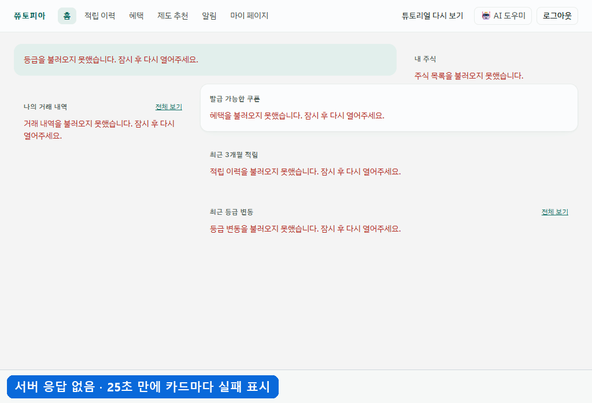
<b>서버가 답하지 않을 때</b> · 12초 상한에 재시도 한 번, 약 25초 뒤 카드마다 실패를 말함
</td>
</tr>
<tr>
<td colspan="2">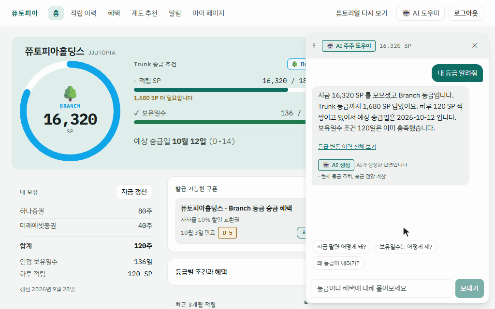
<b>AI 답변</b> · 제도 지식은 근거 문서와 함께, 개인 수치는 도구 결과와 숫자가 같을 때만 표시(답변의 16,320 · 1,680 · 120이 왼쪽 링 · 카드와 같은 값)
</td>
</tr>
<tr>
<td colspan="2">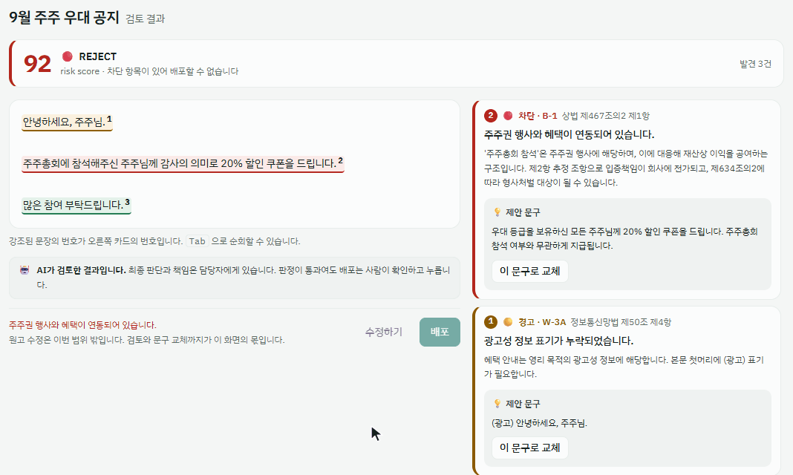
<b>공지 검토</b> · 차단 항목이 있으면 배포 잠금, 제안 문구로 바꾸면 다시 검토해 경고만 남으면 배포 가능
</td>
</tr>
<tr>
<td colspan="2">
<b>주주 홈</b> · 승급 조건 두 가지(적립 SP · 보유 일수)를 따로 표시
</td>
</tr>
<tr>
<td colspan="2">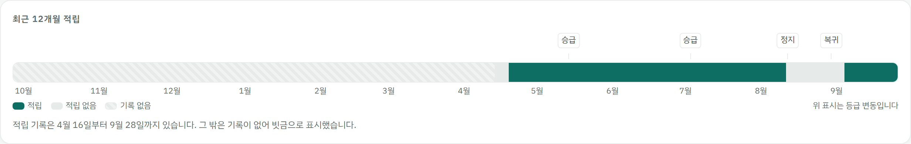
<b>적립 이력 12개월</b> · 적립 없음(회색)과 기록 없음(빗금) 구분
</td>
</tr>
</table>

화면은 모두 목 모드에서 찍었고, 회사와 수치는 목 데이터입니다. '서버가 답하지 않을 때'는 앱이 뜨기 전에 fetch를 바꿔 끼워 재현했고, 기다리는 구간은 6배로 빨리 감았습니다.

**기술 선택 이유**

| 기술 | 왜 이걸 골랐나 |
|---|---|
| TanStack&nbsp;Query | 기획 때 상태의 대부분이 서버에서 오는 값이라고 보고, 캐시와 다시 불러오기를 맡김 |
| Zustand | 브라우저에만 있는 작은 상태용(스토어는 끝까지 두 개) |
| MSW | 백엔드 완성을 기다리지 않고 화면을 먼저 만들려고. 서비스워커가 요청을 가로채 앱 코드를 그대로 둔 채 경로 단위로 실서버에 옮길 수 있었음 |
| Zod | 입력 형식 검증에만 사용. 법적 판단은 서버 컴플라이언스 API에만 맡기도록 역할을 분리 |
| Next.js 미⁠사⁠용 | 모든 화면이 세션 쿠키 뒤라 SSR로 얻을 검색 노출이 없고, 정적 배포 전제 · 서비스워커 기반 MSW와 맞지 않음(ADR 기록) |

<b>🏗 요⁠청⁠이 가⁠는 길 (아⁠키⁠텍⁠처)</b>

 

브라우저 안쪽이 담당 영역이고, AI 서버에서는 마지막 날 공지 문맥 검토 경로(접수 · 결과 조회)를 만들었습니다. 목 서버는 서비스워커라 앱 코드는 어느 경로가 목인지 모르고, `VITE_LIVE_API`에 적은 경로만 실서버로 나갑니다. 운영 빌드에는 목이 아예 없습니다.

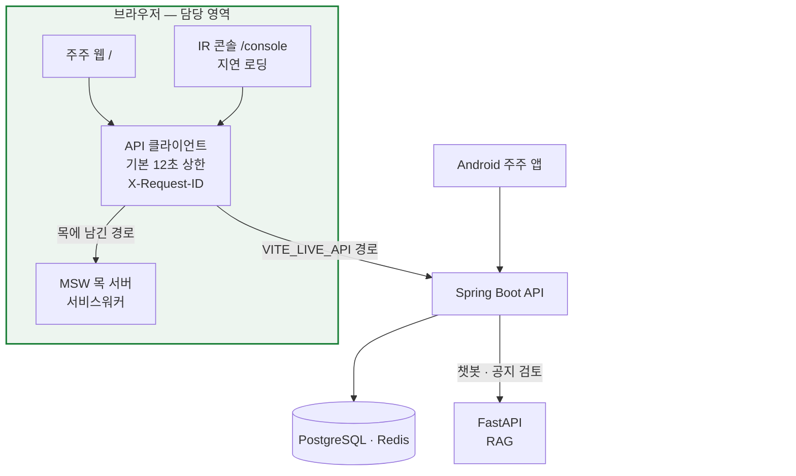

📖 사례마다 **문제와 판단 · 결과**, 코드는 [Notion 쮸⁠토⁠피⁠아 페⁠이⁠지](https://app.notion.com/p/3e91b429679f81728bb5ed4cedc72a62?source=copy_link)에 정리했습니다.

`React 19` `TypeScript` `Vite 8` `TanStack Query` `Zustand` `Zod` `Tailwind CSS 4` `MSW 2` `Vitest` `Playwright` `axe-core` ·&nbsp;공⁠지&nbsp;문⁠맥&nbsp;검⁠토:&nbsp;`FastAPI`

 

---

### 🤖 SSACURITY — 셔⁠틀 승⁠강⁠장 출⁠입 태⁠깅⁠을 로⁠봇⁠이 대⁠신⁠하⁠는 관⁠제 시⁠스⁠템

**기간** 2026.07.13 – 08.11 · **역할** 프론트엔드 · 발표 · **팀** 6명(하드웨어 4 포함)

> **화면은 요원의 동선대로 써 보며 문제를 짚고, 실패한 시연은 로그로 따라가 멈춘 조건을 좁혔습니다.**

보안 요원이 셔틀 시간마다 태깅 기기를 들고 나가 설치 · 회수하던 승강장에, 셔틀이 도착하면 로봇이 AprilTag를 따라 태깅 지점에 서고 미태깅 통과를 바로 경보하는 시스템입니다. 기능은 건물 보안 요원 인터뷰에서 정했습니다. 
저는 **첫 관제 화면 목업, 요원 동선 기준의 실사용 검수, 로봇 동작 검증, 최종 발표**를 맡았습니다. 관제 화면은 백엔드 담당 팀원이, 펌웨어는 STM32 주행 제어 담당 팀원과 모터 제어 담당 팀원이 구현했고, 제가 짚은 문제를 담당 팀원이 코드에 반영했습니다(시연 미출발 수정안은 반영 전에 프로젝트가 끝남).

<picture></picture>
<picture></picture>
<picture></picture>
<picture></picture>
<picture></picture>

관제 화면 사례는 짚어 전달, 로봇 사례는 로그로 조건을 좁혀 넘김 · 코드 반영은 담당 팀원 · 흔들림은 동일 조건 3회 반복 주행 기준(이동창을 거친 측정값) · 시연 미출발은 멈춘 조건만 특정(중립 명령이 끊긴 이유는 남은 질문)

**핵심 성과**
- **감지 → 확인 → 기록이 한 화면에서 끝나게** — 요원 동선대로 써 보며 흐름이 끊기는 두 자리를 짚어 전달
- **거짓 경보와 로그인 루프 제거** — 시연 각본에서 정상 신호에도 뜨던 "재연결 중"과, 로그인한 교육생 계정에 "로그인이 필요합니다"라던 안내를 짚어 전달(원인 수정은 담당 팀원)
- **"속도가 이상해요"가 아니라 "저속 구간에서만"** — 튀는 속도 값이 표시에 그치지 않고 속도 PID 입력으로 들어가 제어까지 흔든다는 점을 이 조건으로 특정해 넘겼고, 팀원이 속도를 이동창으로 재도록 바꿔 측정 흔들림 약 70% 감소
- **안 됐을 때를 먼저 쓴 발표** — 대본 14분 27초 · Q&A 대본 44문항 · 8장면 시연 시나리오 · 실패 상황별 대응 문장 8개
- **시연 실패를 로그로 좁히기** — 39분 뒤 정상 주행 로그와 대조해, 하드웨어가 아니라 끊긴 중립 명령이 로봇을 세웠다는 조건까지 특정(끊긴 이유는 남은 질문)

**화면** (관제 화면은 팀 결과물 · 목 모드 캡처)

<table>
<tr>
<td colspan="2">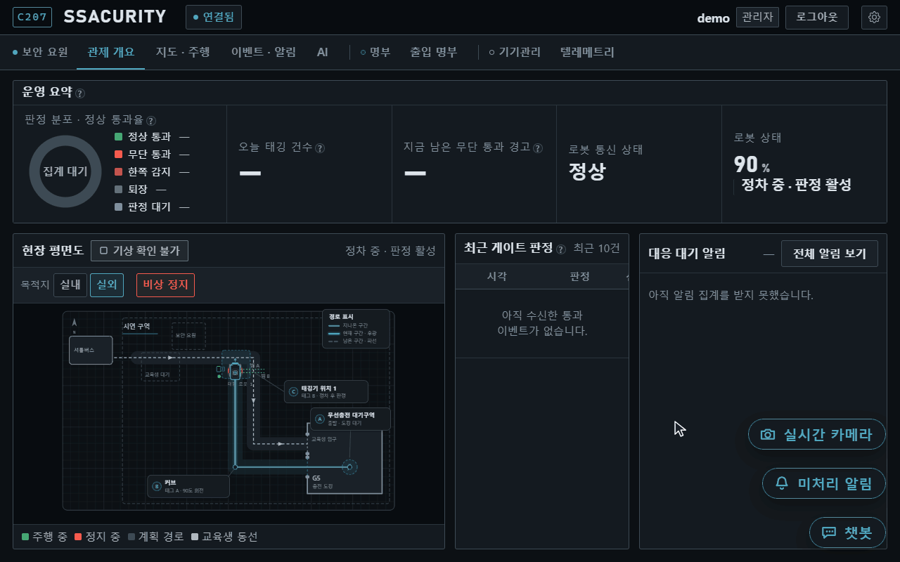
<b>무단 통과 경보 → 신원 입력</b> · 경보 창에서 바로 신원 입력으로, 확인한 요원 칸은 로그인한 이름으로 채워짐(이름은 예시)
</td>
</tr>
<tr>
<td colspan="2">
<b>관제 개요</b> · 로봇 위치 · 게이트 판정 · 경고를 한 화면에
</td>
</tr>
</table>

**발표 장표** (발표 담당)

<table>
<tr>
<td width="33%" valign="top">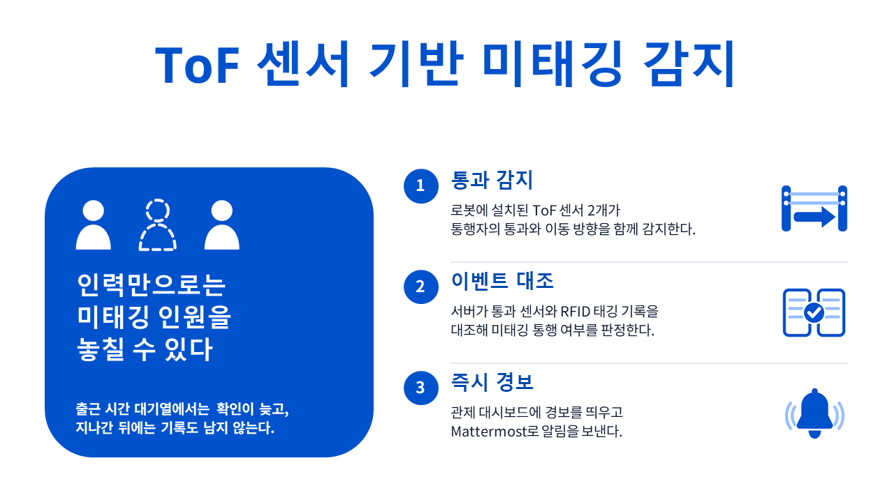
<b>ToF 판정</b> · 통과 · 방향을 잡고 태깅 기록과 대조
</td>
<td width="33%" valign="top">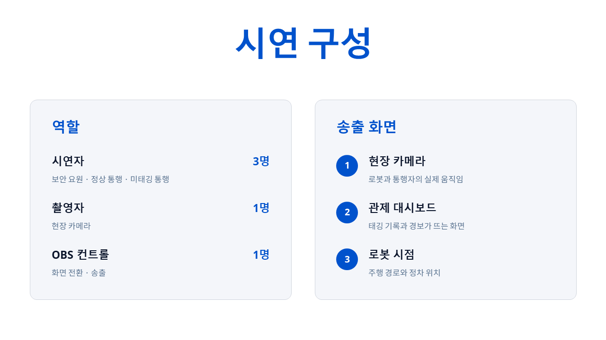
<b>시연 구성</b> · 시연자 셋 · 촬영 · 송출 둘
</td>
<td width="33%" valign="top">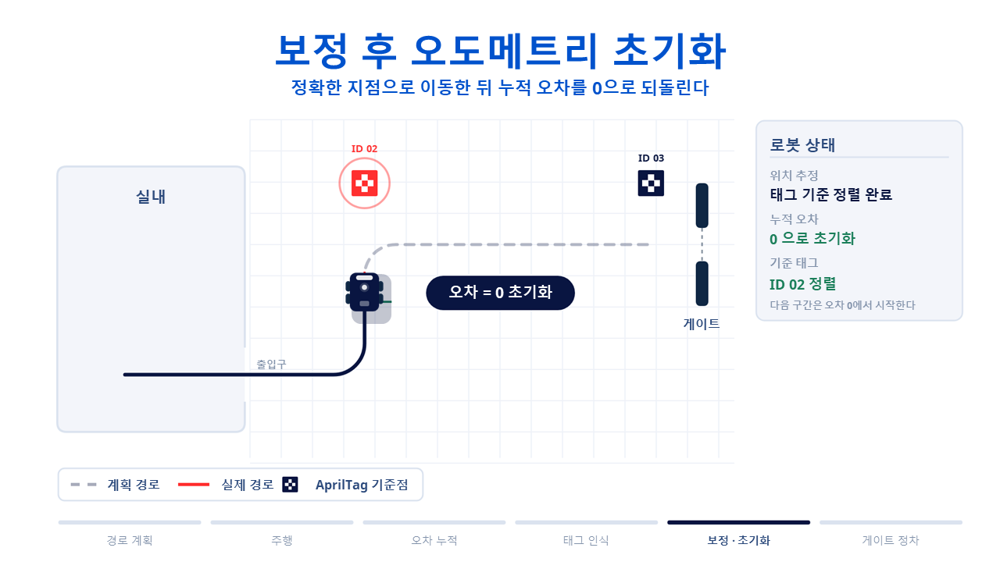
<b>AprilTag 보정</b> · 태그 지점에서 쌓인 오차를 끊고 다시 맞춤
</td>
</tr>
</table>

<b>🏗 요⁠청⁠이 가⁠는 길 (아⁠키⁠텍⁠처)</b>

 

팀은 역할을 **실패했을 때 무엇이 위험한가**로 나눴습니다. 모터 제어와 안전 정지는 STM32가 혼자 판단하고, 무거운 인식은 젯슨이 맡습니다.

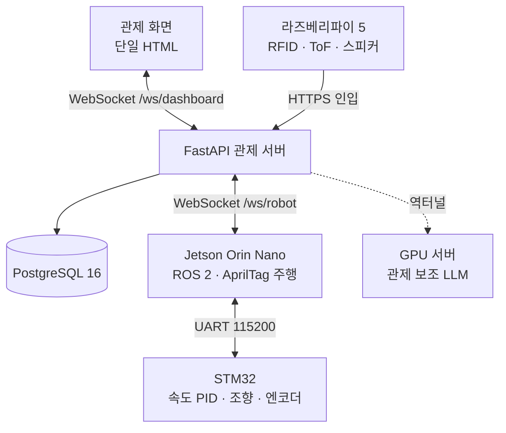

📖 화면 검수 · 로봇 동작 검증 · 발표 · 로그 분석의 **문제와 판단 · 결과**는 [Notion SSACURITY 페이지](https://app.notion.com/p/SSACURITY-3e91b429679f814da3e4d88472095981?source=copy_link)에 정리했습니다.

`관제 화면 검수` `주행 로그 분석` `초기 목⁠업: React · TypeScript` · 팀 스택: `Vanilla JS` `WebSocket` `FastAPI` `ROS 2` `UART`

 

---

### 💼 잡⁠싸⁠피 — SSAFY 교⁠육⁠생⁠을 위⁠한 AI 취⁠업 준⁠비 플⁠랫⁠폼

**기간** 2026.05.08 – 06.26 · **역할** 팀장 · 프론트엔드 · 온디바이스 AI · **팀** 2명

> **목소리가 브라우저 밖으로 나가지 않는 AI 면접 연습을 만들었습니다.**

합격 자소서 추천, AI 자소서 평가, 면접 연습, 취업 커뮤니티를 한곳에 모은 서비스입니다. 
팀장이자 프론트엔드 담당으로 라우팅 · 인증 상태 같은 공통 구조와 홈 · 면접 연습 · 취업 편의 툴 · 커뮤니티 · 프로필 화면을 만들었고, 면접 연습에는 **Whisper 음성 인식 모델을 브라우저 안에서 돌리는 온디바이스 AI**를 붙였습니다.

<picture></picture>
<picture></picture>
<picture></picture>

인식 시간은 WASM · Edge · Core Ultra 7 155H 기준 · JS는 gzip · 화면 14개 중 12개 지연 로딩

**핵심 성과**
- **서버 없는 음성 인식** — Transformers.js로 Whisper(tiny)를 브라우저에서 실행, 말하기 속도와 습관어 5종을 피드백
- **첫 화면에서 AI 라이브러리 빼기** — 모든 화면 정적 import → 12개 지연 로딩으로 첫 화면 JS −73%
- **어느 경로로 와도 같은 본인 판단** — 내 정보가 비어 있으면 먼저 조회해 채운 뒤 서버가 준 프로필 주인과 비교하게 고쳐, 내 프로필에 '팔로우'가 뜨던 버그를 수정(응답 사이 잠깐 보이는 틈은 남음)
- **필드 성격에 맞춘 검색** — 글 유형은 exact, 직무는 icontains, 검색어는 제목 + 본문 OR 검색(커뮤니티 백엔드는 팀원과 나눠 만듦)

**화면**

<table>
<tr>
<td colspan="2" align="center">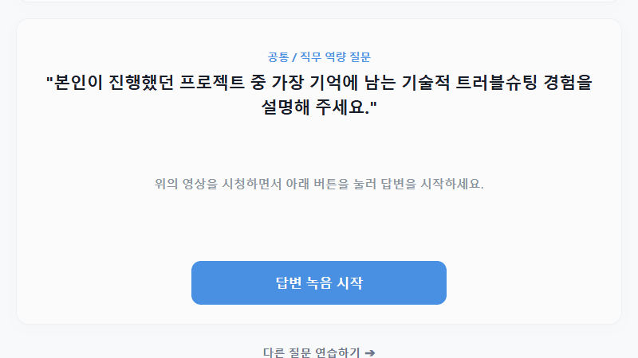
<b>면접 연습</b>(예시 답변 · 합성 음성) · 브라우저 안에서 텍스트로 바꾸고 말하기 속도와 습관어를 짚음 · tiny 모델이라 '면접 → 면적'처럼 발음이 비슷한 단어는 틀리기도 함 · 화면의 답변 시간 25초는 녹음 버튼 기준(음성은 23.5초) · 녹음 구간은 6배로 빨리 감음
</td>
</tr>
<tr>
<td colspan="2" align="center">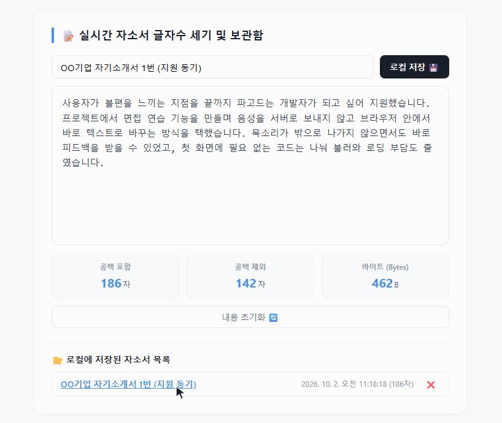
<b>취업 편의 툴</b>(예시 문장) · 서버 없이 글자 수 계산 · 새로 고쳐도 남는 임시 저장 · 보관함 저장(같은 화면에 증명사진 변환기도 있음) · 입력 일부는 2배로 빨리 감음
</td>
</tr>
<tr>
<td colspan="2">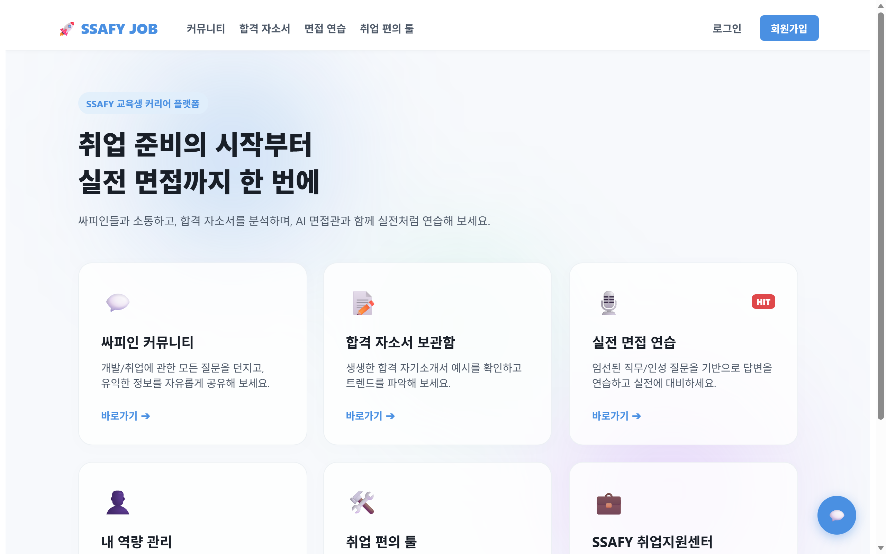
<b>홈</b> · 떠다니는 배경은 transform만 움직여 레이아웃 · 페인트를 다시 계산하지 않음
</td>
</tr>
</table>

**기술 선택 이유** — Transformers.js는 Hugging Face의 음성 인식 모델을 브라우저에서 그대로 불러와, 2명 · 최종 구현 5일 조건에서 서버를 늘리지 않고 붙일 수 있었습니다.

<b>🏗 요⁠청⁠이 가⁠는 길 (아⁠키⁠텍⁠처)</b>

 

음성은 브라우저 밖으로 나가지 않고, 음성 인식을 위해 처음 한 번 받는 것은 모델 파일(Hugging Face)과 WASM 런타임(jsDelivr CDN)뿐입니다. 서버 쪽 AI와 챗봇 · 자소서 평가 · 합격 자소서 화면은 팀원이 맡았습니다. 그림에서 주황 테두리가 주로 맡은 브라우저 쪽입니다.

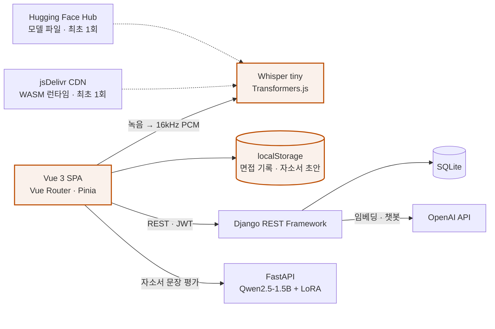

📖 사례마다 **문제와 판단 · 결과**, 코드는 [Notion 잡⁠싸⁠피 페⁠이⁠지](https://app.notion.com/p/3e91b429679f81a8b22cf2e8cb2e0702?source=copy_link)에 정리했습니다.

`Vue 3` `Vite` `Vue Router` `Pinia` `Transformers.js` `Whisper` `Web Audio API` `Django REST Framework` `django-filter`

 

## 🧭 일⁠하⁠는 원⁠칙 — 세 프⁠로⁠젝⁠트⁠를 잇⁠는&nbsp;것

시간순 · 잡싸피 → SSACURITY → 쮸토피아 · 펼치면 프로젝트마다 한 줄씩

잡싸피에서 사용자에게 숨긴 실패는 쮸토피아의 "실패는 실패라고"가 됐고, SSACURITY에서 다시 만들어야 했던 화면은 쮸토피아의 "계약 먼저"가 됐습니다.

🔎 <b>사⁠실⁠만 말⁠하⁠는 화⁠면</b> — 받⁠지 못⁠한 것, 모⁠르⁠는 것, 틀⁠린 것⁠을 미⁠리 채⁠우⁠지 않⁠습⁠니⁠다.

 

- **💼 잡싸피** — 마이크 권한이 없거나 음성 분석에 실패해도 예시 문장으로 피드백을 만들어 기록에 남겨, 사용자가 진짜 결과로 오해할 수 있었습니다.
- **🤖 SSACURITY** — 로그인에 성공한 교육생 계정에 "로그인이 필요합니다"라고 말하던 안내를 짚었습니다. 틀린 안내를 믿고 따르면 같은 고리를 계속 돌게 됩니다.
- **🌳 쮸토피아** — 서버가 죽거나 답하지 않아도 카드마다 무엇을 못 불러왔는지 말하고, 받지 못한 날은 '기록 없음'으로 따로 세고, 도구 결과와 맞지 않는 AI 숫자는 화면에 올리지 않습니다(실서버는 개인 수치 답변을 내지 않아 이 대조는 목에서만 검증).

🧯 <b>안 됐⁠을 때⁠를 먼⁠저</b> — 잘⁠됐⁠을 때⁠보⁠다 안 됐⁠을 때 어⁠떻⁠게 물⁠러⁠설⁠지⁠를 먼⁠저 정⁠합⁠니⁠다.

 

- **💼 잡싸피** — 음성 인식 모델을 불러오는 동안에는 녹음 버튼을 막았지만, 불러오지 못했을 때의 길은 정하지 않았습니다. 실패는 콘솔에만 남고 버튼이 다시 열려, 답변을 마친 뒤에야 예시 문장 피드백으로 넘어갔습니다.
- **🤖 SSACURITY** — 시연 실패에 대비한 문장 여덟 개가 모두 재시도를 전제로 쓰여, 재시도로 풀리지 않는 멈춤 앞에서는 소용이 없었습니다. 필요했던 건 출발 직전 로봇 상태를 확인하는 점검표 한 줄이었습니다.
- **🌳 쮸토피아** — 요청마다 기본 12초 상한을 걸어 멈추는 대신 실패하게 했고, 목 서버가 뜨지 않아 빈 화면으로 남던 실패는 5초 시한으로 막았습니다. 증권사 목록만 실서버로 켜는 부분 연동이 전부 목일 때보다 나빠진다는 걸 병합 전에 찾아, 13분 만에 되돌렸습니다.

🤝 <b>계⁠약⁠을 먼⁠저</b> — 화⁠면⁠보⁠다 서⁠버⁠와 주⁠고⁠받⁠을 약⁠속⁠을 먼⁠저 세⁠웁⁠니⁠다.

 

- **💼 잡싸피** — '내 프로필인가'를 프론트가 추측하다가 "팔로우" 버튼 버그를 냈습니다. 서버가 아는 사실은 응답에 넣자고 먼저 맞췄어야 했습니다.
- **🤖 SSACURITY** — 서버와 메시지 형식을 맞추기 전에 먼저 만든 React 관제 화면 목업은 손대지 않고 살릴 코드가 약 18%뿐이라(팀 전수 측정), 팀이 화면을 새로 만들었습니다.
- **🌳 쮸토피아** — 목 서버로 계약을 먼저 세우고 경로 단위로 목을 끄는 스위치를 만들어, 응답 모양까지 맞는 경로부터 팀이 함께 실서버로 옮겼습니다(마칠 때 데모 빌드의 핸들러 33개). 손으로 쓴 타입 34쌍은 CI에서 서버 OpenAPI와 대조했습니다.

📍 <b>기⁠준⁠은 한⁠곳⁠에</b> — 하⁠나⁠의 판⁠단⁠을 여⁠러 곳⁠에⁠서 하⁠지 않⁠습⁠니⁠다.

 

- **💼 잡싸피** — 로그인이 필요한 화면인지는 라우트마다 따로 막지 않고 전역 가드 한곳에서 판단했습니다.
- **🤖 SSACURITY** — 상단바만 다른 신선도 임계(6초)를 들고 있어, 시연 각본에서 신호가 정상 주기로 와도 "재연결 중"이 떴습니다. 이 거짓 경보를 짚었고, 팀원이 임계를 단일 상수로 모았습니다.
- **🌳 쮸토피아** — 모든 요청이 API 클라이언트 한곳을 지나며 시간 상한 · 추적 번호 · 오류 해석을 한꺼번에 받고, 실서버로 보낼 경로 목록은 테스트가 CI 설정을 직접 읽어 잠급니다.

📦 <b>필⁠요⁠한 사⁠람⁠에⁠게 필⁠요⁠한 코⁠드⁠만</b> — 자⁠리⁠에 맞⁠춰 나⁠누⁠되, 나⁠눌 이⁠유⁠가 없⁠으⁠면 나⁠누⁠지 않⁠습⁠니⁠다.

 

- **💼 잡싸피** — 면접 화면에서만 쓰는 AI 라이브러리를 지연 로딩으로 빼 첫 화면 JS(gzip)를 216.2 KB에서 59.2 KB로 줄였습니다(−73%).
- **🤖 SSACURITY** — 나누지 않는 쪽이 맞았던 사례입니다. 팀이 다시 만든 관제 화면은 빌드 없는 파일 한 장이었고, 1920×1200 화면 하나에서 탭 여섯을 오가는 구조라 라우팅 · 코드 분할 없이도 충분했습니다.
- **🌳 쮸토피아** — IR 콘솔 38.4 KB(gzip)를 주주가 받지 않게 나누고, 운영 빌드에는 목 · 데모 도구 코드를 싣지 않았습니다(0 KB).

📏 <b>재⁠서 판⁠단⁠하⁠기</b> — 체⁠감 대⁠신 측⁠정⁠값⁠으⁠로 정⁠합⁠니⁠다.

 

- **💼 잡싸피** — 음성 인식 모델을 양자화 버전과 비교해 보지 않고 fp32(약 145 MB)로 정했습니다. 끝난 뒤 다시 측정해 보니 면접 화면 첫 로딩이 약 34초였습니다. 같은 모델의 q8 버전은 fp32의 4분의 1쯤인 약 39 MB입니다.
- **🤖 SSACURITY** — 저속 구간에서만 튀는 속도 값을 로그에서 찾아 조건을 특정했고, 실패한 시연 로그를 39분 뒤 성공한 주행 로그와 나란히 놓고 명령 송신 횟수(0회 ↔ 202회)로 원인을 좁혔습니다.
- **🌳 쮸토피아** — 5초 목 부팅 시한은 정상 부팅 실측(0.6–1.0초)에서 정했습니다. AI 답변 범위를 나누자는 요청도, 숫자 대조가 조문 번호 · 연도 · 단계 수까지 막아 제도 설명 예문 3개가 모두 숨는 것을 확인한 뒤에 했습니다.

 

## 📈 돌⁠아⁠보⁠며

<b>🌳 쮸⁠토⁠피⁠아</b> — 증⁠상⁠이 아⁠니⁠라 길⁠을 고⁠쳤⁠다 · 목⁠에⁠서⁠만 참⁠인 것⁠들

 

**잘⁠한 점 · 증⁠상⁠이 아⁠니⁠라 길⁠을 고⁠쳤⁠다**
- 에러 화면이 안 뜰 때 화면을 고치지 않고, **그 화면에 닿지 못하게 하는 길**(없던 시간 상한)을 찾아 막았습니다.
- 기준값은 근거를 남겨 정했습니다. 5초 목 부팅 시한은 정상 부팅 실측(0.6–1.0초)에서, 12초 요청 상한은 느린 네트워크 기준(3초)의 4배로 정했습니다.
- 제 변경도 틀리면 바로 되돌리거나 고쳤습니다. 증권사 부분 연동은 병합 전 검토에서 13분 만에 되돌렸고, dev에 바로 올렸던 추적 번호 회귀는 18분 만에 고쳤습니다.

**아⁠쉬⁠운 점 · 목⁠에⁠서⁠만 참⁠인 것⁠들**
- 개인 수치 대조는 끝내 실서버에서 돌지 못하고 목에서만 증명됐습니다.
- 목에 권한 검사가 없어, 역할 버그를 E2E가 잡지 못하고 잘못된 이유로 통과한 적이 있습니다.
- 계약 대조는 스냅샷 갱신이 CI 밖이라, 스냅샷이 낡으면 조용합니다.

**다⁠음⁠엔 · 목⁠도 서⁠버⁠만⁠큼 엄⁠격⁠하⁠게**
- 목에도 **권한 경계**를 넣어 E2E가 역할 문제를 잡게 하겠습니다.
- OpenAPI 스냅샷 갱신을 CI에 넣고, 손으로 쓴 타입 대신 **생성 타입**을 검토하겠습니다.
- 서버가 개인 수치를 `figures`와 함께 내려 주는 계약을 **처음부터** AI · BE와 맞추겠습니다.

<b>🤖 SSACURITY</b> — 사⁠람⁠이 움⁠직⁠이⁠는 순⁠서⁠로, 좁⁠혀⁠서, 로⁠그⁠로 · 재⁠시⁠도⁠를 전⁠제⁠한 대⁠본, 기⁠능 단⁠위 리⁠허⁠설

 

**잘⁠한 점 · 사⁠람⁠이 움⁠직⁠이⁠는 순⁠서⁠로, 좁⁠혀⁠서, 로⁠그⁠로**
- **화면을 기능이 아니라 동선으로 봤습니다.** "이걸 누가, 어떤 상황에서 보는가"라는 질문 하나로 화면 검수도, 시연 시나리오도, 대본도 정리됐습니다.
- **문제를 좁혀서 넘겼습니다.** "안 돼요" 대신 어디까지 왔고 어디서 끊겼는지, "속도가 이상해요" 대신 어느 구간에서만 튀는지를 말하니 고칠 사람이 같은 것을 보고 움직일 수 있었습니다.
- **눈으로는 정상 주행이어도 로그를 의심**해 저속 구간의 측정 불안정을 찾았고, **실패한 시연을 성공한 주행과 대조**해 "하드웨어 탓"으로 끝날 뻔한 일을 구조적 원인으로 좁혔습니다.

**아⁠쉬⁠운 점 · 재⁠시⁠도⁠를 전⁠제⁠한 대⁠본, 기⁠능 단⁠위 리⁠허⁠설**
- **실패 대응 문장 여덟 개가 전부 재시도를 전제**했습니다. 문장은 만들었지만, 그 문장을 언제 써야 하는지 판별할 눈은 만들지 않았습니다.
- **기능 단위 확인을 리허설이라고 불렀습니다.** 시나리오를 만들었으면 그 시나리오 그대로 리허설했어야 했습니다.
- **수정안은 끝내 코드에 들어가지 못했습니다.** 멈춘 조건을 찾은 시점이 발표 뒤였습니다.
- **같은 판단 기준이 여러 곳에 흩어져** 있는 것을 거짓 경보가 난 뒤에야 알았습니다.
- **붙어 지나가는 두 사람은 끝내 가르지 못했습니다.** 바짝 붙어 지나가면 통과가 한 번으로 집계됩니다. ToF 두 개로는 통과와 방향까지는 알아도 사람 수는 셀 수 없는 구조였습니다.

**다⁠음⁠엔 · 물⁠러⁠설 길⁠부⁠터, 나⁠오⁠는 길⁠까⁠지**
- 무언가를 보여 줄 자리에서는 **어떻게 보여 줄지보다 어떻게 물러설지**를 먼저 정하겠습니다. 출발 전 상태 점검표를 두고, 재시도 여부는 발표자가 아닌 사람이 판단하게 하겠습니다.
- 상태 기계는 **들어가는 조건과 나오는 길을** 같은 무게로 확인하겠습니다. 모든 상태에 탈출 경로가 하나 이상 있는지 표로 그려 보는 것부터입니다.
- **'살아 있음' 신호가 끊기면 보내는 쪽이 먼저 알게 하겠습니다.** 로봇은 위험해서가 아니라 조용해서 멈췄습니다. 대기 중 중립 명령이 '살아 있지만 시킬 일은 없다'는 신호였는데, 그 신호가 끊긴 것을 받는 쪽(STM32)만 알았습니다.
- 통합 직전에는 **안전 관련 정의만이라도 문서와 코드를 대조**하고, 상태 판단에 쓰는 임계는 처음부터 **단일 상수**로 두겠습니다.
- 화면은 **서버 창구와 메시지 형식을 먼저 정하고** 목 데이터로 시작하겠습니다.

<b>💼 잡⁠싸⁠피</b> — 서⁠버⁠보⁠다 브⁠라⁠우⁠저⁠에⁠서 풀 수 있⁠는⁠지 따⁠져 봤⁠다 · 첫 로⁠딩, 메⁠인 스⁠레⁠드, 숨⁠긴 실⁠패

 

**잘⁠한 점 · 서⁠버⁠보⁠다 브⁠라⁠우⁠저⁠에⁠서 풀 수 있⁠는⁠지 따⁠져 봤⁠다**
- 음성 인식을 서버 일로만 보지 않고 **브라우저에서 풀 수 있는지** 따져, 2명 · 최종 구현 5일 조건에서 백엔드 부담 없이 기능을 완성했습니다.
- 무거운 라이브러리를 붙인 뒤 **라우트를 지연 로딩으로 바꿔**, 면접 연습을 하지 않는 사용자가 그 비용을 치르지 않게 했습니다.

**아⁠쉬⁠운 점 · 첫 로⁠딩, 메⁠인 스⁠레⁠드, 숨⁠긴 실⁠패**
- **면접 화면의 첫 로딩이 무겁습니다.** fp32 모델(약 145 MB)과 WASM 런타임(약 22 MB)을 받아야 해서, 다시 재 보니 첫 로딩에 약 34초가 걸렸습니다. 같은 모델의 q8 양자화 버전은 약 39 MB인데, 두 버전을 비교해 보지 않고 fp32로 정했습니다.
- **추론이 메인 스레드에서 돕니다.** 분석하는 동안에는 화면이 멈추거나 느려질 수 있습니다.
- **실패를 숨겼습니다.** 마이크 권한이 없거나 음성 분석에 실패하면 예시 문장으로 피드백을 만들어 기록에 저장했습니다. 모델을 불러오지 못했을 때도 콘솔에만 남기고, 불러오는 동안 막아 둔 녹음 버튼을 다시 열어, 답변을 마치면 역시 예시 문장 피드백이 나왔습니다.
- **본인 여부를 프론트에서 추측했습니다.** 요청을 한 번 더 보내 확인했지만, 서버가 `is_me` 같은 값을 내려 줬다면 요청 한 번으로 끝났을 일입니다.
- **API 주소와 인증 헤더를 호출마다 적었습니다.** 로그인 여부는 전역 가드 한곳에서 판단했지만, 요청은 한곳을 지나지 않았습니다. 제가 쓴 코드에만 `http://localhost:8000`이 20곳, 인증 헤더를 직접 만드는 곳이 16곳이라, 주소를 바꾸거나 배포 환경으로 옮기려면 호출을 하나하나 고쳐야 하는 구조였습니다.

**다⁠음⁠엔 · 무⁠거⁠운 일⁠은 워⁠커⁠로, 판⁠단⁠은 서⁠버⁠로**
- 모델은 **fp32와 양자화 버전의 정확도를 비교해** 고르고, 추론은 **Web Worker**로 옮겨 화면이 멈추지 않게 하겠습니다.
- 실패는 **실패라고 알리고** 기록에서 빼겠습니다.
- 본인 여부 · 권한처럼 **서버가 아는 사실은 응답에 넣자고** API 설계 단계에서 먼저 맞추겠습니다.
- 요청은 **API 클라이언트 한곳**을 지나게 해, 주소와 인증 헤더를 한 번만 적겠습니다.

 

## 📊 Activity

프로젝트는 SSAFY **GitLab**(비공개 · 요청 시 공개)에서 진행했습니다. 아래는 쮸토피아(JJUTOPIA) 저장소 기록입니다.

 

<picture></picture>
<picture></picture>
<picture></picture>

 

최종 dev(2026.09.28) 기준 · 커밋은 병합 제외 · MR은 dev에 병합된 본인 MR · 문서 커밋은 커밋 224개 가운데 📝 커밋 
GitHub에는 앞으로의 개인 작업과 학습 기록을 쌓아 갈 예정입니다.

<picture>
  <source media="(prefers-color-scheme: dark)" srcset="./assets/footer-dark.svg"/>
  
</picture>
