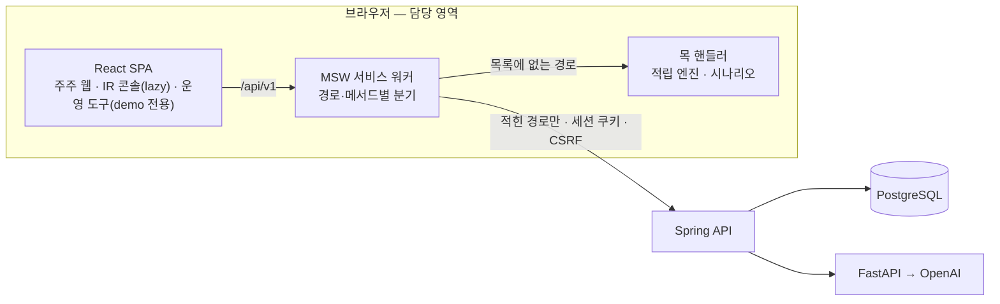
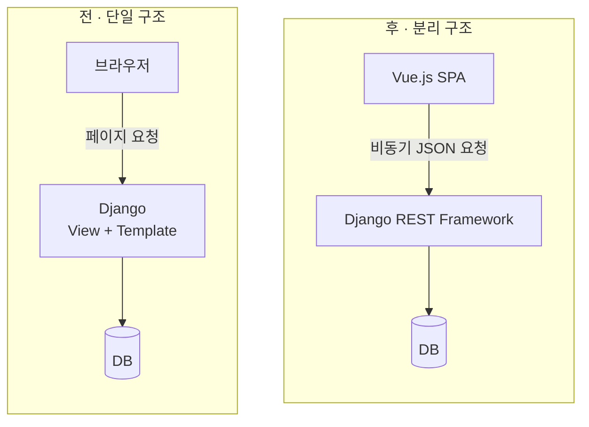

<div align="center">


<br/>

<!-- ▼ 헤더 카드: 여기부터 -->
<table>
<tr>
<td align="center" width="50%">🎓 <b>수학 전공</b><br/><sub>Samsung Software Academy For Youth 15기 이수 중</sub></td>
<td align="center" width="50%">💻 <b>Frontend Developer</b><br/><sub>React · TypeScript · Vue.js</sub></td>
</tr>
<tr>
<td align="center">🏦 <b>핀테크 · 🤖 로봇 관제 · 💼 취업 지원</b><br/><sub>SSAFY 프로젝트 3개</sub></td>
<td align="center">🔍 <b>프론트엔드 포지션을 찾고 있어요</b><br/><sub>편하게 연락 주세요</sub></td>
</tr>
</table>

<a href="mailto:handongin15@gmail.com"></a>
<a href="https://app.notion.com/p/3e91b429679f8183ae77c26eb318da9e"></a>

<sub>📂 프로젝트별 포트폴리오</sub><br/>
<a href="https://app.notion.com/p/3e91b429679f81728bb5ed4cedc72a62?source=copy_link"></a>
<a href="https://app.notion.com/p/SSACURITY-3e91b429679f814da3e4d88472095981?source=copy_link"></a>
<a href="https://app.notion.com/p/3e91b429679f81a8b22cf2e8cb2e0702?source=copy_link"></a>
<!-- ▲ 헤더 카드: 여기까지 -->

<br/>

<a href="#about"></a>
<a href="#stack"></a>
<a href="#zzutopia"></a>
<a href="#ssacurity"></a>
<a href="#jobssafy"></a>
<a href="#retro"></a>

</div>

<br/>

<a id="about"></a>

## 🙋 About Me

수학을 전공하고 **Samsung Software Academy For Youth(SSAFY) 15기 수료 예정**인 프론트엔드 개발자입니다.

ChatGPT가 등장해 사람들이 일하고 배우는 방식이 바뀌는 흐름을 보며, **바라보는 쪽이 아니라 그 흐름을 만드는 쪽에 서고 싶어** 개발을 시작했습니다.<br/>
그래서 첫 프로젝트부터 AI 파트를 맡았고, 이후에는 **AI가 실제 데이터와 일치하도록** 만드는 데 집중했습니다.

<br/>

### 💪 이런 방식으로 일합니다

| 강점 | 근거가 된 경험 |
|---|---|
| **🤝 협력 · 존중** | 다른 파트에 보낼 요청은 번호 붙은 문안으로 관리하고, **보내기 전에 코드와 수치를 다시 재서** 이미 해결된 일을 요청하지 않았습니다. 팀원이 먼저 만든 해결책은 복사하지 않고 공용 함수로 빼서 함께 쓰게 했습니다. |
| **🧱 논리 · 구조** | "FE는 도메인 수치를 계산하지 않는다" 같은 **불변 규칙 12개**를 세우고 eslint · 테스트로 강제했습니다. 라이브 시연 실패는 정상 주행 로그와 **대조 분석**해 하드웨어가 아닌 상태 교착임을 밝혔습니다. |
| **🌱 적응 · 학습** | 수학 전공에서 개발로 넘어와 Django · Vue.js로 시작했고, 이후 WebSocket 관제 화면, React · TypeScript 핀테크 서비스까지 **프로젝트마다 새 스택으로 결과를 냈습니다.** |
| **🙇 겸손** | 테스트가 통과해도 믿지 않고 **가드를 일부러 되돌려 실패하는지 확인**합니다. 회고에서는 잘한 점만큼 아쉬운 점과 다음에 바꿀 점을 구체적으로 남깁니다. |

<br/>

<a id="stack"></a>

## 🛠 Tech Stack

<div align="center">

**Frontend**<br/><br/>


<br/>

**Backend · Tools**<br/><br/>


<br/>

**Library · Test**<br/><br/>


</div>

<br/>

---

## 🚀 Projects

<a id="zzutopia"></a>

### 🏦 쮸토피아 — 주주 우대 B2B 핀테크 서비스

  

발행사가 주주 우대 제도를 설계·검증·운영하고, 주주는 보유 주식 수 × 보유 일수로 쌓인 혜택을 확인하는 서비스입니다.<br/>
주주 웹 · IR 콘솔 · 데모 운영 도구를 **한 React 앱 안의 세 라우트 트리**로 설계·구현했습니다.

<div align="center">


</div>

**핵심 성과**
- **화면과 AI 챗봇이 같은 숫자를 말하게** — FE는 도메인 수치를 계산하지 않는 규칙을 세우고 eslint로 강제
- **목 → 실서버를 한 경로씩** — `VITE_LIVE_API` 스위치로 경로·메서드 단위 전환, 실연동 날 화면 코드 수정 거의 없음
- **데모 도구가 운영 번들에 남지 않게** — 운영 빌드에서 `/ops` 404, 청크·경로 문자열까지 제거
- **법 규제를 코드 규칙으로** — 상법 · AI 기본법을 근거로 한 불변 규칙 12개, 일부는 eslint·테스트로 강제
- **모든 화면을 한 번에 덮는 검증** — axe 접근성 · 3개 해상도 가로 스크롤 · 랜드마크 횡단 게이트

**직접 만든 주요 화면**

<table>
<tr>
<td width="50%"><p align="center"><sub><b>주주 홈</b> · 등급 링 게이지와 승급 조건</sub></p></td>
<td width="50%"><p align="center"><sub><b>AI 주주 도우미</b> · 화면과 같은 숫자로 답변</sub></p></td>
</tr>
<tr>
<td width="50%"><p align="center"><sub><b>프로그램 설계 위저드</b> · 법 조항과 함께 보이는 조건</sub></p></td>
<td width="50%"><p align="center"><sub><b>컴플라이언스 검토</b> · 차단 시 배포 잠금</sub></p></td>
</tr>
</table>


| 화면 | 경로 | 구현 포인트 |
|---|---|---|
| 주주 홈 | `/` | 등급 링 게이지 · 승급 조건. 등급을 색이 아니라 아이콘과 글자로 구분 |
| AI 주주 도우미 | `?chat=1` | 링 게이지와 같은 서버 숫자로 답변, AI 생성 표시는 조건 없이 부착 |
| 쿠폰 · 바코드 | `/benefits` | 혜택 사용 시 쿠폰 번호와 Code 128 바코드, 발급됨 탭에서 재열람 |
| 적립 이력 | `/history` | "적립 없음"과 "기록 없음"을 구분 — 기록 없는 날을 0으로 그리던 버그 수정 |
| 프로그램 설계 위저드 | `/console/programs/new` | 쓸 수 없는 적립 조건을 숨기지 않고 법 조항과 함께 표시 |
| 공지 컴플라이언스 검토 | `/console/comms/:id/review` | 원고 문장과 검토 카드를 각주로 연결, 차단 항목이 남으면 배포 버튼이 이유와 함께 잠김 |
| 운영 대시보드 | `/console` | 도입 전후 보유일수 · 유지율 · 이탈률 비교, 일별 적립 추이 |

**기술 선택 이유**

| 기술 | 왜 이걸 골랐나 |
|---|---|
| TanStack Query | 화면의 도메인 수치를 전부 서버 값으로 쓰기로 했기 때문에, 서버 상태의 캐싱 · 재조회를 전담시킴 |
| Zustand | 서버 상태와 섞이지 않는 순수 클라이언트 상태만 가볍게 관리 |
| URL 검색 파라미터 | 새로고침 후에도 남아야 할 UI 상태(챗봇 열림 등)를 URL에 두어 공유 · 뒤로가기가 살아 있게 함 |
| MSW | 백엔드 API가 하나씩 완성되는 상황에서, 화면 코드를 바꾸지 않고 경로 단위로 실서버에 붙이기 위해 |
| Zod | 입력 형식 검증에만 사용. 법적 판단은 서버 컴플라이언스 API에만 맡기도록 역할을 분리 |

<details>
<summary><b>📜 어떤 이유로도 어기지 않는 불변 규칙 (12개 중 일부)</b></summary>
<br/>

| 규칙 | 이유 |
|---|---|
| FE는 도메인 수치를 계산하지 않는다 | 화면과 챗봇의 숫자가 갈라지지 않게 |
| 의결권과 혜택을 잇는 코드를 쓰지 않는다 | 상법 §467의2 이익공여 금지 |
| AI 생성 텍스트엔 조건 없이 생성 표시 | AI 기본법 §31 |
| 등급을 색으로만 구분하지 않는다 | 색각 이상 사용자도 읽을 수 있게 |
| 혜택에 현금성 옵션을 두지 않는다 | 상법 §464, 이익배당 재성질결정 위험 |
| 등급 임계값 · 혜택 문구를 하드코딩하지 않는다 | 발행사가 콘솔에서 바꾸는 값 |
| 운영 도구 코드는 demo 빌드 밖으로 나가지 않는다 | 라우트 · 청크 · 링크까지 |

</details>

<details>
<summary><b>🏗 요청이 가는 길 (아키텍처)</b></summary>
<br/>

MSW 서비스 워커가 모든 `/api/v1` 요청을 먼저 받고, `VITE_LIVE_API`에 적힌 경로만 실서버로 보냅니다. 화면 코드는 목과 실서버를 구분하지 않습니다.



</details>

<details>
<summary><b>🔧 트러블슈팅 — 처음 여는 사람만 보는 로그인 403</b></summary>
<br/>

- **문제** 새 브라우저엔 CSRF 쿠키가 없어 첫 로그인만 403. 개발 브라우저에선 재현되지 않고 처음 여는 심사위원만 보는 버그
- **판단** 팀원이 IR 로그인에 먼저 넣은 해결책을 복사하지 않고 함수로 추출해 두 훅이 공유 — 한쪽만 고쳐지던 자리였기 때문
- **결과** preview에서 재현·수정 확인, 호출을 빼면 테스트가 실패하는 것까지 검증

```tsx
async function ensureCsrfCookie() {
  if (!readCsrfToken(document.cookie)) await api.get('/health')
}

mutationFn: async (body: LoginRequest) => {
  await ensureCsrfCookie()
  return api.post('/me/auth/login', body)
},
```

</details>

<details>
<summary><b>🔧 트러블슈팅 — 라우트를 지워도 코드는 배포되는 함정</b></summary>
<br/>

- **문제** 모듈 최상위의 `lazy()`는 라우트를 등록하지 않아도 Vite가 청크를 만들어 운영 산출물에 남음
- **판단** `lazy()`와 라우트 배열을 빌드 상수 `isDemo` 안쪽에 두어 운영 빌드에서 `import()` 자체를 죽은 코드로 만듦
- **결과** 운영 빌드에서 `/ops`는 404, 번들에 경로 문자열도 남지 않음. 서버도 운영 프로필에서 컨트롤러를 빼 대칭 유지

```tsx
const isDemo = import.meta.env.VITE_DEMO === 'true'

const TimeMachinePage = isDemo
  ? lazy(() => import('../ops/pages/TimeMachinePage'))
  : null
```

</details>

<details>
<summary><b>🔧 트러블슈팅 — 목에서 실서버로, 한 경로씩</b></summary>
<br/>

- **문제** 백엔드 API는 하나씩 완성되는데, 목을 통째로 끄면 아직 없는 경로 때문에 화면 전체가 죽음
- **판단** `VITE_LIVE_API` 스위치로 경로 단위, 이후 메서드 단위까지 실서버로 보낼 수 있게 설계
- **발견** 증권사 목록만 켜 보니 연결 여부 플래그가 목과 어긋나 `/link` 화면이 스스로 모순 → 되돌리고 "함께 켜야 하는 묶음"으로 문서화
- **결과** 로그인 · 알림 · 챗봇 등을 preview에서 차례로 실서버에 연결. 목록에 적었는데 맞는 핸들러가 없으면 콘솔 경고

```bash
# 경로만 적으면 모든 메서드, 앞에 메서드를 적으면 그것만
VITE_LIVE_API=/health,/me/auth/,GET /me/brokers
```

</details>

<details>
<summary><b>🔧 트러블슈팅 — 서버에 없는 기능을 먼저 만드는 법</b></summary>
<br/>

- **문제** 아이디·비밀번호 변경 API가 서버에 없음. 기다리면 일정이 밀리고, 추측으로 만들면 다시 고쳐야 함
- **판단** 요청·응답·오류 코드를 제안 계약으로 정해 목으로 구현. 틀린 비밀번호는 401이 아닌 **400**으로 제안 — 앱이 401을 세션 만료로 읽기 때문
- **결과** BE가 같은 모양으로 붙이면 FE 변경 없음. 실서버가 404를 주면 오류 대신 "준비 중"으로 표시

</details>

<br/>

---

<a id="ssacurity"></a>

### 🤖 SSACURITY — 자율주행 보안 로봇 관제 시스템

 

<div align="center">


</div>

**핵심 성과**
- **거짓 경보 제거** — 화면 요소마다 달랐던 신선도 임계값(상단바만 6초)을 25초 단일 상수로 통합
- **재로그인 무한 루프 차단** — WebSocket 인증 거절(1008)을 세션 만료와 권한 부족으로 분기
- **끊겨도 놓치지 않는 재연결** — 지수 백오프(1.5초 → 15초 상한) + 재접속 시 스냅샷 재수신
- **시연 실패를 구조적 원인으로 규명** — 로그 대조 분석으로 상태 교착을 찾아 수정안·재발 방지안 수립

<details>
<summary><b>🔧 트러블슈팅 — 통신은 정상인데 뜨는 "재연결 중" 경보</b></summary>
<br/>

- **문제** 실시간 관제 화면에서 통신이 정상인데도 회차마다 거짓 "재연결 중" 경보 발생
- **원인** 신호 주기 상한은 20초인데, 상단바 · 로봇 카드 · 텔레메트리가 신선도 임계를 각자 다른 값으로 보유(상단바만 6초)
- **해결 1** 임계를 **25초 단일 상수**로 통합해 화면 요소끼리 판단이 갈라지지 않게 함
- **해결 2** WebSocket 인증 거절(1008)을 **세션 만료**와 **권한 부족**으로 분기 — "로그인이 필요합니다" 오안내로 재로그인 무한 루프에 빠지던 경로 차단
- **해결 3** 재연결은 지수 백오프(1.5초 → 15초 상한), 재접속 시 스냅샷을 다시 받아 끊긴 동안의 이벤트 복구

</details>

<details>
<summary><b>🔧 트러블슈팅 — 저속 구간에서만 튀는 속도 값</b></summary>
<br/>

- **문제** 화면상 정상 주행인데 로그에선 저속 구간 속도가 크게 튐
- **원인** 엔코더가 정수 펄스를 출력해, 10ms 샘플링 구간의 저속 펄스 수가 극히 적어 ±1 오차가 속도를 크게 왜곡
- **해결** 5샘플 이동창(50ms) 누적 + 목표 속도 비례 피드포워드를 제안해 반영 → **흔들림 약 70% 감소, 추종률 88% → 98%**

</details>

<details>
<summary><b>🔧 트러블슈팅 — 라이브 시연에서 3회 연속 미출발</b></summary>
<br/>

- **문제** 최종 발표에서 로봇이 3회 연속 출발하지 않았고, 재시도로도 복구 불가
- **분석** 39분 뒤 같은 하드웨어의 주행 시험은 정상(명령 송신 202회 · fault 0). 유일한 차이는 **"명령 송신 여부"**
- **원인** 대기 중 명령 미송신 → 300ms 후 `COMM_TIMEOUT` · `SAFE_STOP` → 출동 명령이 "READY 아님"으로 거절 → 다시 대기로 회귀하는 **상태 교착**
- **해결** 준비 판정의 예외 기준을 "조치 등급"에서 "중립 명령 재송신으로 해제 가능한가"로 변경하는 수정안 도출, 시나리오 단위 리허설 · 출발 전 상태 점검 도입

</details>

`Vanilla JS` `WebSocket` `FastAPI` `ROS 2` `UART`

<br/>

---

<a id="jobssafy"></a>

### 💼 잡싸피 — 취업 지원 서비스

 

Django 템플릿 중심이던 서비스를 **Vue.js + Django REST Framework**로 분리하고,<br/>
분리 과정에서 생긴 **검색 정확도 문제**와 **목록 API 오버헤드**를 쿼리 레벨에서 해결했습니다.

<div align="center">


</div>

**핵심 성과**
- **구조 전환** — 서버가 HTML까지 그리던 구조를 Vue.js(화면) + DRF(JSON API)로 나눠, 화면과 API를 독립적으로 개발 · 배포할 수 있게 함
- **실시간 다중 검색** — 입력이 조금만 어긋나도 결과가 비던 검색을, 코드 추가 없이 대소문자 무시 부분 일치로 개선
- **목록 조회 경량화** — 목록에 쓰지 않는 자기소개서 본문을 DB에서 아예 읽지 않도록 해 응답 크기와 메모리 사용을 줄임

<details>
<summary><b>🏗 구조 전환 — 단일 구조에서 프론트 · 백엔드 분리로</b></summary>
<br/>



- **문제** 화면을 바꿀 때마다 서버 템플릿을 함께 고쳐야 했고, 검색처럼 입력마다 결과가 바뀌는 화면은 페이지 새로고침 방식으로는 구현하기 어려움
- **판단** 화면은 Vue.js, 데이터는 DRF가 JSON으로만 내려주도록 역할을 분리
- **결과** 입력 변화에 즉시 반응하는 실시간 검색이 가능해짐. 다만 분리 후 목록 API가 모든 필드를 JSON으로 보내면서 새로운 오버헤드가 생김 (아래 트러블슈팅)

</details>

<details>
<summary><b>🔧 트러블슈팅 — 조금만 달라도 결과가 비는 검색</b></summary>
<br/>

- **문제** 사용자가 입력할 때마다 결과를 보여 주는 실시간 검색이 필요했는데, django-filter 기본값은 **완전 일치(exact)** 라 대소문자나 일부 글자만 달라도 결과가 0건
- **검토** 필드마다 커스텀 필터 메서드를 쓰면 되지만, 검색 조건이 늘 때마다 코드가 같이 늘어남
- **판단** `Meta.fields`를 **lookup 확장 딕셔너리**로 바꿔 필드별로 `icontains`를 선언 — 조건이 늘어도 한 줄씩만 추가
- **결과** 추가 코드 복잡도 없이 **대소문자 무시 · 부분 일치 · 다중 조건** 검색 구현

**전 · 완전 일치만 가능**

```python
class PostingFilter(django_filters.FilterSet):
    class Meta:
        model = Posting
        fields = ['title', 'company', 'location']  # exact
```

**후 · 필드별 부분 일치 선언**

```python
class PostingFilter(django_filters.FilterSet):
    class Meta:
        model = Posting
        fields = {
            'title':    ['icontains'],
            'company':  ['icontains'],
            'location': ['icontains'],
        }
# ?title__icontains=프론트&company__icontains=삼성
```

</details>

<details>
<summary><b>🔧 트러블슈팅 — 목록 API에 실려 가던 자기소개서 본문</b></summary>
<br/>

- **문제** 구조 분리 후 목록 조회 API가 화면에 쓰지도 않는 **자기소개서 본문**까지 모든 행에 담아 보내 패킷 오버헤드 발생
- **검토** 시리얼라이저에서 필드만 빼면 응답에서는 사라지지만, DB에서는 여전히 본문을 읽어 메모리에 올림
- **판단** `defer()`로 본문 컬럼을 **DB 조회 단계에서부터 제외** — 상세 조회에서만 읽도록 분리
- **결과** 불필요한 메모리 낭비 방지, 목록 API 응답 속도 개선 (**[N]ms → [M]ms**)

```python
# 목록: 본문은 DB에서 읽지 않음
queryset = CoverLetter.objects.defer('content')

# 상세: 본문 포함 전체 조회
CoverLetter.objects.get(pk=pk)
```

</details>

`Vue.js` `Django REST Framework` `django-filter`

<br/>

---

<a id="retro"></a>

## 📈 돌아보며

**잘한 점**
- 불변 규칙을 eslint · 테스트로 강제해, 3주 동안 기능을 빠르게 붙여도 법적 경계가 무너지지 않았습니다.
- 목을 실서버와 같은 모양으로 두어, 실연동 날 화면 코드를 거의 고치지 않았습니다.

**아쉬운 점**
- 목이 친절해서 목과 실서버가 갈라지는 조합을 늦게 알았습니다.
- 문서 MR마다 E2E가 3분씩 돌아, "다른 파트가 그날 읽어야 하는 것만 즉시, 나머지는 모아서"로 바꿨습니다.

**다음엔**
- OpenAPI 대조를 첫 주에 붙이겠습니다. 이번엔 마지막 주에야 붙였습니다.
- 목과 실서버를 섞는 조합을 문서 경고가 아니라 테스트로 막겠습니다.
- 요청 문안은 "없다"가 아니라 "계획을 묻는" 형태로 써서, 상대가 먼저 만들어도 낡지 않게 하겠습니다.

<br/>

---

## 📊 Activity

<div align="center">

프로젝트는 SSAFY 사내 **GitLab**에서 진행했습니다. 아래는 쮸토피아 저장소 기록 기준입니다.

<br/>


<br/>

<sub>GitHub에는 앞으로의 개인 작업과 학습 기록을 쌓아 갈 예정입니다.</sub>

</div>


