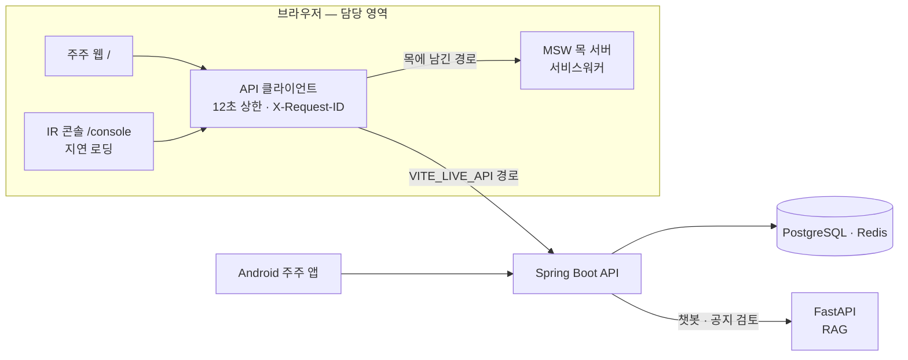
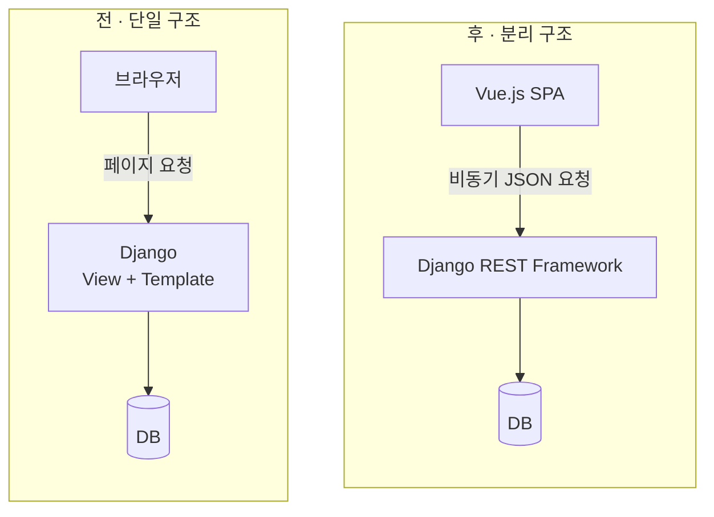

<div align="center">


<br/>

<!-- ▼ 헤더 카드: 여기부터 -->
<table>
<tr>
<td align="center" width="50%">🎓 <b>수학 전공</b><br/><sub>Samsung Software Academy For Youth 15기 이수 중</sub></td>
<td align="center" width="50%">💻 <b>Frontend Developer</b><br/><sub>React · TypeScript · Vue.js</sub></td>
</tr>
<tr>
<td align="center">🏦 <b>핀테크 · 🤖 로봇 관제 · 💼 취업 지원</b><br/><sub>SSAFY 프로젝트 3개</sub></td>
<td align="center">🔍 <b>프론트엔드 포지션을 찾고 있어요</b><br/><sub>편하게 연락 주세요</sub></td>
</tr>
</table>

<a href="mailto:handongin15@gmail.com"></a>
<a href="https://app.notion.com/p/3e91b429679f8183ae77c26eb318da9e"></a>

<sub>📂 프로젝트별 포트폴리오</sub><br/>
<a href="https://app.notion.com/p/3e91b429679f81728bb5ed4cedc72a62?source=copy_link"></a>
<a href="https://app.notion.com/p/SSACURITY-3e91b429679f814da3e4d88472095981?source=copy_link"></a>
<a href="https://app.notion.com/p/3e91b429679f81a8b22cf2e8cb2e0702?source=copy_link"></a>
<!-- ▲ 헤더 카드: 여기까지 -->

<br/>

<a href="#about"></a>
<a href="#stack"></a>
<a href="#zzutopia"></a>
<a href="#ssacurity"></a>
<a href="#jobssafy"></a>
<a href="#retro"></a>

</div>

<br/>

<a id="about"></a>

## 🙋 About Me

수학을 전공하고 **Samsung Software Academy For Youth(SSAFY) 15기 수료 예정**인 프론트엔드 개발자입니다.

ChatGPT가 등장해 사람들이 일하고 배우는 방식이 바뀌는 흐름을 보며, **바라보는 쪽이 아니라 그 흐름을 만드는 쪽에 서고 싶어** 개발을 시작했습니다.<br/>
그래서 첫 프로젝트부터 AI 파트를 맡았고, 이후에는 **AI가 실제 데이터와 일치하도록** 만드는 데 집중했습니다.

<br/>

### 💪 이런 방식으로 일합니다

| 강점 | 근거가 된 경험 |
|---|---|
| **🤝 협력** | 다른 파트에 보낼 요청은 번호 붙은 문안으로 관리하고, **보내기 전에 코드와 수치를 다시 재서** 이미 해결된 일을 요청하지 않았습니다. 팀원이 먼저 만든 해결책은 복사하지 않고 공용 함수로 빼서 함께 쓰게 했습니다. |
| **🧱 논리 · 구조** | "FE는 도메인 수치를 계산하지 않는다" 같은 **불변 규칙 12개**를 세우고 eslint · 테스트로 강제했습니다. 라이브 시연 실패는 정상 주행 로그와 **대조 분석**해 하드웨어가 아닌 상태 교착임을 밝혔습니다. |
| **🌱 학습** | 수학 전공에서 개발로 넘어와 Django · Vue.js로 시작했고, 이후 WebSocket 관제 화면, React · TypeScript 핀테크 서비스까지 **프로젝트마다 새 스택으로 결과를 냈습니다.** |
| **🙇 증명** | 테스트가 통과해도 믿지 않고 **가드를 일부러 되돌려 실패하는지 확인**합니다. 회고에서는 잘한 점만큼 아쉬운 점과 다음에 바꿀 점을 구체적으로 남깁니다. |

<br/>

<a id="stack"></a>

## 🛠 Tech Stack

<div align="center">

**Frontend**<br/><br/>


<br/>

**Backend · Tools**<br/><br/>


<br/>

**Library · Test**<br/><br/>


</div>

<br/>

---

## 🚀 Projects

<a id="zzutopia"></a>

### 🏦 쮸토피아 — 주주 우대 제도를 설계 · 운영하는 B2B SaaS

   <a href="https://jjutopia.site"></a>

> **실패는 실패라고, 모르는 숫자는 모른다고 말하는 화면을 만들었습니다.**

발행사 IR 담당자가 법적 위험 없이 주주 우대 제도를 설계 · 검증 · 운영하고, 주주는 '보유 주식 수 × 보유 일수'로 쌓인 혜택을 확인하는 서비스입니다.<br/>
7명 팀에서 프론트엔드를 혼자 맡아 **주주 웹과 IR 콘솔을 한 SPA로** 만들었습니다. 백엔드보다 먼저 MSW 목 서버로 화면을 완성하고, 준비된 API부터 경로 단위로 실서버에 옮겼습니다.

<div align="center">


<sub>테스트: Vitest 898 + Playwright 314 · 주주가 받지 않는 콘솔 코드 38.4 KB(gzip) · axe serious·critical, E2E 24곳 검사 · 2026-09-28 기준</sub>

</div>

**핵심 성과**
- **멈추지 않고 실패를 말하는 화면** — `networkMode: 'always'`와 모든 요청 12초 상한으로, API가 죽으면 카드마다 무엇을 못 불러왔는지 표시
- **백엔드를 기다리지 않는 개발** — 목에서 뺄 경로만 적는 `VITE_LIVE_API` 스위치로 종료 시점 핸들러 33개를 실서버로 이전
- **숫자를 지어낸 AI 답변 차단** — 본문 숫자를 서버 도구 결과와 대조해, 없는 숫자가 있으면 본문을 표시하지 않음
- **모르는 날을 "0"이라 말하지 않기** — '적립 · 적립 없음 · 기록 없음' 세 상태를 색이 아닌 빗금으로 구분
- **타입 불일치를 CI가 잡게** — 서버 OpenAPI와 손으로 쓴 타입 35쌍을 `npm test`로 자동 대조

**화면**

<table>
<tr>
<td width="50%"><p align="center"><sub><b>주주 홈</b> · 승급 조건 두 가지(SP · 보유일수)를 따로 표시</sub></p></td>
<td width="50%"><p align="center"><sub><b>API 장애 시 홈</b> · 멈추지 않고 카드마다 실패를 말함</sub></p></td>
</tr>
<tr>
<td width="50%"><p align="center"><sub><b>AI 개인 수치 답변</b> · 도구 결과와 숫자가 같을 때만 표시</sub></p></td>
<td width="50%"><p align="center"><sub><b>AI 제도 지식 답변</b> · 근거 문서가 있을 때만 표시</sub></p></td>
</tr>
<tr>
<td width="50%"><p align="center"><sub><b>적립 이력 12개월</b> · 적립 없음(회색)과 기록 없음(빗금) 구분</sub></p></td>
<td width="50%"><p align="center"><sub><b>공지 검토</b> · 차단 항목이 있으면 배포 잠금</sub></p></td>
</tr>
<tr>
<td width="50%"><p align="center"><sub><b>제도 설계</b> · 현금 지급은 고를 수 없고 이유를 그 자리에서 표시</sub></p></td>
<td width="50%"></td>
</tr>
</table>

<sub>화면 속 회사와 수치는 모두 목 데이터입니다.</sub>

**기술 선택 이유**

| 기술 | 왜 이걸 골랐나 |
|---|---|
| TanStack Query | 화면의 도메인 수치를 전부 서버 값으로 쓰기로 했기 때문에, 서버 상태의 캐싱 · 재조회를 전담시킴 |
| Zustand | 서버 상태와 섞이지 않는 순수 클라이언트 상태만 가볍게 관리 |
| MSW | 백엔드보다 먼저 화면을 완성하고, 화면 코드를 바꾸지 않고 경로 단위로 실서버에 붙이기 위해 |
| Zod | 입력 형식 검증에만 사용. 법적 판단은 서버 컴플라이언스 API에만 맡기도록 역할을 분리 |
| Next.js 미사용 | 모든 화면이 세션 쿠키 뒤라 SSR로 얻을 검색 노출이 없고, 정적 배포 전제 · 서비스워커 기반 MSW와 맞지 않음 (ADR 기록) |

<details>
<summary><b>🏗 요청이 가는 길 (아키텍처)</b></summary>
<br/>

목 서버는 서비스워커라 앱 코드는 어느 경로가 목인지 모르고, `VITE_LIVE_API`에 적은 경로만 실서버로 나갑니다. 운영 빌드에는 목이 아예 없습니다.



</details>

<details>
<summary><b>🔧 트러블슈팅 — 에러 화면을 다 만들고도 "불러오는 중…"에 멈춘 화면</b></summary>
<br/>

- **문제** 서버가 죽으면 홈 카드 6개가 30초 뒤에도 로딩. 에러 화면은 다 만들어 두었는데 한 번도 뜨지 않음
- **원인** TanStack Query 기본값 `networkMode: 'online'`이 실패한 쿼리를 `paused`로 묶음(목이 서비스워커라 전제가 맞지 않음). 게다가 `fetch`에 시간 상한이 없었음
- **판단** `networkMode: 'always'` + 모든 요청 **12초 상한**(목 최장 지연 1.2초 · 느린 네트워크 3초의 4배, E2E 대기 15초보다 짧게). 끊긴 요청은 취소가 아니라 **실패**(`TimeoutError`)로 구분
- **결과** API가 죽으면 카드마다 실패를 말함. E2E가 앱보다 먼저 `fetch`를 바꿔 끼워 로딩 문구가 남지 않는지 확인

```typescript
queries: { networkMode: 'always' },

export const REQUEST_TIMEOUT_MS = 12_000
const timeout = AbortSignal.timeout(options.timeoutMs ?? REQUEST_TIMEOUT_MS)
const signal = options.signal ? AbortSignal.any([options.signal, timeout]) : timeout
```

</details>

<details>
<summary><b>🔧 트러블슈팅 — 백엔드를 기다리지 않고, 경로 단위로 옮기기</b></summary>
<br/>

- **문제** 프론트가 부르는 31개 경로 중 백엔드에 있는 건 12개, 응답 모양까지 맞는 건 핸들러 7개뿐. 목 전체 on/off로는 실연동을 확인할 수 없음
- **판단** **목에서 뺄 경로만 적는 스위치**(`VITE_LIVE_API`). 비우면 전부 목이라 기본값이 안전하고, 아무 핸들러에도 안 맞는 항목은 오타로 알림
- **되돌림** 증권사 목록(`GET`)만 실서버로 켰다가 연결 직후 `linked: false`가 오는 모순을 보고 13분 만에 되돌림 → **부분 연동의 단위는 경로가 아니라 한 상태를 읽고 쓰는 흐름**
- **결과** 종료 시점 핸들러 33개가 실서버로 이전. 테스트가 CI 설정 파일을 직접 읽어 이 목록을 잠금

</details>

<details>
<summary><b>🔧 트러블슈팅 — 숫자를 지어낸 AI 답변은 화면에 올리지 않는다</b></summary>
<br/>

- **문제** 챗봇이 홈과 나란히 떠서, AI가 숫자를 지어내면 사용자는 어느 쪽을 믿어야 할지 모름. 서버 쪽 숫자 검증은 없었음
- **판단** 개인 수치 답변은 본문 숫자를 도구 결과(`figures`)와 대조해 없는 숫자가 있으면 본문 비표시. 조문 번호(상법 제467조의2) 때문에 제도 설명이 통째로 숨는 걸 실측하고, 답변 범위를 나눠 달라고 요청 → AI 파트가 `answerScope` 추가
- **링크 안전** AI가 준 주소는 허용 목록으로만 링크화. 'AI 생성' 표시는 조건 없이 부착(AI기본법 §31)
- **한계** 실서버가 항상 제도 지식으로 답해, 개인 수치 대조는 목에서만 증명됨

```typescript
if (input.answerScope === 'KNOWLEDGE') {
  return renderableCitations(input.citations) > 0 ? PASS : { blocked: true, reason: 'NO_CITATIONS' }
}
const numbers = unverifiedNumbers(input.reply, input.figures) // 모르는 범위도 엄격한 쪽으로
return numbers.length > 0 ? { blocked: true, reason: 'UNVERIFIED_NUMBERS', numbers } : PASS
```

</details>

<details>
<summary><b>🔧 트러블슈팅 — 받지 못한 것을 "0"이라고 말하지 않기</b></summary>
<br/>

- **문제** 적립 원장이 빈 배열로 오자 "적립된 날 0일" 표시(같은 화면 등급 카드는 보유 198일). 빈 배열 가드 후에도 "91일 중 적립된 날 1일"로 다시 틀림
- **원인** 비어 있는 날을 `?? 0`으로 채움. 진짜 조건은 '배열이 비었나'가 아니라 **'원장이 이 기간을 덮는가'**
- **판단** 기록 구간 안의 빈칸은 진짜 0, 구간 밖은 **모름**. '기록 없음'이라는 세 번째 상태를 더하고, 회색 명도 대신 **빗금**으로 구분. 범례 · 툴팁 · 스크린리더 라벨도 같은 말
- **결과** "최근 364일 중 적립된 날 136일. 기록이 없는 날 198일." 고친 뒤 되돌려 테스트 5건이 실패하는 것까지 확인

```typescript
// 전
return { date, sp: bySp.get(date) ?? 0 }
// 후
const known = recorded && date >= recorded.from && date <= recorded.to
if (!known) return { date, sp: 0, unknown: true }
```

</details>

<details>
<summary><b>🔧 트러블슈팅 — 손으로 쓴 타입이 서버와 어긋나는 걸 CI가 잡게</b></summary>
<br/>

- **문제** 손으로 쓴 약 700줄 API 타입은 서버가 바뀌어도 컴파일이 통과하고 화면은 `undefined`를 그림. 한 주에 손으로 대조한 것만 네 번
- **판단** 서버 OpenAPI 스냅샷을 커밋하고, TypeScript 컴파일러 API로 타입 파일을 파싱해 비교. FE에만 있는 필드(`+`) · 서버에만 있는 필드(`-`) · 타입 불일치(`≠`) · **해소됐는데 남은 예외(`!`)** 네 가지 검사
- **결과** 첫 실행에서 이미 요청해 둔 불일치를 독립적으로 재발견. 종료 시점 35쌍을 CI에서 대조. 필수 여부 · enum은 대조하지 않는다는 한계도 기록

</details>

<details>
<summary><b>📜 그 밖에 만든 것</b></summary>
<br/>

- **법을 화면 구조로** — 현금성 혜택은 선택 불가 + 이유(상법 제464조) 표시, 공지 검토 차단 시 배포 잠금, 투자 권유 어휘는 테스트로 차단(자본시장법 제178조)
- **콘솔은 주주에게 보내지 않기** — IR 콘솔 지연 로딩, 데모 도구(`/ops`)는 `lazy()`를 빌드 상수 삼항 안에 둬 운영 빌드에 청크 자체가 없음
- **추적 번호** — 요청마다 `X-Request-ID`를 만들어 실패 안내에 남김. 빈 문자열이 번호를 지우던 회귀를 18분 만에 수정하고 가드 테스트 추가
- **인증 경계** — 401은 보던 자리를 `next`에 남기고(열린 리다이렉트 차단), 403은 장애가 아닌 역할로 안내. 쿠키 없는 첫 로그인만 막히던 CSRF 버그 수정
- **목 부팅 시한** — `worker.start()`가 끝나지 않아 빈 화면이 되던 간헐적 실패를 5초 시한으로 차단
- **접근성** — 등급을 색만으로 구분하지 않음. `aria-hidden` 라벨 대비를 실제 CSS 변수로 읽어 4.5:1 이상인지 테스트로 잠금
- **계약 먼저 협업** — 백엔드 스키마 요청 8건 중 7건 반영, "E2E가 CI에 없다"는 요청 다음 날 CI에 E2E 잡 생성

</details>

`React 19` `TypeScript` `Vite 8` `TanStack Query` `Zustand` `Zod` `Tailwind CSS 4` `MSW 2` `Vitest` `Playwright` `axe-core`


<br/>

---

<a id="ssacurity"></a>

### 🤖 SSACURITY — 자율주행 보안 로봇 관제 시스템

 

<div align="center">


</div>

**핵심 성과**
- **거짓 경보 제거** — 화면 요소마다 달랐던 신선도 임계값(상단바만 6초)을 25초 단일 상수로 통합
- **재로그인 무한 루프 차단** — WebSocket 인증 거절(1008)을 세션 만료와 권한 부족으로 분기
- **끊겨도 놓치지 않는 재연결** — 지수 백오프(1.5초 → 15초 상한) + 재접속 시 스냅샷 재수신
- **시연 실패를 구조적 원인으로 규명** — 로그 대조 분석으로 상태 교착을 찾아 수정안·재발 방지안 수립

<details>
<summary><b>🔧 트러블슈팅 — 통신은 정상인데 뜨는 "재연결 중" 경보</b></summary>
<br/>

- **문제** 실시간 관제 화면에서 통신이 정상인데도 회차마다 거짓 "재연결 중" 경보 발생
- **원인** 신호 주기 상한은 20초인데, 상단바 · 로봇 카드 · 텔레메트리가 신선도 임계를 각자 다른 값으로 보유(상단바만 6초)
- **해결 1** 임계를 **25초 단일 상수**로 통합해 화면 요소끼리 판단이 갈라지지 않게 함
- **해결 2** WebSocket 인증 거절(1008)을 **세션 만료**와 **권한 부족**으로 분기 — "로그인이 필요합니다" 오안내로 재로그인 무한 루프에 빠지던 경로 차단
- **해결 3** 재연결은 지수 백오프(1.5초 → 15초 상한), 재접속 시 스냅샷을 다시 받아 끊긴 동안의 이벤트 복구

</details>

<details>
<summary><b>🔧 트러블슈팅 — 저속 구간에서만 튀는 속도 값</b></summary>
<br/>

- **문제** 화면상 정상 주행인데 로그에선 저속 구간 속도가 크게 튐
- **원인** 엔코더가 정수 펄스를 출력해, 10ms 샘플링 구간의 저속 펄스 수가 극히 적어 ±1 오차가 속도를 크게 왜곡
- **해결** 5샘플 이동창(50ms) 누적 + 목표 속도 비례 피드포워드를 제안해 반영 → **흔들림 약 70% 감소, 추종률 88% → 98%**

</details>

<details>
<summary><b>🔧 트러블슈팅 — 라이브 시연에서 3회 연속 미출발</b></summary>
<br/>

- **문제** 최종 발표에서 로봇이 3회 연속 출발하지 않았고, 재시도로도 복구 불가
- **분석** 39분 뒤 같은 하드웨어의 주행 시험은 정상(명령 송신 202회 · fault 0). 유일한 차이는 **"명령 송신 여부"**
- **원인** 대기 중 명령 미송신 → 300ms 후 `COMM_TIMEOUT` · `SAFE_STOP` → 출동 명령이 "READY 아님"으로 거절 → 다시 대기로 회귀하는 **상태 교착**
- **해결** 준비 판정의 예외 기준을 "조치 등급"에서 "중립 명령 재송신으로 해제 가능한가"로 변경하는 수정안 도출, 시나리오 단위 리허설 · 출발 전 상태 점검 도입

</details>

`Vanilla JS` `WebSocket` `FastAPI` `ROS 2` `UART`

<br/>

---

<a id="jobssafy"></a>

### 💼 잡싸피 — 취업 지원 서비스

 

Django 템플릿 중심이던 서비스를 **Vue.js + Django REST Framework**로 분리하고,<br/>
분리 과정에서 생긴 **검색 정확도 문제**와 **목록 API 오버헤드**를 쿼리 레벨에서 해결했습니다.

<div align="center">


</div>

**핵심 성과**
- **구조 전환** — 서버가 HTML까지 그리던 구조를 Vue.js(화면) + DRF(JSON API)로 나눠, 화면과 API를 독립적으로 개발 · 배포할 수 있게 함
- **실시간 다중 검색** — 입력이 조금만 어긋나도 결과가 비던 검색을, 코드 추가 없이 대소문자 무시 부분 일치로 개선
- **목록 조회 경량화** — 목록에 쓰지 않는 자기소개서 본문을 DB에서 아예 읽지 않도록 해 응답 크기와 메모리 사용을 줄임

<details>
<summary><b>🏗 구조 전환 — 단일 구조에서 프론트 · 백엔드 분리로</b></summary>
<br/>



- **문제** 화면을 바꿀 때마다 서버 템플릿을 함께 고쳐야 했고, 검색처럼 입력마다 결과가 바뀌는 화면은 페이지 새로고침 방식으로는 구현하기 어려움
- **판단** 화면은 Vue.js, 데이터는 DRF가 JSON으로만 내려주도록 역할을 분리
- **결과** 입력 변화에 즉시 반응하는 실시간 검색이 가능해짐. 다만 분리 후 목록 API가 모든 필드를 JSON으로 보내면서 새로운 오버헤드가 생김 (아래 트러블슈팅)

</details>

<details>
<summary><b>🔧 트러블슈팅 — 조금만 달라도 결과가 비는 검색</b></summary>
<br/>

- **문제** 사용자가 입력할 때마다 결과를 보여 주는 실시간 검색이 필요했는데, django-filter 기본값은 **완전 일치(exact)** 라 대소문자나 일부 글자만 달라도 결과가 0건
- **검토** 필드마다 커스텀 필터 메서드를 쓰면 되지만, 검색 조건이 늘 때마다 코드가 같이 늘어남
- **판단** `Meta.fields`를 **lookup 확장 딕셔너리**로 바꿔 필드별로 `icontains`를 선언 — 조건이 늘어도 한 줄씩만 추가
- **결과** 추가 코드 복잡도 없이 **대소문자 무시 · 부분 일치 · 다중 조건** 검색 구현

**전 · 완전 일치만 가능**

```python
class PostingFilter(django_filters.FilterSet):
    class Meta:
        model = Posting
        fields = ['title', 'company', 'location']  # exact
```

**후 · 필드별 부분 일치 선언**

```python
class PostingFilter(django_filters.FilterSet):
    class Meta:
        model = Posting
        fields = {
            'title':    ['icontains'],
            'company':  ['icontains'],
            'location': ['icontains'],
        }
# ?title__icontains=프론트&company__icontains=삼성
```

</details>

<details>
<summary><b>🔧 트러블슈팅 — 목록 API에 실려 가던 자기소개서 본문</b></summary>
<br/>

- **문제** 구조 분리 후 목록 조회 API가 화면에 쓰지도 않는 **자기소개서 본문**까지 모든 행에 담아 보내 패킷 오버헤드 발생
- **검토** 시리얼라이저에서 필드만 빼면 응답에서는 사라지지만, DB에서는 여전히 본문을 읽어 메모리에 올림
- **판단** `defer()`로 본문 컬럼을 **DB 조회 단계에서부터 제외** — 상세 조회에서만 읽도록 분리
- **결과** 불필요한 메모리 낭비 방지, 목록 API 응답 속도 개선 (**[N]ms → [M]ms**)

```python
# 목록: 본문은 DB에서 읽지 않음
queryset = CoverLetter.objects.defer('content')

# 상세: 본문 포함 전체 조회
CoverLetter.objects.get(pk=pk)
```

</details>

`Vue.js` `Django REST Framework` `django-filter`

<br/>

---

<a id="retro"></a>

## 📈 돌아보며 — 쮸토피아

**잘한 점 · 증상이 아니라 길을 고쳤다**
- 에러 화면이 안 뜰 때 화면을 고치지 않고, **그 화면에 도달하지 못하는 길**(`networkMode`, 시간 상한)을 찾아 막았습니다.
- 기준값은 잰 값에서 정했습니다. 12초 요청 상한은 목 지연과 느린 네트워크 기준에서, 5초 목 부팅 시한은 정상 부팅 실측(0.6–1.0초)에서 나왔습니다.
- 제 변경도 틀리면 바로 되돌렸습니다. 증권사 부분 연동은 13분, 추적 번호 회귀는 18분 만에 닫았습니다.

**아쉬운 점 · 목에서만 참인 것들**
- 개인 수치 대조는 끝내 실서버에서 돌지 못하고 목에서만 증명됐습니다.
- 목에 권한 검사가 없어, 역할 버그를 E2E가 잡지 못하고 잘못된 이유로 통과한 적이 있습니다.
- 계약 대조는 스냅샷 갱신이 CI 밖이라, 스냅샷이 낡으면 조용합니다.

**다음엔 · 목도 서버만큼 엄격하게**
- 목에도 **권한 경계**를 넣어 E2E가 역할 문제를 잡게 하겠습니다.
- OpenAPI 스냅샷 갱신을 CI에 넣고, 수기 타입 대신 **생성 타입**을 검토하겠습니다.
- 서버가 개인 수치를 `figures`와 함께 내려주는 계약을 **처음부터** AI · BE와 맞추겠습니다.

<br/>

---

## 📊 Activity

<div align="center">

프로젝트는 SSAFY 사내 **GitLab**에서 진행했습니다. 아래는 쮸토피아 저장소 기록 기준입니다.

<br/>


<br/>

<sub>GitHub에는 앞으로의 개인 작업과 학습 기록을 쌓아 갈 예정입니다.</sub>

</div>


